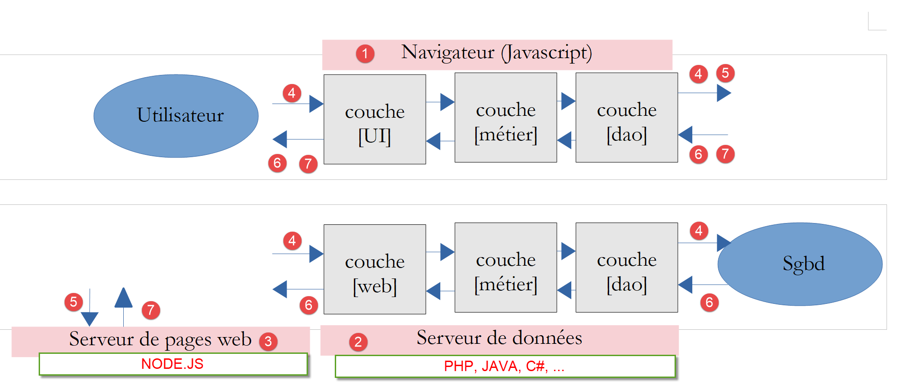

Présentation du cours
=====================

Ce document fait partie d’une série de quatre articles :

1. [`Introduction au langage PHP7 par
   l’exemple <https://stahe-php7.readthedocs.io/fr/latest/>`__] ;

2. [`Introduction au langage ECMASCRIPT 6 par
   l’exemple <https://stahe-ecmascript6.readthedocs.io/fr/latest/>`__] ;

3. [`Introduction au framework VUE.JS par
   l’exemple <https://stahe-vuejs.readthedocs.io/fr/latest/>`__] ;

4. [`Introduction au framework NUXT.JS par
   l’exemple <https://stahe-nuxtjs.readthedocs.io/fr/latest/>`__].
   **C’est le document présent** ;

Ce sont tous des documents pour **débutants**. Les articles ont une
suite logique mais **sont faiblement couplés** :

-  le document [1] présente le langage PHP 7. Le lecteur seulement
   intéressé par le langage PHP et pas par le langage Javascript des
   articles suivants s’arrêtera là ;

-  les documents [2-4] visent à construire un client Javascript au
   serveur de calcul de l’impôt développé dans le document [1] ;

-  les frameworks Javascript [vue.js] et [nuxt.js] des articles 3 et 4
   nécessitent de connaître le Javascript des dernières versions
   d’ECMASCRIPT, celles de la version 6. Le document [2] est donc
   destiné à ceux qui ne connaissent pas cette version de Javascript. Il
   fait référence au serveur de calcul de l’impôt construit dans le
   document [1]. Le lecteur de [2] aura alors parfois besoin de se
   référer au document [1] ;

-  une fois ECMASCRIPT 6 maîtrisé, on peut aborder le framework VUE.JS
   qui permet de construire des clients Javascript s’exécutant dans un
   navigateur en mode SPA (Single Page Application). C’est le document
   [3]. Il fait référence à la fois au serveur de calcul de l’impôt
   construit dans le document [1] et au code du client Javascript
   autonome construit en [2]. Le lecteur de [3] aura alors parfois
   besoin de se référer aux documents [1] et [2] ;

-  une fois VUE.JS maîtrisé, on peut aborder le framework NUXT.JS qui
   permet de construire des clients Javascript s’exécutant dans un
   navigateur en mode SSR (Server Side Rendered). Il fait référence à la
   fois au serveur de calcul de l’impôt construit dans le document [1],
   au code du client Javascript autonome construit en [2] ainsi qu’à
   l’application [vue.js] développée dans le document [3]. Le lecteur de
   [4] aura alors parfois besoin de se référer aux documents [1] [2] et
   [3] ;

Ce document poursuit le travail fait dans le document [3] avec le
framework VUE.JS.

Cette section s’intéresse à l’architecture suivante :

|image0|

-  en **[1]**, un navigateur web affiche des pages web **[5, 7]** isues
   d’un serveur [3] à destination d’un utilisateur. Ces pages
   contiennent du Javascript implémentant un client d’un service web de
   données **[2]** ainsi qu’un client d’un serveur de fragments de pages
   web **[3]** ;

-  en **[2]**, le serveur web est un serveur de données. Il peut être
   écrit dans n’importe quel langage. Il ne produit pas de pages web au
   sens classique (HTML, CSS, Javascript) sauf peut-être la 1ère fois.
   Mais cette 1ère page peut être obtenue d’un serveur web classique
   **[3]** (pas un serveur de données). Le Javascript de la page
   initiale va alors générer les différentes pages web de l’application
   en obtenant les données **[4]** à afficher, auprès du serveur web qui
   agit comme un serveur de données **[2]**. Il peut également obtenir
   des fragments de page web **[5]** pour habiller ces données auprès du
   serveur de pages web **[3]** ;

-  en **[4]**, l’utilisateur initie une action ;

-  en **[6,7]** : il reçoit des données habillées par un fragment de
   page web ;

Le framework [nuxt.js] \|\ https://fr.nuxtjs.org/\ \| va nous permettre
d’implémenter le fonctionnement suivant :

-  la 1ère page de l’application est délivrée par le serveur [node.js]
   [3]. Par ailleurs les autres pages de l’application sont également
   présentes sur ce même serveur. Elles sont délivrées lorsque
   l’utilisateur tape leur URL à la main dans le navigateur. Ces pages
   embarquent une application [vue.js] (approximativement) ;

-  une fois la 1ère page chargée dans le navigateur, l’application se
   comporte comme une application [vue.js] classique. Dans notre schéma
   ci-dessus, elle va alors dialoguer avec le serveur de données [2] ;

Au final, l’application se comporte comme une application [vue.js] sauf
pour la 1ère page et lorsque l’utilisateur tape des URL à la main. Dans
ces cas, la page est cherchée sur le serveur [3]. Lorsque qu’un moteur
de recherche demande les différentes pages de l’aplication, il reçoit
les pages du serveur [3]. Celles-ci ont pu être optimisées pour le SEO
(Search Engine Optimization). Dans une application [vue.js], le moteur
de recherche reçoit une page avec peu de signification SEO. Par exemple,
dans l’application du client du serveur de calcul de l’impôt du document
[3], la page reçue par le navigateur lors du démarrage de l’application
était la suivante :

.. code-block:: javascript 
   :linenos:

   <!DOCTYPE html>
   <html lang="en">
     <head>
       <meta charset="utf-8">
       <meta http-equiv="X-UA-Compatible" content="IE=edge">
       <meta name="viewport" content="width=device-width,initial-scale=1.0">
       <link rel="icon" href="/client-vuejs-impot/favicon.ico">
       <title>vuejs</title>
     <link href="/client-vuejs-impot/app.js" rel="preload" as="script"></head>
     <body>
       <noscript>
         <strong>We're sorry but vuejs doesn't work properly without JavaScript enabled. Please enable it to continue.</strong>
       </noscript>
       

       <!-- built files will be auto injected -->
     </body>
   </html>

C’est l’unique page chargée par le navigateur. Toutes les autres pages
de l’application sont générées dynamiquement par le Javascript sans
l’aide du navigateur. Certains moteurs de recherche se contentent de
cette page. D’autres vont plus loin en exécutant le Javascript contenu
dans la page (ligne 9 ci-dessus). Une autre page est alors obtenue.
Celle-ci peut contenir une opération asynchrone pour aller chercher les
données que la page va afficher. Dans ce cas les moteurs de recherche
n’attendent pas. On se retrouve alors avec une page incomplète. On se
rappelle peut-être que c’est le cas de notre client [vue.js] du serveur
de calcul de l’impôt : de façon asynchrone, il initialise au cours du
chargement de la 1ère page, une session jSON avec le serveur de calcul
de l’impôt. Dans ce cas précis, cela n’influe pas sur la page récupérée
par le moteur de recherche. Pour d’autres applications, cela pourrait
être pénalisant en termes SEO.

Avec [nuxt.js] on peut servir au moteur de recherche une page plus
signifiante pour chacune des pages de l’application.

Les scripts de ce document sont commentés et leur exécution console
reproduite. Des explications supplémentaires sont parfois fournies. Le
document nécessite une lecture active : pour comprendre un script, il
faut à la fois lire son code, ses commentaires et ses résultats
d'exécution.

Les exemples du document sont disponibles
\|\ `ici <http://sergetahe.com/cours-tutoriels-de-programmation/wp-content/uploads/documents/php7-ecmascript6-vuejs-nuxtjs/nuxtjs.rar>`__\ **\ \|**.

L’application serveur PHP 7 peut être testée
\|\ `ici <https://sergetahe.com/apps/impot/serveur-php7/>`__\ **\ \|**.

Serge Tahé, décembre 2019

