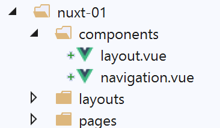
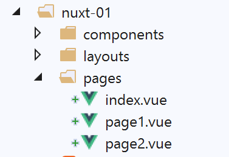
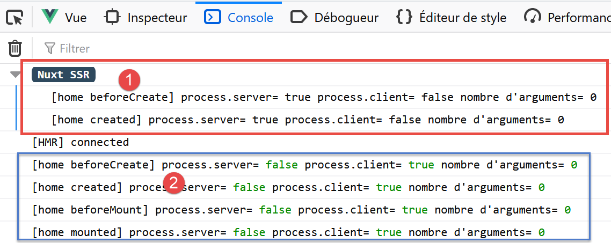
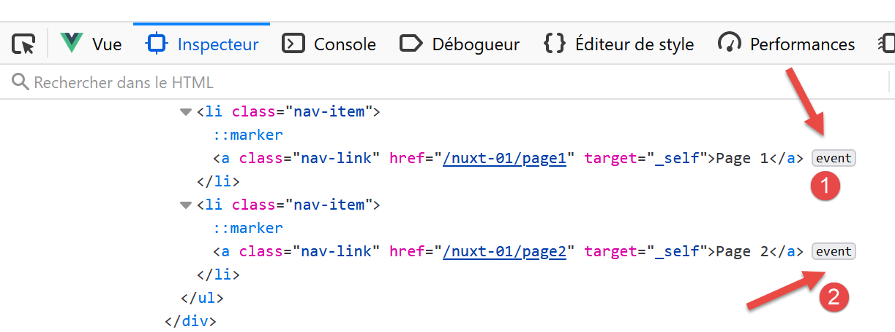

Exemple [nuxt-01] : routage et navigation
===========================================

Nous allons construire une série d’exemples simples pour découvrir
progressivement le fonctionnement d’une application [nuxt]. Nous allons
commencer par porter l’application [vuejs-11] du document
\|\ `Introduction au framework VUE.JS par
l’exemple <https://tahe.developpez.com/tutoriels-cours/vuejs>`__\ \|,
pour découvrir tout d’abord ce qui différencie l’organisation du code
d’une application [nuxt] de celle du code d’une application [vue].

Arborescence du projet
----------------------

Le projet [vuejs-11] était un projet de navigation entre vues :

|image0|

L’arborescence du code source du projet [vuejs-11] était le suivant :

|image1|

-  [main.js] était le script exécuté lors du démarrage de l’application
   [vue] ;

-  [router.js] fixait les règles de routage ;

-  [App.vue] était la vue structurante de l’application. Elle organisait
   la mise en page des différentes vues ;

-  [Component1, Component2, Component3, Layout, Navigation] étaient les
   composants utilisés dans les différentes vues de l’application ;

Dans le portage de l’application [vue] [1] vers une application
[nuxt] [2] :

-  les scripts exécutés au démarrage de l’application doivent être
   déclarés dans la clé [plugins] du fichier [nuxt.config.js]. Par
   ailleurs, il est possible de séparer les scripts destinés au serveur
   [nuxt] de ceux destinés au client [nuxt] ;

-  la vue [App.vue] doit être installée dans le dossier [layouts] et
   être renommée [default.vue] ;

-  les composants [Component1, Component2, Component3] qui sont les
   cibles du routage doivent migrer dans le dossier [pages]. L’un d’eux,
   celui qui sert de page d’accueil, doit être renommé [index.vue]. Nous
   avons ici renommé les fichiers :

   -  [Component1] --> [index] : affiche le texte [Home] ;

   -  [Component2] --> [page1] : affiche le texte [Page 1] ;

   -  [Component3] --> [page2] : affiche le texte [Page 2] ;

..

   [nuxt] utilise le contenu du dossier [pages] pour générer
   dynamiquement les routes suivantes :

.. code-block:: javascript 
   :linenos:

   { name :’index’, ‘path’ :’/’}
   { name :’page1’, ‘path’ :’/page1’}
   { name :’page2’, ‘path’ :’/page2’}

..

   Du coup, le fichier [router.js] utilisé dans le projet [vue] devient
   inutile dans le projet [nuxt].

Le fichier de configuration [nuxt.config.js] sera le suivant :

.. code-block:: javascript 
   :linenos:

   export default {
     mode: 'universal',
     /*
      ** Headers of the page
      */
     head: {
       title: 'Introduction à [nuxt.js]',
       meta: [
         { charset: 'utf-8' },
         { name: 'viewport', content: 'width=device-width, initial-scale=1' },
         {
           hid: 'description',
           name: 'description',
           content: 'ssr routing loading asyncdata middleware plugins store'
         }
       ],
       link: [{ rel: 'icon', type: 'image/x-icon', href: '/favicon.ico' }]
     },
     /*
      ** Customize the progress-bar color
      */
     loading: { color: '#fff' },
     /*
      ** Global CSS
      */
     css: [],
     /*
      ** Plugins to load before mounting the App
      */
     plugins: [],
     /*
      ** Nuxt.js dev-modules
      */
     buildModules: [
       // Doc: https://github.com/nuxt-community/eslint-module
       '@nuxtjs/eslint-module'
     ],
     /*
      ** Nuxt.js modules
      */
     modules: [
       // Doc: https://bootstrap-vue.js.org
       'bootstrap-vue/nuxt',
       // Doc: https://axios.nuxtjs.org/usage
       '@nuxtjs/axios'
     ],
     /*
      ** Axios module configuration
      ** See https://axios.nuxtjs.org/options
      */
     axios: {},
     /*
      ** Build configuration
      */
     build: {
       /*
        ** You can extend webpack config here
        */
       extend(config, ctx) {}
     },
     // répertoire du code source
     srcDir: 'nuxt-01',
     // routeur
     router: {
       // racine des URL de l'application
       base: '/nuxt-01/'
     },
     // serveur
     server: {
       // port de service, 3000 par défaut
       port: 81,
       // adresses réseau écoutées, par défaut localhost : 127.0.0.1
       // 0.0.0.0 = toutes les adresses réseau de la machine
       host: '0.0.0.0'
     }
   }

-  ligne 62 : on indique le dossier qui contient le code source du
   projet [dvp] ;

-  ligne 66 : : on indique l’URL racine de l’application [dvp] (on peut
   mettre ce qu’on veut) ;

-  ligne 43 : notons que la bibliothèque [bootstrap-vue] est référencée
   dans la configuration ;

   1. .. rubric:: Portage du fichier [main.js]
         :name: portage-du-fichier-main.js

Le fichier [main.js] du projet [vuejs-11] était le suivant :

.. code-block:: javascript 
   :linenos:

   // imports
   import Vue from 'vue'
   import App from './App.vue'

   // plugins
   import BootstrapVue from 'bootstrap-vue'
   Vue.use(BootstrapVue);

   // bootstrap
   import 'bootstrap/dist/css/bootstrap.css'
   import 'bootstrap-vue/dist/bootstrap-vue.css'

   // routeur
   import monRouteur from './router'

   // configuration
   Vue.config.productionTip = false

   // instanciation projet [App]
   new Vue({
     name: "app",
     // vue principale
     render: h => h(App),
     // routeur
     router: monRouteur,
   }).$mount('#app')

En-dehors des [imports], le code fait les choses suivantes :

-  lignes 5-11 : utilisation de la bibliothèque [bootstrap-vue]. Ce
   travail est désormais fait par le module [bootstrap-vue/nuxt] de la
   ligne 43 du fichier de configuration [nuxt.config.js] ;

-  lignes 14 et 25 : utilisation du fichier de routage [router.js]. Ce
   travail est désormais fait automatiquement par l’application [nuxt] à
   partir de l’arborescence du dossier [pages] ;

-  lignes 20-26 : instanciation de la vue principale de l’application.
   Dans une application [nuxt], c’est la vue [layouts/default.vue] qui
   sert de vue principale ;

Le fichier [main.js] n’a désormais plus de raison d’être. S’il en avait
eu une, on l’aurait déclaré dans la clé [plugins] de la ligne 30 du
fichier de configuration [nuxt.config.js] ;

La vue principale [default.vue]
-------------------------------

|image2|

La vue principale [layouts / default.vue] est la suivante :

.. code-block:: javascript 
   :linenos:

   <template>
     

       <b-card>
         <!-- un message -->
         <b-alert show variant="success" align="center">
           <h4>[nuxt-01] : routage et navigation</h4>
         </b-alert>
         <!-- la vue courante du routage -->
         <nuxt />
       </b-card>
     

   </template>

   

-  ligne 9, dans le projet [vuejs-11], on avait la balise
   <**router-view** /> au lieu de la balise <**nuxt** /> utilisée ici.
   Les deux semblent utilisables. Je les ai essayées toutes les deux
   sans voir de changement. J’ai gardé la balise <**nuxt** /> qui est
   celle conseillée. Elle affiche la vue courante, ç-à-d la page cible
   du routage courant ;

   1. .. rubric:: Les composants
         :name: les-composants

|image3|

Par rapport au projet [vuejs-11], les composants [layout, navigation] ne
changent pas :

[**components / layout.vue**]

.. code-block:: javascript 
   :linenos:

   <!-- disposition des vues -->
   <template>
     <!-- ligne -->
     

       <b-row>
         <!-- zone à deux colonnes -->
         <b-col v-if="left" cols="2">
           <slot name="left" />
         </b-col>
         <!-- zone à dix colonnes -->
         <b-col v-if="right" cols="10">
           <slot name="right" />
         </b-col>
       </b-row>
     

   </template>

   

Ce composant sert à structurer les pages de l’application en deux
colonnes :

-  lignes 7-9 : la colonne de gauche sur 2 colonnes Bootstrap ;

-  lignes 11-13 : la colonne de droite sur 10 colonnes Bootstrap ;

[**navigation.vue**]

.. code-block:: javascript 
   :linenos:

   <template>
     <!-- menu Bootstrap à trois options -->
     <b-nav vertical>
       <b-nav-item to="/" exact exact-active-class="active">
         Home
       </b-nav-item>
       <b-nav-item to="/page1" exact exact-active-class="active">
         Page 1
       </b-nav-item>
       <b-nav-item to="/page2" exact exact-active-class="active">
         Page 2
       </b-nav-item>
     </b-nav>
   </template>

Ce composant affiche trois liens de navigation :

|image4|

Pour savoir quoi mettre comme valeur aux attributs [to] des lignes 4, 7
et 10, il faut regarder le dossier [pages] [2] :

-  la page [index] aura l’URL [/] ;

-  la page [page1] aura l’URL [/page1] ;

-  la page [page2] aura l’URL [/page2] ;

Le composant [navigation] peut être également écrit de la façon
suivante :

.. code-block:: javascript 
   :linenos:

   <template>
     <!-- menu Bootstrap à trois options -->
     <b-nav vertical>
       <nuxt-link to="/" exact exact-active-class="active">
         Home
       </nuxt-link>
       <nuxt-link to="/page1" exact exact-active-class="active">
         Page 1
       </nuxt-link>
       <nuxt-link to="/page2" exact exact-active-class="active">
         Page 2
       </nuxt-link>
     </b-nav>
   </template>

La balise <**b-nav-item**> est remplacée par la balise <**nuxt-link**>
qui désigne un lien de routage. A l’exécution, je n’ai pas vu de grande
différence, rien qui pourrait faire pencher la balance vers une balise
plutôt que l’autre.

Les pages
---------

|image5|

La page [index.vue] affiche la vue suivante :

|image6|

Le code de la page est le suivant :

.. code-block:: javascript 
   :linenos:

   <!-- page principale -->
   <template>
     <Layout :left="true" :right="true">
       <!-- navigation -->
       <Navigation slot="left" />
       <!-- message-->
       <b-alert slot="right" show variant="warning">
         Home
       </b-alert>
     </Layout>
   </template>

   

-  ligne 5 : le composant de navigation est placé en colonne de gauche ;

-  lignes 7-9 : une alerte est placée dans la colonne de droite ;

Dans la partie 
     
     
     
     
   </body>
   </html>

**Commentaires**

-  la première chose qui peut être remarquée est que le code HTML
   **reçu** reflète correctement ce que voit l’utilisateur. Ce n’était
   pas le cas des applications [vue] pour lesquelles le code source
   affiché était le code source d’un fichier HTML quasi vide. C’était ce
   qu’avait reçu le navigateur. Ensuite le client [vue] prenait la main
   et construisait la page attendue par l’utilisateur. Il fallait alors
   aller dans l’onglet [inspecteur] des outils de développement du
   navigateur (F12) pour découvrir le code HTML de la page affichée ;

-  lignes 57-67 : c’est le script qui a affiché les logs tagués [Nuxt
   SSR]. Ces logs ont été produits côté serveur et les résultats ont été
   embarqués dans un script inclus dans la page envoyée ;

-  lignes 68-71 : les scripts qui forment le client exécuté côté
   navigateur ;

Les scripts des lignes 68-71 sont exécutés et transforment la page
reçue. Pour connaître la page finalement affichée pour l’utilisateur, il
faut aller dans l’onglet [inspecteur] des outils de développement du
navigateur (F12) :

|image10|

Lorsqu’on développe la balise <html> [3], on a le contenu suivant :

.. code-block:: javascript 
   :linenos:

   <head>
     <title>Introduction à [nuxt.js]</title>
     <meta data-n-head="ssr" charset="utf-8">
     <meta data-n-head="ssr" name="viewport" content="width=device-width, initial-scale=1">
     <meta data-n-head="ssr" data-hid="description" name="description" content="ssr routing loading asyncdata middleware plugins store">
     <link data-n-head="ssr" rel="icon" type="image/x-icon" href="/favicon.ico">
     <base href="/nuxt-01/">
     ...
     <link rel="preload" href="/nuxt-01/_nuxt/runtime.js" as="script">
     <link rel="preload" href="/nuxt-01/_nuxt/commons.app.js" as="script">
     <link rel="preload" href="/nuxt-01/_nuxt/vendors.app.js" as="script">
     <link rel="preload" href="/nuxt-01/_nuxt/app.js" as="script">

     
     
     
   </head>
   <body>
     

       

         

           

             

               

                 <h4>[nuxt-01] : routage et navigation</h4>
               

               

                 

                   

                     <ul class="nav flex-column">
                       <li class="nav-item">
                         <a href="/nuxt-01/" target="_self" class="nav-link active nuxt-link-active">
                           Home
                         </a>
                       </li>
                       <li class="nav-item">
                         <a href="/nuxt-01/page1" target="_self" class="nav-link">
                           Page 1
                         </a>
                       </li>
                       <li class="nav-item">
                         <a href="/nuxt-01/page2" target="_self" class="nav-link">
                           Page 2
                         </a>
                       </li>
                     </ul>
                   

                   

                     

                       Home
                     

                   

                 

               

             

           

         

       

     

     
     
     
     
     

     <iframe id="mc-sidebar-container" ...></iframe>
     <iframe id="mc-topbar-container"...>  </iframe>
     <iframe id="mc-toast-container" ...></iframe>
     <iframe id="mc-download-overlay-container"...></iframe>
   </body>

**Commentaires**

-  à première vue, la page affichée lignes 19-59, semble être la même
   que la page reçue ;

-  lignes 14-16 : trois nouveaux scripts apparaissent, un pour chacune
   des pages de l’application ;

-  lignes 76-79 : quatre [iframe] apparaissent ;

Lignes 33, 37 et 42, les liens posent problème. Ils semblent être des
liens normaux qui lorsqu’on les clique vont faire une requête vers le
serveur. Or à l’exécution, on voit que ce n’est pas vrai : il n’y a pas
de requête vers le serveur. Pour comprendre pourquoi, il faut retourner
dans l’onglet [inspecteur] du navigateur :

|image11|

On voit qu’en [1, 2] des événements ont été attachés aux liens. Ce sont
les scripts des lignes 71-74 qui ont attaché des gestionnaires
d’événements aux liens. Donc :

-  la page affichée par le client est visuellement identique à celle
   envoyée par le serveur ;

-  un comportement dynamique a été ajouté à la page par le client ;

Maintenant demandons la page [page1] en tapant l’URL à la main
[http://192.168.1.128:81/nuxt-01/page1]. Les logs deviennent les
suivants :

|image12|

On obtient les mêmes résultats que pour la page [index] mais pour
[page1]. Le code source de la page reçue est lui le suivant :

.. code-block:: javascript 
   :linenos:

   <body>
     

       

         

           

             

               
<h4>[nuxt-01] : routage et navigation</h4>
 

                 

                   

                     <ul class="nav flex-column">
                       <li class="nav-item">
                         <a href="/nuxt-01/" target="_self" class="nav-link">
                           Home
                         </a>
                       </li>
                       <li class="nav-item">
                         <a href="/nuxt-01/page1" target="_self" class="nav-link active nuxt-link-active">
                           Page 1
                         </a>
                       </li>
                       <li class="nav-item">
                         <a href="/nuxt-01/page2" target="_self" class="nav-link">
                           Page 2
                         </a>
                       </li>
                     </ul>
                   
 

                     

                       Page 1
                     

                   

                 

               

             

           

         

       

     

     
     
     
     
     
   </body>

On obtient le même type de page que la page [index] mais avec l’alerte
de la vue [Page 1] (ligne 30). Lignes 41-44, le code du client a été
renvoyé avec la page. Au final, demander une URL à la main est
**identique** à redémarrer l’application. Simplement la page affichée
n’est pas forcément la page d’accueil, c’est celle qui a été demandée.
Une fois la page reçue, c’est le client qui prend la main. Le serveur ne
sera plus sollicité à moins que l’utilisateur n’en décide autrement.

.. |image8| image:: ./chap-04/media/image9.png
   :width: 6.36614in
   :height: 2.61024in

