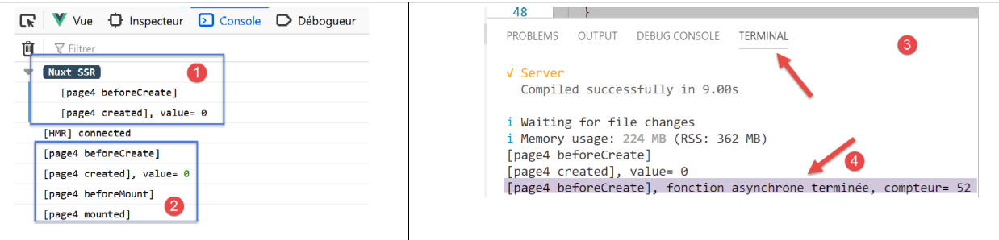

Exemple [nuxt-02] : pages serveur et client
=============================================

Dans ce projet, nous montrons :

-  que la page construite par le client peut être visuellement
   différente de celle reçue du serveur. On a alors un changement rapide
   de page, perceptible par l’utilisateur, et qui est donc nuisible à
   l’ergonomie de l’application. C’est donc une option à éviter ;

-  une solution pour que la page client recrée la même page que celle
   envoyée par le serveur ;

Le projet [nuxt-02] est obtenue initialement par recopie du projet
[nuxt-01].

|image0|

Un dossier [store] est ajouté au projet ainsi que deux nouvelles pages.
Nous y reviendrons.

1. .. rubric:: La page [index]
      :name: la-page-index

   1. .. rubric:: Le code de la page
         :name: le-code-de-la-page

Le code de la page [index] devient le suivant :

.. code-block:: javascript 
   :linenos:

   <!-- page principale -->
   <template>
     <Layout :left="true" :right="true">
       <!-- navigation -->
       <Navigation slot="left" />
       <!-- message-->
       <b-alert slot="right" show variant="warning"> Home - value= {{ value }} </b-alert>
     </Layout>
   </template>

   

**Commentaires**

-  ligne 7 : la page [index] va afficher la valeur de sa propriété
   [value] (ligne 28) ;

-  lignes 36-45 : il faut se rappeler ici que la fonction [created] est
   exécutée à la fois côté serveur et côté client. Lignes 40-42, le
   serveur fera passer à 10 la valeur de la propriété [value]. Le
   client, lui, ne touche pas à cette valeur. On veut simplement savoir
   si cette valeur est conservée par le client. On va découvrir que
   non ;

   1. .. rubric:: Exécution
         :name: exécution

Nous modifions le fichier [/nuxt.config.js] pour exécuter le projet
[nuxt-02] :

.. code-block:: javascript 
   :linenos:

   ...
     // répertoire du code source
     srcDir: 'nuxt-02',
     // routeur
     router: {
       // racine des URL de l'application
       base: '/nuxt-02/'
     },
     // serveur
     server: {
       // port de service, 3000 par défaut
       port: 81,
       // adresses réseau écoutées, par défaut localhost : 127.0.0.1
       // 0.0.0.0 = toutes les adresses réseau de la machine
       host: 'localhost'
     }
   ...

Nous exécutons le projet [1] :

|image1|

La page [index] est alors affichée [2-3]. Elle affiche la valeur [10]
pendant quelques instants puis affiche la valeur [0]. Que s’est-il
passé ?

**étape 1**

C’est le serveur qui s’exécute le premier. Il exécute le code de la page
[index] :

.. code-block:: javascript 
   :linenos:

   export default {
     name: 'Home',
     // composants utilisés
     components: {
       Layout,
       Navigation
     },
     data() {
       return {
         value: 0
       }
     },
     // cycle de vie
     beforeCreate() {
       // client et serveur
       console.log('[home beforeCreate]')
     },
     created() {
       // client et serveur
       console.log('[home created]')
       // serveur seulement
       if (process.server) {
         this.value = 10
       }
       // client et serveur
       console.log('value=', this.value)
     },
     beforeMount() {
       // client seulement
       console.log('[home beforeMount]')
     },
     mounted() {
       // client seulement
       console.log('[home mounted]')
     }
   }

-  à cause de la ligne 23, la propriété [value] de la ligne 10 prend la
   valeur 10 ;

On peut le vérifier en regardant le code source de la page reçue par le
navigateur (option [code source] dans le navigateur) :

.. code-block:: javascript 
   :linenos:

   <!doctype html>
   <html data-n-head-ssr>
   <head>
     <title>Introduction à [nuxt.js]</title>
     <meta data-n-head="ssr" charset="utf-8">
     <meta data-n-head="ssr" name="viewport" content="width=device-width, initial-scale=1">
     <meta data-n-head="ssr" data-hid="description" name="description" content="ssr routing loading asyncdata middleware plugins store">
     <link data-n-head="ssr" rel="icon" type="image/x-icon" href="/favicon.ico">
     <base href="/nuxt-02/">
     <link rel="preload" href="/nuxt-02/_nuxt/runtime.js" as="script">
     <link rel="preload" href="/nuxt-02/_nuxt/commons.app.js" as="script">
     <link rel="preload" href="/nuxt-02/_nuxt/vendors.app.js" as="script">
     <link rel="preload" href="/nuxt-02/_nuxt/app.js" as="script">
     ....
   </head>
   <body>
     

       

         

           

             

               

                 <h4>[nuxt-02] : page serveur, page client</h4>
               
 

                 

                   

                     <ul class="nav flex-column">
                       <li class="nav-item">
                         <a href="/nuxt-02/" target="_self" class="nav-link active nuxt-link-active">
                           Home
                         </a>
                       </li>
                       <li class="nav-item">
                         <a href="/nuxt-02/page1" target="_self" class="nav-link">
                           Page 1
                         </a>
                       </li>
                       <li class="nav-item">
                         <a href="/nuxt-02/page2" target="_self" class="nav-link">
                           Page 2
                         </a>
                       </li>
                     </ul>
                   
 

                     

                       Home - value= 10
                     

                   

                 

               

             

           

         

       

     

     
     
     
     
     
   </body>
   </html>

-  ligne 46 : dans la page reçue, [value] avait la valeur 10 ;

**étape 2**

On sait qu’après réception de la page, les scripts des lignes 57-60
prennent la main et transforment le comportement de la page reçue, voire
les informations affichées comme ici. Ces scripts forment le client qui
lui aussi exécute le code de la page [index], le même code que le
serveur :

.. code-block:: javascript 
   :linenos:

   export default {
     name: 'Home',
     // composants utilisés
     components: {
       Layout,
       Navigation
     },
     data() {
       return {
         value: 0
       }
     },
     // cycle de vie
     beforeCreate() {
       // client et serveur
       console.log('[home beforeCreate]')
     },
     created() {
       // client et serveur
       console.log('[home created]')
       // serveur seulement
       if (process.server) {
         this.value = 10
       }
       // client et serveur
       console.log('value=', this.value)
     },
     beforeMount() {
       // client seulement
       console.log('[home beforeMount]')
     },
     mounted() {
       // client seulement
       console.log('[home mounted]')
     }
   }

-  pour comprendre ce qui se passe, il faut comprendre que le client
   [nuxt] n’exécutera pas les lignes 22-24 (process.server=false) ;

-  dans une application [vue] classique la propriété [value] de la ligne
   10 reste à 0. C’est pourquoi, une fois que le client est passé sur la
   page reçue, la valeur affichée devient [0] ;

La valeur générée par le serveur [nuxt] pour la propriété [value] n’a
servi à rien.

1. .. rubric:: La page [page1]
      :name: la-page-page1

   1. .. rubric:: Le store [Vuex]
         :name: le-store-vuex

Nous avons ajouté un dossier [store] au projet [nuxt-02] :

|image2|

La présence de ce dossier fait qu’automatiquement [nuxt] va implémenter
un store [Vuex]. C’est le fichier [index.js] qui implémente ce store.
Ici, le fichier [index.js] est le suivant :

.. code-block:: javascript 
   :linenos:

   export const state = () => ({
     counter: 0
   })

   export const mutations = {
     increment(state, inc) {
       state.counter += inc
     }
   }

[nuxt] implémente un store [Vuex] à partir du contenu de [index.js] :

-  lignes 1-3 : définition de l’état [state] du store. Cet état est
   retourné par une **fonction**. Ici, l’état n’a qu’une propriété, le
   compteur de la ligne 2. La fonction exportée doit s’appeler [state] ;

-  lignes 5-9 : les opération possibles sur l’état du store. On les
   appelle des [mutations]. Ici, la mutation [increment] permet
   d’incrémenter la propriété [counter] d’une quantité [inc]. L’objet
   exporté doit s’appeler [mutations] ;

Le [store] Vuex implémenté par [nuxt] est disponible à différents
endroits. Dans les vues, il est disponible dans la propriété
[**this.$store**].

.. _le-code-de-la-page-1:

Le code de la page
~~~~~~~~~~~~~~~~~~

Comme la page [index], la page [page1] va afficher une valeur, celle du
compteur du store Vuex :

.. code-block:: javascript 
   :linenos:

   <!-- page 1 -->
   <template>
     <Layout :left="true" :right="true">
       <!-- navigation -->
       <Navigation slot="left" />
       <!-- message-->
       <b-alert slot="right" show variant="primary"> Page 1 - value = {{ value }} </b-alert>
     </Layout>
   </template>

   

**Commentaires**

-  lignes 38-40 : le serveur va incrémenter le compteur de 25 ;

-  ligne 42 : aussi bien le serveur que le client vont afficher la
   valeur du compteur ;

-  ligne 7 : la valeur du compteur est affichée ;

En lisant ce code, il faut comprendre deux choses :

-  le code exécuté est le même pour le serveur que le client ;

-  l’objet [this] n’est lui pas le même : il y a une version [this] côté
   serveur et une autre côté [client] ;

Nous cherchons à savoir si le [this.$store] du serveur est le même que
le [this.$store] du client. Comme c’est le serveur qui s’exécute en
premier (au démarrage de l’application), cela revient à se poser la
question : est-ce que le [store] initialisé par le serveur est transmis
au client ?

.. _exécution-1:

Exécution
~~~~~~~~~

On exécute le projet [nuxt-02] et on tape
[localhost:81/nuxt-02/**page1**] à la main pour que le serveur soit
sollicité. Comme au démarrage pour la page [index] :

-  le serveur exécute la page [page1.vue] ;

-  envoie la page générée au navigateur. Celle-ci est affichée ;

-  les scripts client embarqués dans la page envoyée prennent la main et
   exécutent à nouveau la page [page1.vue] ;

-  la page affichée est alors modifiée ;

Le résultat final est le suivant :

|image3|

Cette fois-ci, la valeur affichée est bien celle fixée par le serveur et
visuellement, on ne voit pas la page ‘tressauter’ à cause d’un
changement par le client de la valeur affichée par le serveur. Cette
fois-ci que s’est-il passé ?

Le serveur a exécuté la page [page1] suivante :

.. code-block:: javascript 
   :linenos:

   ...

   

-  les lignes 30-32 ont été exécutées sans erreur. Ce qui signifie que
   côté serveur également, [this.$store] désigne le store [Vuex]. La
   ligne 31 a fait passer le compteur du store à 25 ;

-  ceci fait, la page a été envoyée au client ;

Si on regarde la page reçue par le client, on trouve les éléments
suivants :

.. code-block:: javascript 
   :linenos:

   <!doctype html>
   <html data-n-head-ssr>
   <head>
     <title>Introduction à [nuxt.js]</title>
     <meta data-n-head="ssr" charset="utf-8">
     <meta data-n-head="ssr" name="viewport" content="width=device-width, initial-scale=1">
     <meta data-n-head="ssr" data-hid="description" name="description" content="ssr routing loading asyncdata middleware plugins store">
     <link data-n-head="ssr" rel="icon" type="image/x-icon" href="/favicon.ico">
     <base href="/nuxt-02/">
     <link rel="preload" href="/nuxt-02/_nuxt/runtime.js" as="script">
     <link rel="preload" href="/nuxt-02/_nuxt/commons.app.js" as="script">
     <link rel="preload" href="/nuxt-02/_nuxt/vendors.app.js" as="script">
     <link rel="preload" href="/nuxt-02/_nuxt/app.js" as="script">
     ...
   </head>
   <body>
     

       

         

           

             

               

                 <h4>[nuxt-02] : page serveur, page client</h4>
               

               

                 

                   

                     <ul class="nav flex-column">
                       <li class="nav-item">
                         <a href="/nuxt-02/" target="_self" class="nav-link">
                           Home
                         </a>
                       </li>
                       <li class="nav-item">
                         <a href="/nuxt-02/page1" target="_self" class="nav-link active nuxt-link-active">
                           Page 1
                         </a>
                       </li>
                       <li class="nav-item">
                         <a href="/nuxt-02/page2" target="_self" class="nav-link">
                           Page 2
                         </a>
                       </li>
                     </ul>
                   
 

                     

                       Page 1 - value = 25
                     

                   

                 

               

             

           

         

       

     

     
     
     
     
     
   </body>
   </html>

-  ligne 47 : la valeur envoyée par le serveur ;

-  ligne 60 : on constate que l’état du store [Vuex] a été embarqué dans
   la page. Cela va permettre au client qui va s’exécuter après
   réception de la page, de reconstituer un nouveau store [Vuex] avec 25
   comme valeur initiale du compteur ;

Après réception et affichage de la page reçue du serveur, le client
prend la main et exécute à son tour la page [page1] :

.. code-block:: javascript 
   :linenos:

   ...

   

-  ligne 34 : la propriété [value] de la ligne 18 reçoit à son tour la
   valeur 25 du compteur ;

Le store de [nuxt] permet donc au serveur de transmettre des
informations au client lors du chargement initial de la page, lorsque
celle-ci est cherchée sur le serveur. On rappelle qu’une fois cette page
obtenue, le serveur n’est plus sollicité et l’application fonctionne
comme une application [vue] classique, en mode SAP.

La page [page2]
---------------

Dans la page [page2], nous montrons une autre façon pour que :

-  le serveur inclut des informations calculées dans la page ;

-  le client ne modifie pas celles-ci ;

   1. .. rubric:: Le code de la page
         :name: le-code-de-la-page-2

Le code de la page [page2] évolue de la façon suivante :

.. code-block:: javascript 
   :linenos:

   <!-- page2 -->
   <template>
     <Layout :left="true" :right="true">
       <!-- navigation -->
       <Navigation slot="left" />
       <!-- message -->
       <b-alert slot="right" show variant="secondary"> Page 2 - value = {{ value }} </b-alert>
     </Layout>
   </template>

   

-  ligne 7 : la page affiche la valeur d’une propriété nommée [value] ;

-  la propriété [value] n’existe pas comme élément d’un objet rendu par
   la fonction [data]. Ici cette fonction n’existe pas. La propriété
   [value] est créée dynamiquement par la ligne 36 ;

-  ligne 25 : la fonction [asyncData] est une fonction [nuxt]. Comme son
   nom l’indique, c’est normalement une fonction asynchrone. Son rôle
   habituel est d’aller chercher des données externes. [nuxt] assure que
   la page n’est pas envoyée au navigateur client avant que la fonction
   [asyncData] n’ait rendu ses données asynchrones ;

-  la fonction [asyncData] reçoit comme paramètre le contexte [nuxt].
   Cet objet est très dense et donne accès à beaucoup d’informations sur
   l’application [nuxt. Nous le découvrirons dans les sections à venir ;

-  ligne 31 : on implémente la fonction [asyncData] avec une [Promise]
   (cf document \|\ `Introduction au langage ECMASCRIPT 6 par
   l’exemple <https://tahe.developpez.com/tutoriels-cours/ecmascript6>`__\ \|).
   Le constructeur de cette classe accepte comme paramètre une fonction
   asynchrone qui :

   -  signale un succès en rendant des données avec la fonction
      [resolve]. L’objet rendu par cette fonction est automatiquement
      inclus dans les propriétés [data] de la page ;

   -  signale un échec en rendant une erreur avec la fonction [reject] ;

-  ligne 34 : on simule une fonction asynchrone avec la fonction
   [setTimeout]. Cette fonction rend l’objet [{ value: 87 }] (ligne 36)
   au bout d’une seconde (ligne 31) grâce à la fonction [resolve] qui
   signale un succès de la [Promise]. L’objet rendu par la fonction
   asynchrone est inclus automatiquement dans les propriétés [data] de
   la page. Et c’est donc cette propriété que la ligne 7 affiche ;

-  ligne 27 : nous allons découvrir que la fonction [asyncData] est
   exécutée par le serveur mais pas par le client ;

-  ligne 29 : l’initialisation de la propriété [value] est faite par le
   serveur ;

**Note** : l’objet [this] n’est pas connu dans la fonction [asyncData]
car l’objet encapsulant le composant [vue] n’a pas encore été créé ;

.. _exécution-2:

Exécution
~~~~~~~~~

On exécute le projet [nuxt-02] et on tape
[localhost:81/nuxt-02/**page2**] à la main pour que le serveur soit
sollicité. Comme au démarrage pour la page [index] :

-  le serveur exécute la page [page2.vue] ;

-  envoie la page générée au navigateur. Celle-ci est affichée ;

-  les scripts client embarqués dans la page envoyée prennent la main et
   exécutent à nouveau la page [page2.vue] ;

-  la page affichée est alors modifiée ;

Le résultat final est le suivant :

|image4|

Cette fois-ci, la valeur affichée est bien celle fixée par le serveur et
visuellement, on ne voit pas la page ‘tressauter’ à cause d’un
changement par le client de la valeur affichée par le serveur. Cette
fois-ci que s’est-il passé ?

Le serveur a exécuté la page [page2] suivante :

.. code-block:: javascript 
   :linenos:

   <!-- page2 -->
   <template>
     <Layout :left="true" :right="true">
       <!-- navigation -->
       <Navigation slot="left" />
       <!-- message -->
       <b-alert slot="right" show variant="secondary"> Page 2 - value = {{ value }} </b-alert>
     </Layout>
   </template>

   

C’est la ligne 36 qui a fixé la valeur affichée par la ligne 7. C’est
donc ce qu’a reçu le navigateur client. Très exactement il reçoit la
page suivante :

.. code-block:: javascript 
   :linenos:

   <!doctype html>
   <html data-n-head-ssr>
   <head>
     <title>Introduction à [nuxt.js]</title>
     <meta data-n-head="ssr" charset="utf-8">
     <meta data-n-head="ssr" name="viewport" content="width=device-width, initial-scale=1">
     <meta data-n-head="ssr" data-hid="description" name="description" content="ssr routing loading asyncdata middleware plugins store">
     <link data-n-head="ssr" rel="icon" type="image/x-icon" href="/favicon.ico">
     <base href="/nuxt-02/">
     <link rel="preload" href="/nuxt-02/_nuxt/runtime.js" as="script">
     <link rel="preload" href="/nuxt-02/_nuxt/commons.app.js" as="script">
     <link rel="preload" href="/nuxt-02/_nuxt/vendors.app.js" as="script">
     <link rel="preload" href="/nuxt-02/_nuxt/app.js" as="script">
     ...
   </head>
   <body>
     

       

         

           

             

               

                 <h4>[nuxt-02] : page serveur, page client</h4>
               

               

                 

                   

                     <ul class="nav flex-column">
                       <li class="nav-item">
                         <a href="/nuxt-02/" target="_self" class="nav-link">
                           Home
                         </a>
                       </li>
                       <li class="nav-item">
                         <a href="/nuxt-02/page1" target="_self" class="nav-link">
                           Page 1
                         </a>
                       </li>
                       <li class="nav-item">
                         <a href="/nuxt-02/page2" target="_self" class="nav-link active nuxt-link-active">
                           Page 2
                         </a>
                       </li>
                     </ul>
                   

                   

                     

                       Page 2 - value = 87
                     

                   

                 

               

             

           

         

       

     

     
     
     
     
     
   </body>
   </html>

-  ligne 48 : on voit que la valeur dans la page reçue est 87 ;

-  ligne 61 : dans la réponse du serveur, on voit deux objets : [data]
   et [state] :

   -  [state] est l’état du store [Vuex]. Celui-ci a été instancié à
      partir du contenu du dossier [store] de l’application [nuxt-02] ;

   -  [data] contient les propriétés créées par le serveur grâce à la
      fonction [asyncData]. On retrouve la propriété [value : 87] créée
      par le serveur. Les scripts du client vont intégrer cette
      propriété dans celles de la page [page2] ;

Revenons au code de la page [page2] :

.. code-block:: javascript 
   :linenos:

   <!-- page2 -->
   <template>
     <Layout :left="true" :right="true">
       <!-- navigation -->
       <Navigation slot="left" />
       <!-- message -->
       <b-alert slot="right" show variant="secondary"> Page 2 - value = {{ value }} </b-alert>
     </Layout>
   </template>

   

-  la ligne 7 utilise la propriété [value]. Or la page ne définit aucune
   propriété nommée [value]. Cependant les scripts du client ont créé
   automatiquement cette propriété grâce à l’objet [data: [{ value: 87
   }]] reçue du serveur ;

Les logs montrent par ailleurs que la fonction [asyncData] n’a pas été
exécutée par le client :

|image5|

La fonction [asyncData] a été exécutée par le serveur [1] mais pas par
le client [2]. Par ailleurs, on peut noter que les fonctions du cycle de
vie ne sont pas exécutées par le serveur avant la fin de la fonction
[asyncData]. On peut augmenter la durée de l’attente au sein de la
fonction [asyncData] pour le vérifier.

La page [page3]
---------------

Nous ajoutons une nouvelle page [page3] à notre application :

|image6|

Le composant [navigation]
~~~~~~~~~~~~~~~~~~~~~~~~~

Le composant [vavigation] est modifié pour permettre la navigation vers
la nouvelle page :

.. code-block:: javascript 
   :linenos:

   <template>
     <!-- menu Bootstrap à trois options -->
     <b-nav vertical>
       <b-nav-item to="/" exact exact-active-class="active">
         Home
       </b-nav-item>
       <b-nav-item to="/page1" exact exact-active-class="active">
         Page 1
       </b-nav-item>
       <b-nav-item to="/page2" exact exact-active-class="active">
         Page 2
       </b-nav-item>
       <b-nav-item to="/page3" exact exact-active-class="active">
         Page 3
       </b-nav-item>
     </b-nav>
   </template>

Le code de [page3]
~~~~~~~~~~~~~~~~~~

Le code de la page [page3] est le suivant :

.. code-block:: javascript 
   :linenos:

   <!-- page3 -->
   <template>
     <Layout :left="true" :right="true">
       <!-- navigation -->
       <Navigation slot="left" />
       <!-- message -->
       <b-alert slot="right" show variant="secondary"> Page 3 - value = {{ value }} </b-alert>
     </Layout>
   </template>

   

-  ligne 30 : la fonction [fetch] a un comportement analogue à celui de
   la fonction [asyncData] :

   -  elle est exécutée avant les fonctions du cycle de vie ;

   -  l’objet [this] n’est pas connu dans cette fonction ;

   -  son fonctionnement est asynchrone ;

   -  le cycle de vie ne commence pas tant que la fonction asynchrone
      n’a pas rendu son résultat ;

   -  le résultat est ici rendu par la méthode [then] de la [Promise],
      ligne 43 ;

   -  fonction [fetch] reçoit le paramètre [context]. Celui-ci
      représente le contexte [nuxt] du moment ;

-  ligne 30 : parmi ses nombreuses propriétés, l’objet [context] a une
   propriété [store] qui représente le store [Vuex] de l’application ;

-  ligne 41 : artificiellement, on signale le succès de la [Promise] au
   bout d’une seconde (cf. document \|\ `Introduction au langage
   ECMASCRIPT 6 par
   l’exemple <https://tahe.developpez.com/tutoriels-cours/ecmascript6>`__\ \|)
   ;

-  ligne 45 : la méthode [then] est alors exécutée. On y incrémente le
   compteur du [store] ;

   1. .. rubric:: Exécution
         :name: exécution-3

On exécute le projet [nuxt-02] et on tape
[localhost:81/nuxt-02/**page3**] à la main pour que le serveur soit
sollicité. Comme au démarrage pour la page [index] :

-  le serveur exécute la page [page3.vue] ;

-  envoie la page générée au navigateur. Celle-ci est affichée ;

-  les scripts client embarqués dans la page envoyée prennent la main et
   exécutent à nouveau la page [page3.vue] ;

-  la page affichée est alors modifiée ;

Le résultat final est le suivant :

|image7|

La valeur affichée est bien celle fixée par le serveur et visuellement,
on ne voit pas la page ‘tressauter’ à cause d’un changement par le
client de la valeur affichée par le serveur. Cette fois-ci que s’est-il
passé ?

Le serveur a exécuté la page [page3] suivante :

.. code-block:: javascript 
   :linenos:

   <!-- page3 -->
   <template>
     <Layout :left="true" :right="true">
       <!-- navigation -->
       <Navigation slot="left" />
       <!-- message -->
       <b-alert slot="right" show variant="secondary"> Page 3 - value = {{ value }} </b-alert>
     </Layout>
   </template>

   

-  ligne 45 : la fonction asynchrone [fetch] est la première des
   fonctions ci-dessus à s’exécuter. Elle reçoit en paramètre, un objet
   appelé [context] qui est le contexte [nuxt] du moment. Parmi les très
   nombreuses propriétés de cet objet, la propriété [context.store]
   représente le store [Vuex] ;

-  ligne 45 : dans la fonction asynchrone [fetch], le serveur fixe le
   compteur du store à 28 ;

-  ligne 56 : lorsque la fonction [created] s’exécute, [nuxt] garantit
   que la fonction asynchrone [fetch] a terminé son travail ;

-  ligne 58 : la valeur du compteur du store est affectée à la propriété
   [value] de la ligne 27 ;

-  ligne 7 : affichage de la valeur de [value], donc du compteur du
   store ;

Le navigateur client reçoit la page suivante :

.. code-block:: javascript 
   :linenos:

   <!doctype html>
   <html data-n-head-ssr>
   <head>
     <title>Introduction à [nuxt.js]</title>
     <meta data-n-head="ssr" charset="utf-8">
     <meta data-n-head="ssr" name="viewport" content="width=device-width, initial-scale=1">
     <meta data-n-head="ssr" data-hid="description" name="description" content="ssr routing loading asyncdata middleware plugins store">
     <link data-n-head="ssr" rel="icon" type="image/x-icon" href="/favicon.ico">
     <base href="/nuxt-02/">
     <link rel="preload" href="/nuxt-02/_nuxt/runtime.js" as="script">
     <link rel="preload" href="/nuxt-02/_nuxt/commons.app.js" as="script">
     <link rel="preload" href="/nuxt-02/_nuxt/vendors.app.js" as="script">
     <link rel="preload" href="/nuxt-02/_nuxt/app.js" as="script">
     ...
   </head>
   <body>
     

       

         

           

             

               

                 <h4>[nuxt-02] : page serveur, page client</h4>
               

               

                 

                   

                     <ul class="nav flex-column">
                       <li class="nav-item">
                         <a href="/nuxt-02/" target="_self" class="nav-link">
                           Home
                         </a>
                       </li>
                       <li class="nav-item">
                         <a href="/nuxt-02/page1" target="_self" class="nav-link">
                           Page 1
                         </a>
                       </li>
                       <li class="nav-item">
                         <a href="/nuxt-02/page2" target="_self" class="nav-link">
                           Page 2
                         </a>
                       </li>
                       <li class="nav-item">
                         <a href="/nuxt-02/page3" target="_self" class="nav-link active nuxt-link-active">
                           Page 3
                         </a>
                       </li>
                     </ul>
                   
 

                     

                       Page 3 - value = 28
                     

                   

                 

               

             

           

         

       

     

     
     
     
     
     
   </body>
   </html>

-  ligne 52 : on voit que la valeur dans la page reçue est 28 ;

-  ligne 65 : dans la réponse du serveur, on voit que le serveur a
   envoyé au client l’état [state] du store [Vuex]. Grâce à cette
   information, les scripts client vont pouvoir reconstituer un store
   [Vuex] ;

Les scripts client vont à leur tour exécuter le code de la page
[page3] :

.. code-block:: javascript 
   :linenos:

   <!-- page3 -->
   <template>
     <Layout :left="true" :right="true">
       <!-- navigation -->
       <Navigation slot="left" />
       <!-- message -->
       <b-alert slot="right" show variant="secondary"> Page 3 - value = {{ value }} </b-alert>
     </Layout>
   </template>

   

-  line 58 : la fonction [created] exécutée par le client affecte la
   valeur du compteur à la propriété [value] de la ligne 27 ;

-  la ligne 7 affiche cette valeur. Puisque c’est la même que celle
   envoyée par le serveur, on ne voit pas la page ‘tressauter’ à cause
   d’une modification ;

Les logs montrent par ailleurs que la fonction [fetch] n’a pas été
exécutée par le client :

|image8|

La fonction [fetch] a été exécutée par le serveur [1] mais pas par le
client [2]. Par ailleurs, on peut noter que les fonctions du cycle de
vie ne sont pas exécutées par le serveur avant la fin de la fonction
[fetch] [3]. On peut augmenter la durée de l’attente au sein de la
fonction [fetch] pour le vérifier.

Les pages [page1] et [page3] ont montré deux méthodes utilisant le store
[Vuex] pour transmettre une information du serveur au client. On peut se
demander si elles sont équivalentes. Nous construisons une page [page4]
pour le vérifier.

La page [page4]
---------------

Nous ajoutons une nouvelle page [page4] à notre application :

|image9|

.. _le-composant-navigation-1:

Le composant [navigation]
~~~~~~~~~~~~~~~~~~~~~~~~~

Le composant [navigation] est modifié pour permettre la navigation vers
la nouvelle page :

.. code-block:: javascript 
   :linenos:

   <template>
     <!-- menu Bootstrap à cinq options -->
     <b-nav vertical>
       <b-nav-item to="/" exact exact-active-class="active">
         Home
       </b-nav-item>
       <b-nav-item to="/page1" exact exact-active-class="active">
         Page 1
       </b-nav-item>
       <b-nav-item to="/page2" exact exact-active-class="active">
         Page 2
       </b-nav-item>
       <b-nav-item to="/page3" exact exact-active-class="active">
         Page 3
       </b-nav-item>
       <b-nav-item to="/page4" exact exact-active-class="active">
         Page 4
       </b-nav-item>
     </b-nav>
   </template>

Le code de [page4]
~~~~~~~~~~~~~~~~~~

Le code de la page [page4] est le suivant :

.. code-block:: javascript 
   :linenos:

   <!-- page4 -->
   <template>
     <Layout :left="true" :right="true">
       <!-- navigation -->
       <Navigation slot="left" />
       <!-- message -->
       <b-alert slot="right" show variant="secondary"> Page 4 - value = {{ value }} </b-alert>
     </Layout>
   </template>

   

-  ligne 30 : ce qui était fait auparavant dans la fonction [fetch] est
   désormais fait dans la méthode [beforeCreate]. On utilise le couple
   async (ligne 30) / await (ligne 36) pour attendre la fin de la
   fonction asynchrone ;

-  ligne 36 : on récupère le résultat de la fonction asynchrone rendu
   ligne 41 après 10 secondes (ligne 42) ;

-  lignes 50-54 : dans la méthode [created] exécutée aussi bien côté
   serveur que côté client, le compteur est affecté à la propriété
   [value] de la page ;

   1. .. rubric:: Exécution
         :name: exécution-4

On exécute le projet [nuxt-02] et on tape
[localhost:81/nuxt-02/**page4**] à la main pour que le serveur soit
sollicité. Comme au démarrage pour la page [index] :

-  le serveur exécute la page [page4.vue] ;

-  envoie la page générée au navigateur. Celle-ci est affichée ;

-  les scripts client embarqués dans la page envoyée prennent la main et
   exécutent à nouveau la page [page4.vue] ;

-  la page affichée est alors modifiée ;

Le résultat final est le suivant :

|image10|

Contrairement à ce qui était attendu, la valeur affichée en [2] n’est
pas 52. Que s’est-il passé ?

Les logs sont les suivants :

|image11|

On peut remarquer qu’en [1] le log de fin de l’action asynchrone n’a pas
été affiché. La fonction [created] qui affiche la valeur du compteur,
affiche 0. Tout cela laisse penser que [nuxt] n’a pas attendu la fin de
l’action asynchrone.

Si on retourne dans le terminal de VSCode qui a servi au lancement de
l’application, on trouve les logs [3-4]. On voit que la fonction
asynchrone a bien été exécutée côté serveur.

Au final, la fonction [beforeCreate] a bien été exécutée totalement côté
serveur, mais [nuxt] n’a pas attendu la fin de son exécution pour
envoyer la page au navigateur client alors qu’il attend bien la fin de
la fonction [fetch]. C’est donc cette méthode qu’il faut utiliser si on
veut que le serveur initialise un store [Vuex].

Navigation dans l’application [vue]
-----------------------------------

Nous avons montré ce qui se passait lorsque chacune des pages [index,
page1, page2, page3, page4] était chargée initialement par le serveur.
Dans la pratique, ce n’est pas ce qui se passe : dans un fonctionnement
normal, seule la page [index] est cherchée sur le serveur. Voyons les
trois pages dans ce cas là :

**page [index]**

|image12|

Nous avons déjà expliqué ce résultat au paragraphe
`lien <chap-05.html#nuxt02_index_execution>`__.

Maintenant cliquons sur le lien [Page 1] :

|image13|

La valeur affichée est 0. C’était 25 lorsque la page était d’abord
demandée au serveur en tapant son URL à la main. L’explication est
simple. Le code exécuté est le suivant :

.. code-block:: javascript 
   :linenos:

     created() {
       // client et serveur
       console.log('[page1 created]')
       // serveur seulement
       if (process.server) {
         this.$store.commit('increment', 25)
       }
       // client et serveur
       this.value = this.$store.state.counter
       console.log('value=', this.value)
   },

C’est la ligne 6 qui mettait le compteur à 25. Comme la page n’a pas été
demandée au serveur, les lignes 5-7 n’ont pas été exécutées et le
compteur du store [Vuex] est resté à 0.

Maintenant, cliquons sur le lien [Page 2] :

|image14|

Cette fois-ci, aucune valeur n’est affichée et on a de plus un
avertissement dans les logs de la console :

|image15|

-  en [1], on découvre que la fonction [asyncData] a été exécutée par le
   client. C’est toujours ainsi :

   -  elle est exécutée par le serveur si la page est demandée au
      serveur. dans ce cas, elle n’est pas exécutée par le client ;

   -  puis à chaque fois que la page est la **cible** de la route
      courante du client ;

-  en [2] : [nuxt] émet un avertissement parce que dans le template de
   la page, il y a une expression réactive {{ value }} alors que la page
   n’a pas de propriété [value] ;

Rappelons le code exécuté par le client :

.. code-block:: javascript 
   :linenos:

   asyncData() {
       // qui exécute ce code ?
       console.log('asyncData, client=', process.client, 'serveur=', process.server)
       // seulement pour le serveur
       if (process.server) {
         // on retourne une promesse
         return new Promise(function(resolve, reject) {
           // on a normalement ici une fonction asynchrone - pas ici donc
           // ce résultat sera inclus dans les propriétés de [data]
           resolve({ value: 87 })
         })
       }
     },

-  la ligne 3 a permis de voir que la fonction [asyncData] a été
   exécutée par le client avant même les fonctions du cycle de vie ;

-  la ligne 5 a empêché l’exécution du reste du code qui créait la
   propriété [value] car ce code est exécuté par le client ;

Maintenant passons à la page [page3] :

|image16|

-  en [2], on avait 28 lorsque la page était fournie par le serveur. Ici
   ce n’est pas le cas ;

-  en [4], on voit que la fonction [fetch] a été exécutée côté client ;

Examinons le code exécuté par le client :

.. code-block:: javascript 
   :linenos:

   ...
   fetch(context) {
       // qui exécute ce code ?
       console.log('fetch, client=', process.client, 'serveur=', process.server)
       // seulement pour le serveur
       if (process.server) {
         // on retourne une promesse
         return new Promise(function(resolve, reject) {
           // on a normalement ici une fonction asynchrone
           // on la simule avec une attente d'une seconde
           setTimeout(() => {
             // succès
             resolve()
           }, 1000)
         }).then(() => {
           // on modifie le store
           context.store.commit('increment', 28)
           // log
           console.log('fetch commit terminé')
         })
       }
   },
   ...

-  le client exécute la méthode [fetch], ligne 2 ;

-  les lignes 6-21 ne sont pas exécutées car la condition
   [process.server] est fausse. Donc la ligne 17 qui met le compteur à
   28 n’est pas exécuté. Il reste à zéro. C’est pourquoi le client
   affiche 0 au lieu de 28 ;

Passons maintenant à la page [page4]. On a le résultat suivant :

|image17|

-  en [2], la valeur du compteur ;

-  en [3], les logs du client ;

Le code exécuté par le client est le suivant :

.. code-block:: javascript 
   :linenos:

   ...
   data() {
       return {
         value: 0
       }
     },
     // cycle de vie
     async beforeCreate() {
       // client et serveur
       console.log('[page4 beforeCreate]')
       // seulement pour le serveur
       if (process.server) {
         // on exécute la fonction asynchrone
         const valeur = await new Promise(function(resolve, reject) {
           // on a normalement ici une fonction asynchrone
           // on la simule avec une attente de 10 secondes
           setTimeout(() => {
             // succès - on rend la valeur du compteur
             resolve(52)
           }, 10000)
         })
         // on modifie le store
         this.$store.commit('increment', valeur)
         // log
         console.log('[page4 beforeCreate], fonction asynchrone terminée, compteur=', this.$store.state.counter)
       }
     },
     created() {
       // client et serveur
       this.value = this.$store.state.counter
       console.log('[page4 created], value=', this.value)
     },
   ...

-  les lignes 12-26 ne sont pas exécutées par le client, car la
   condition [process.server] de la ligne 12 est fausse. Donc le
   compteur du store [Vuex] vaut 0 (sa valeur initiale dans le store) et
   c’est cette valeur qu’affiche la page ;

On peut se demander ce qui se passe lorsqu’on met en commentaires le
[if] des lignes 12 et 26. Voici la réponse :

-  le client exécute cette fois les lignes 14-25 mais [nuxt] n’attend
   pas la fin de la fonction asynchrone (comme pour le serveur) et
   laisse donc le compteur à 0 ;

-  au bout de 10 s, la fonction asynchrone se termine et le compteur est
   mis à 52 ligne 23 ;

-  lorsqu’on navigue de nouveau vers la page [page4], c’est alors la
   valeur 52 qui est affichée ;

   1. .. rubric:: Résumé
         :name: résumé

De nos différents essais, on retiendra les points suivants :

-  si la page [index] doit contenir des données externes, celles-ci
   peuvent être cherchées par le serveur avec la fonction [asyncData] ;

-  si le serveur doit initialiser un store [Vuex] avec des données
   externes au chargement de la page [index], il le fera dans la
   fonction [fetch] ;

-  la page générée par le serveur et la page générée par le client
   doivent être **identiques** si on veut éviter l’effet de
   ‘tressautement’ provoqué par le fait que la page du client vient
   visuellement remplacer la page envoyée par le serveur et initialement
   affichée ;

Nous allons découvrir d’autres aspects de [nuxt] au travers d’un nouvel
exemple.

.. |image0| image:: ./chap-05/media/image1.png
   :width: 1.54724in
   :height: 2.12598in

.. |image7| image:: ./chap-05/media/image8.png
   :width: 5.02362in
   :height: 2.55472in

.. |image13| image:: ./chap-05/media/image14.png
   :width: 4.47244in
   :height: 2.01969in

