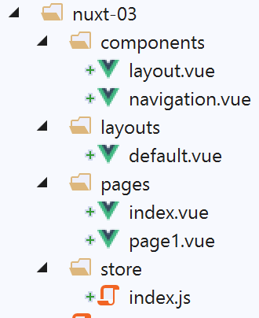
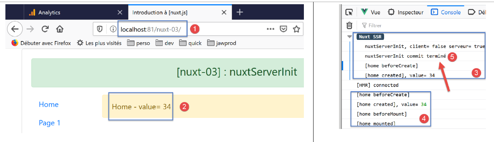
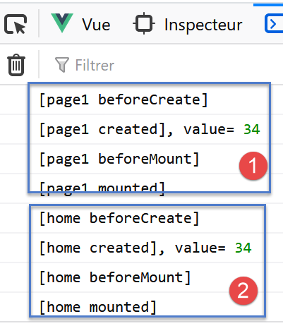
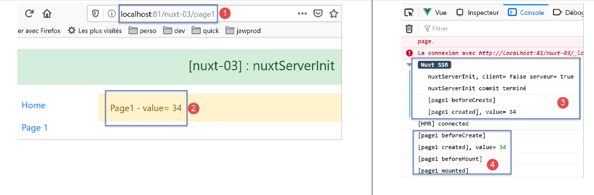

Exemple [nuxt-03] : nuxtServerInit
====================================

Le projet [nuxt-03] vise à présenter une fonction du store [Vuex]
appelée [nuxtServerInit]. Elle permet au serveur d’initialiser le store
[Vuex] comme le fait la fonction [fetch]. Mais contrairement à la
fonction [fetch], la fonction [nuxtServerInit] n’est jamais exécutée par
le client.

|image0|

Le projet [nuxt-03] est initialement obtenu par recopie du projet
[nuxt-01] duquel on supprime la page [page2] du dossier [pages] et du
composant [navigation]. Le dossier [store] est obtenu par recopie du
dossier [nuxt-02/store].

Le store [Vuex]
---------------

Le store [Vuex] sera implémenté par le fichier [store/index.js]
suivant :

.. code-block:: javascript 
   :linenos:

   /* eslint-disable no-console */
   export const state = () => ({
     // compteur
     counter: 0
   })

   export const mutations = {
     // incrémentation du compteur d'une valeur [inc]
     increment(state, inc) {
       state.counter += inc
     }
   }

   export const actions = {
     async nuxtServerInit(store, context) {
       // qui exécute ce code ?
       console.log('nuxtServerInit, client=', process.client, 'serveur=', process.server)
       // on attend la fin d'une promesse
       await new Promise(function(resolve, reject) {
         // on a normalement ici une fonction asynchrone
         // on la simule avec une attente d'une seconde
         setTimeout(() => {
           // succès
           resolve()
         }, 1000)
       })
       // on modifie le store
       store.commit('increment', 34)
       // log
       console.log('nuxtServerInit commit terminé')
     }
   }

-  lignes 1-12 : sont analogues à ce qu’elles étaient dans le projet
   [nuxt-02] ;

-  lignes 14-32 : on exporte un objet [actions]. C’est un terme réservé
   du store de [Vuex] ;

-  ligne 15 : on définit la fonction [nuxtServerInit]. Celle-ci sera
   exécutée au démarrage de l’application par le serveur. Son rôle usuel
   est d’initialiser un store [Vuex] à l’aide de données externes
   obtenues avec une fonction asynchrone. [nuxt] attend que celle-ci
   rende ses résultats avant d’entamer le cycle de vie de la page
   demandée. La fonction reçoit deux paramètres :

   -  le store [Vuex] à initialiser ;

   -  le contexte [nuxt] du moment ;

-  lignes 19-26 : on attend la fin de l’action asynchrone, ici une
   attente artificielle d’une seconde (ligne 15) ;

-  ligne 28 : on donne au compteur la valeur 34 ;

-  lignes 17 et 30 : des logs pour suivre le déroulement de l’exécution
   de la fonction [nuxtServerInit] ;

   1. .. rubric:: La page [index]
         :name: la-page-index

La page [index] sera la suivante :

.. code-block:: javascript 
   :linenos:

   <!-- page [index] -->
   <template>
     <Layout :left="true" :right="true">
       <!-- navigation -->
       <Navigation slot="left" />
       <!-- message-->
       <b-alert slot="right" show variant="warning"> Home - value= {{ value }} </b-alert>
     </Layout>
   </template>

   

-  ligne 37 : la valeur du compteur initialisé par la fonction
   [nuxtServerInit] est affectée à la propriété [value] de la ligne 27.
   Cette valeur est affichée par la ligne 7 ;

-  la ligne 37 sera exécutée aussi bien par le serveur que par le
   client. Dans les deux cas, la propriété [value] recevra la même
   valeur ce qui assure l’identité de la page générée par le serveur
   avec celle générée par le client ;

   1. .. rubric:: La page [page1]
         :name: la-page-page1

La page [page1] est obtenue par recopie de la page [index]. On modifie
ensuite son texte pour remplacer [home] par [page1] :

.. code-block:: javascript 
   :linenos:

   <!-- page [page1]] -->
   <template>
     <Layout :left="true" :right="true">
       <!-- navigation -->
       <Navigation slot="left" />
       <!-- message-->
       <b-alert slot="right" show variant="warning"> Page1 - value= {{ value }} </b-alert>
     </Layout>
   </template>

   

Cette page n’est là que pour rendre possible la navigation entre deux
pages.

Exécution
---------

Le fichier [nuxt.config.js] est modifié de la façon suivante :

.. code-block:: javascript 
   :linenos:

   // répertoire du code source
     srcDir: 'nuxt-03',
     // routeur
     router: {
       // racine des URL de l'application
       base: '/nuxt-03/'
     },
     // serveur
     server: {
       // port de service, 3000 par défaut
       port: 81,
       // adresses réseau écoutées, par défaut localhost : 127.0.0.1
       // 0.0.0.0 = toutes les adresses réseau de la machine
       host: 'localhost'
   }

La page affichée à l’exécution est alors la suivante :

|image1|

-  en [5], on voit que la fonction [nuxtServerInit] a été exécutée par
   le serveur avant le cycle de vie de la page [index]. [nuxt] a attendu
   que la fonction asynchrone ait terminé son travail avant de passer au
   cycle de vie ;

-  en [4], on voit que le client n’a pas exécuté la fonction
   [nuxtServerInit] ;

Maintenant naviguons deux fois : index --> page1 --> index. Les logs
sont alors les suivants :

|image2|

-  en [1-2], on voit que la fonction [nuxtServerInit] n’est pas exécutée
   par le client ;

Maintenant tapons l’URL de la page [page1] à la main pour forcer un
appel au serveur :

|image3|

en [3-4], on retrouve le même mécanisme que celui qui avait précédé le
chargement de la page [index] au démarrage. On rappelle ici ce qui a
déjà été dit : lorsqu’on force l’appel d’une page au serveur, tout se
passe comme si l’application redémarrait avec une page d’accueil qui
serait la page demandée ;

