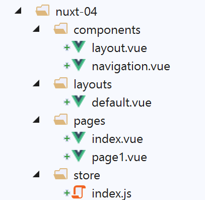
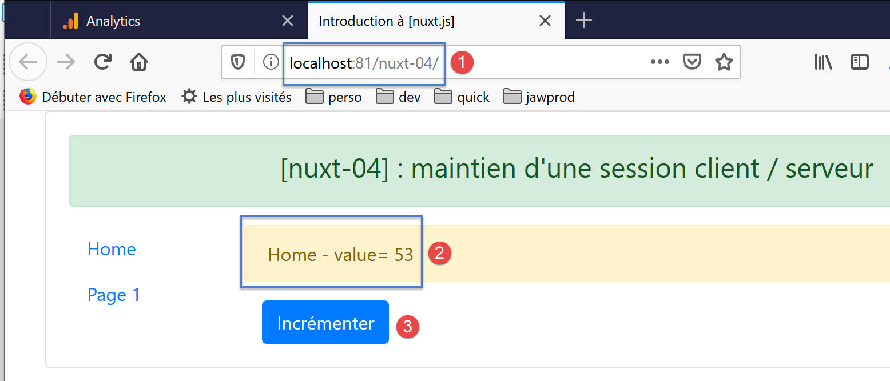
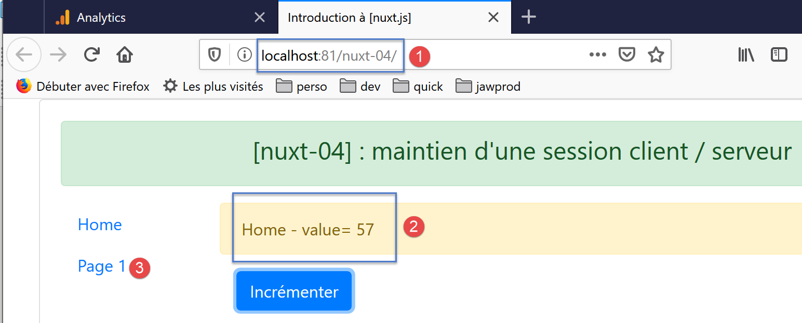
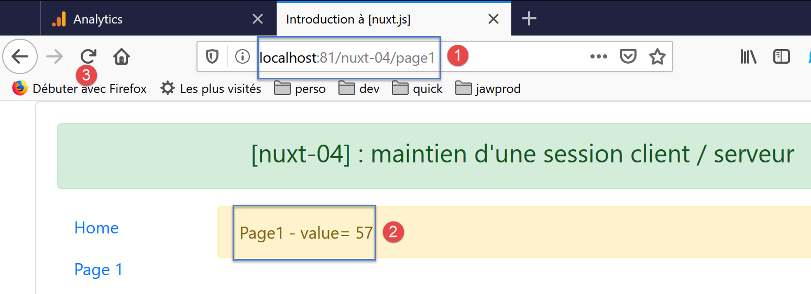
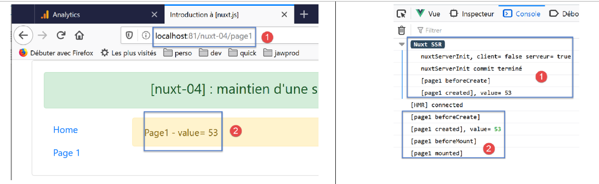
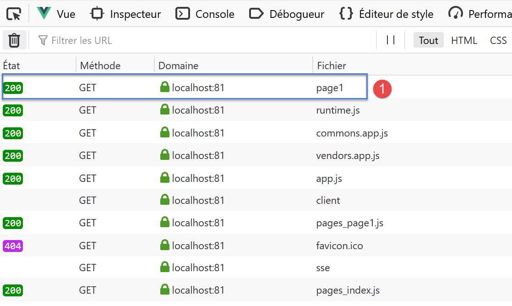

Exemple [nuxt-04] : maintien d’une session client / serveur
=============================================================

Le projet [nuxt-04] aborde le problème du maintien d’une session client
/ serveur. On reprend le projet [nuxt-03] avec les modifications
suivantes :

-  la page [index] aura un bouton qui permettra d’incrémenter le
   compteur du store [Vuex] ;

-  la page [page1] reste inchangée ;

-  on voudrait que lorsqu’une page est demandée à la main au serveur,
   celui-ci renvoie la page demandée avec un store [Vuex] qui aurait
   pour valeur de compteur, la dernière valeur que celui-ci avait côté
   client ;

Le projet [nuxt-04] est initialement créé par recopie du projet
[nuxt-03] :

|image0|

Seule la page [index] change :

.. code-block:: javascript 
   :linenos:

   <!-- page [index] -->
   <template>
     <Layout :left="true" :right="true">
       <!-- navigation -->
       <Navigation slot="left" />
       <!-- message-->
       <template slot="right">
         <b-alert show variant="warning"> Home - value= {{ value }} </b-alert>
         <!-- bouton -->
         <b-button @click="incrementCounter" class="ml-3" variant="primary">Incrémenter</b-button>
       </template>
     </Layout>
   </template>

   

-  ligne 10 : on a ajouté un bouton pour incrémenter le compteur du
   store [Vuex] ;

-  ligne 54 : la méthode qui gère le [clic] sur le bouton
   [Incrémenter] ;

-  ligne 57 : le compteur du store est incrémenté de 1 ;

-  ligne 59 : la valeur du compteur est affectée à la propriété [value]
   afin qu’elle soit affichée par la ligne 8 ;

On exécute le projet [nuxt-04] avec le fichier [nuxt.config.js]
suivant :

.. code-block:: javascript 
   :linenos:

   // répertoire du code source
     srcDir: 'nuxt-04',
     // routeur
     router: {
       // racine des URL de l'application
       base: '/nuxt-04/'
     },
     // serveur
     server: {
       // port de service, 3000 par défaut
       port: 81,
       // adresses réseau écoutées, par défaut localhost : 127.0.0.1
       // 0.0.0.0 = toutes les adresses réseau de la machine
       host: 'localhost'
   }

A l’exécution la première page affichée est la suivante :

|image1|

En utilisant plusieurs fois le bouton [3], on a la nouvelle page
suivante :

|image2|

Si on utilise le lien [3], on a la page suivante :

|image3|

-  en [2], la page [page1] [1] affiche bien la valeur du compteur ;

Maintenant, rafraîchissons la page avec [3]. La nouvelle page est la
suivante :

|image4|

-  en [2], on a perdu la valeur courante du compteur. On est revenu à sa
   valeur initiale ;

Ce résultat est tout a fait compréhensible si on regarde les logs :

-  en [1], le serveur a réexécuté la fonction [nuxtServerInit]. Or
   celle-ci est la suivante :

.. code-block:: javascript 
   :linenos:

   /* eslint-disable no-console */
   export const state = () => ({
     // compteut
     counter: 0
   })

   export const mutations = {
     // incrémentation du compteur d'une valeur [inc]
     increment(state, inc) {
       state.counter += inc
     }
   }

   export const actions = {
     async nuxtServerInit(store, context) {
       // qui exécute ce code ?
       console.log('nuxtServerInit, client=', process.client, 'serveur=', process.server)
       // on attend la fin d'une promesse
       await new Promise(function(resolve, reject) {
         // on a normalement ici une fonction asynchrone
         // on la simule avec une attente d'une seconde
         setTimeout(() => {
           // succès
           resolve()
         }, 1000)
       })
       // on modifie le store
       store.commit('increment', 53)
       // log
       console.log('nuxtServerInit commit terminé')
     }
   }

La ligne 28 affecte la valeur 53 au compteur.

Examinons la requête HTTP faite par le navigateur lorsqu’on a rafraîchi
la page [page1] :

|image5|

On voit qu’outre la page [page1] [1], le client demande un certain
nombre de scripts au serveur. On notera les scripts [pages_index,
pages_page1] qui sont les scripts associés aux pages [index, page]. Ces
scripts sont fournis à chaque requête au serveur quelque soit la page
demandée ;

En [1], la page [page1] est demandée au serveur avec la requête HTTP
suivante :

.. code-block:: javascript 
   :linenos:

   GET http://localhost:81/nuxt-04/page1
   Host: localhost:81
   User-Agent: Mozilla/5.0 (Windows NT 10.0; Win64; x64; rv:70.0) Gecko/20100101 Firefox/70.0
   Accept: text/html,application/xhtml+xml,application/xml;q=0.9,*/*;q=0.8
   Accept-Language: fr,fr-FR;q=0.8,en-US;q=0.5,en;q=0.3
   Accept-Encoding: gzip, deflate
   DNT: 1
   Connection: keep-alive
   Upgrade-Insecure-Requests: 1
   Pragma: no-cache
   Cache-Control: no-cache

On voit que cette requête ne transmet aucune information au serveur.
Celui-ci n’a donc aucun moyen de connaître l’état du store [Vuex] côté
client. Il aurait fallu pour cela que le client lui envoie cette
information.

Dans le projet suivant [nuxt-05] nous utilisons un cookie pour que le
client puisse envoyer de l’information au serveur lorsque celui-ci est
sollicité.

