Exemple [nuxt-05] : persistance du store avec un cookie de session
==================================================================

**Objectif** : on voudrait que le store [Vuex] ne soit pas réinitialisé
à chaque requête vers le serveur. Pour ce faire nous allons utiliser un
cookie de session :

-  le store sera initialisé par le serveur et mis par celui-ci dans un
   cookie de session ;

-  le navigateur client recevra ce cookie de session et mécaniquement
   l’enverra à chaque nouvelle requête vers le serveur ;

-  le serveur pourra alors récupérer ce cookie de session et travailler
   avec le store qu’il contient, un store mis à jour par le client ;

   1. .. rubric:: Présentation
         :name: présentation

Le projet [nuxt-05] est obtenu initialement par recopie du projet
[nuxt-04] :

|image0|

Nous allons voir que seul le fichier [store / index.js] va changer.

Pour utiliser des cookies avec [nuxt], nous allons utiliser le module
[cookie-universal-nuxt] que nous installlons avec [yarn] dans un
terminal VSCode :

|image1|

-  en [4], on tape la commande [yarn add cookie-universal-nuxt] ;

Un nouveau module est ainsi ajouté au fichier [package.json] du projet
[dvp] :

.. code-block:: javascript 
   :linenos:

   ...
   },
     "dependencies": {
       "@nuxtjs/axios": "^5.3.6",
       "bootstrap": "^4.1.3",
       "bootstrap-vue": "^2.0.0",
       "cookie-universal-nuxt": "^2.0.19",
       "nuxt": "^2.0.0"
   },

Le fichier de configuration [nuxt.config.js]
--------------------------------------------

Pour que [nuxt] puisse utiliser les cookies de [cookie-universal-nuxt],
il faut déclarer ce module dans le fichier de configuration
[nuxt.config.js] :

.. code-block:: javascript 
   :linenos:

   ...
   ],
     /*
      ** Nuxt.js modules
      */
     modules: [
       // Doc: https://bootstrap-vue.js.org
       'bootstrap-vue/nuxt',
       // Doc: https://axios.nuxtjs.org/usage
       '@nuxtjs/axios',
       // https://www.npmjs.com/package/cookie-universal-nuxt
       'cookie-universal-nuxt'
     ],
   ...

-  ligne 12, le module [cookie-universal-nuxt] est ajouté au tableau des
   modules [6] de [nuxt] ;

Le fichier [nuxt.config.js] est au final le suivant :

.. code-block:: javascript 
   :linenos:

   export default {
     mode: 'universal',
     /*
      ** Headers of the page
      */
     head: {
       title: 'Introduction à [nuxt.js]',
       meta: [
         { charset: 'utf-8' },
         { name: 'viewport', content: 'width=device-width, initial-scale=1' },
         {
           hid: 'description',
           name: 'description',
           content: 'ssr routing loading asyncdata middleware plugins store'
         }
       ],
       link: [{ rel: 'icon', type: 'image/x-icon', href: '/favicon.ico' }]
     },
     /*
      ** Customize the progress-bar color
      */
     loading: { color: '#fff' },
     /*
      ** Global CSS
      */
     css: [],
     /*
      ** Plugins to load before mounting the App
      */
     plugins: [],
     /*
      ** Nuxt.js dev-modules
      */
     buildModules: [
       // Doc: https://github.com/nuxt-community/eslint-module
       '@nuxtjs/eslint-module'
     ],
     /*
      ** Nuxt.js modules
      */
     modules: [
       // Doc: https://bootstrap-vue.js.org
       'bootstrap-vue/nuxt',
       // Doc: https://axios.nuxtjs.org/usage
       '@nuxtjs/axios',
       // https://www.npmjs.com/package/cookie-universal-nuxt
       'cookie-universal-nuxt'
     ],
     /*
      ** Axios module configuration
      ** See https://axios.nuxtjs.org/options
      */
     axios: {},
     /*
      ** Build configuration
      */
     build: {
       /*
        ** You can extend webpack config here
        */
       extend(config, ctx) {}
     },
     // répertoire du code source
     srcDir: 'nuxt-05',
     // routeur
     router: {
       // racine des URL de l'application
       base: '/nuxt-05/'
     },
     // serveur
     server: {
       // port de service, 3000 par défaut
       port: 81,
       // adresses réseau écoutées, par défaut localhost : 127.0.0.1
       // 0.0.0.0 = toutes les adresses réseau de la machine
       host: 'localhost'
     },
     // environnement
     env: {
       maxAge: 60 * 5
     }
   }

-  ligne 79 : on a ajouté la clé [env] au fichier. Cette clé est un mot
   réservé. Les éléments déclarés dans cet objet sont disponibles à
   partir de l’objet [context.env] dans les éléments de l’application ;

-  ligne 80 : l’attribut [maxAge] sera la durée de vie maximale du
   cookie de session, durée qui se mesure à partir de la dernière fois
   que le cookie a été initialisé. Cette durée s’exprime en secondes. On
   a mis ici une durée de vie de 5 minutes ;

   1. .. rubric:: Le principe de la persistance du store
         :name: le-principe-de-la-persistance-du-store

Les cookies échangés entre le client et le serveur sont disponibles de
chaque côté (client et serveur) dans :

-  [context.app.$cookies] là ou l’objet [context] est disponible, ç-à-d
   à peu près partout ;

-  [this.$cookies] à l’intérieur d’une vue ;

On obtient un cookie particulier avec l’expression
[...$cookies.\ **get**\ (‘nom_du_cookie’)]. On fixe la valeur d’un
cookie avec l’expression [...$cookies.\ **set**\ (‘nom_du_cookie’,
valeur_du_cookie)].

Le principe du cookie de persistance du store sera le suivant :

-  lorsque le serveur va initialiser le store dans la fonction
   [nuxtServerInit], l’état du store sera stocké dans un cookie nommé
   ‘session’ ;

-  le cookie ‘session’ fera alors partie de la réponse HTTP du serveur.
   On sait qu’un navigateur renvoie au serveur les cookies que celui-ci
   lui a envoyés. Il le fait à chaque nouvelle requête qu’il fait au
   serveur. On sait également que le serveur envoie le store à
   l’intérieur la page qu’il envoie au client ;

-  au sein du navigateur, l’application cliente récupère le store envoyé
   par le serveur et va ensuite faire son travail. On fera en sorte qu’à
   chaque fois qu’elle modifie le store, le nouvel état de celui-ci soit
   stocké dans le cookie ‘session’ enregistré par le navigateur ;

-  si l’utilisateur force un appel au serveur, le navigateur client
   renverra automatiquement tous les cookies que le serveur lui a
   précédemment envoyés, notamment le cookie nommé ‘session’ ;

-  lorsque suite à cet appel, le serveur va réinitialiser de nouveau le
   store, il récupèrera le cookie nommé ‘session’ et initialisera l’état
   du store avec la valeur de celui-ci ;

-  il y aura donc continuité du store entre le client et le serveur ;

   1. .. rubric:: Initialisation du store
         :name: initialisation-du-store

Le store est implémenté dans le fichier [store / index.js] :

.. code-block:: javascript 
   :linenos:

   /* eslint-disable no-console */
   export const state = () => ({
     // compteur
     counter: 0
   })

   export const mutations = {
     // incrémentation du compteur d'une valeur [inc]
     increment(state, inc) {
       state.counter += inc
     },
     // remplacement du state
     replace(state, newState) {
       for (const attr in newState) {
         state[attr] = newState[attr]
       }
     }
   }

   export const actions = {
     async nuxtServerInit(store, context) {
       // qui exécute ce code ?
       console.log('nuxtServerInit, client=', process.client, 'serveur=', process.server, 'env=', context.env)
       // on attend la fin d'une promesse
       await new Promise(function(resolve, reject) {
         // on a normalement ici une fonction asynchrone
         // on la simule avec une attente d'une seconde
         setTimeout(() => {
           // init session
           initStore(store, context)
           // succès
           resolve()
         }, 1000)
       })
     }
   }

   function initStore(store, context) {
     // y-a-t-il un cookie de session dans la requête en cours
     const cookies = context.app.$cookies
     const session = cookies.get('session')
     if (!session) {
       // pas de session existante
       console.log("nuxtServerInit, initialisation d'une nouvelle session")
       // on initialise le store
       store.commit('increment', 77)
     } else {
       console.log("nuxtServerInit, reprise d'une session existante")
       // on met à jour le store avec le cookie de session
       store.commit('replace', session.store)
     }
     // on met le store dans le cookie de session
     cookies.set('session', { store: store.state }, { path: context.base, maxAge: context.env.maxAge })
     // log
     console.log('initStore terminé, store=', store.state)
   }

**Commentaires**

-  lignes 2-5 : le store sera constitué d’un compteur ;

-  lignes 9-11 : ce compteur pourra être incrémenté ;

-  lignes 13-17 : l’état du store pourra être initialisé à partir d’un
   nouvel état. Cette fonction est là pour montrer une initialisation
   possible du store lorsque celui-ci n’est pas limité au seul compteur
   comme ici ;

-  lignes 21-35 : la fonction [nuxtServerInit] n’a pas changé ;

-  ligne 30 : lorsque le temps d’attente d’une seconde est écoulé, on
   initialise le store à l’aide de la fonction des lignes 38-56 ;

-  lignes 40-41 : on commence par récupérer le cookie nommé ‘session’ :

   1. lors de la 1ère exécution de l’application et lors de la 1ère
      requête faite au serveur, ce cookie **n’existera pas encore**. Il
      sera alors créé (ligne 53) et sera envoyé au navigateur client ;

   2. lors de la même exécution de l’application et lors des requêtes
      n°s 2, 3, ... faites au serveur, ce cookie **existera** car le
      navigateur client le renverra avec chaque nouvelle requête faite
      au serveur ;

   3. lors d’une seconde exécution de l’application et lors de la 1ère
      requête faite au serveur, ce cookie **peut exister également**. En
      effet, à l’issue de l’étape 1, le cookie a été stocké sur le
      navigateur avec une certaine durée de vie. Si cette durée de vie
      n’est pas dépassée, le cookie nommé ‘session’ sera envoyé avec la
      1ère requête faite au serveur

..

   En résumé, pour chaque requête faite au serveur : si le cookie
   ‘session’ est déjà stocké sur le navigateur client alors le serveur
   va le recevoir, sinon il ne le recevra pas.

-  lignes 42-47 : si le serveur ne reçoit pas le cookie de session,
   alors le store est initialisé par la ligne 46 ;

   -  puis ligne 53, un cookie nommé ‘session’ sera créé et placé dans
      la réponse HTTP du serveur. La valeur du cookie est l’objet [{
      store: store.state }]. C’est donc l’état du store et non le store
      lui-même qui est mis dans le cookie de session ;

   -  le 3ième paramètre de la fonction [set] est un objet d’options :

      -  [path] indique à quelle URL ce cookie devra être renvoyé.
         [context.base] est l’URL de base de l’application [nuxt-05].
         Celle-ci est définie dans le fichier [nuxt.config.js] :

.. code-block:: javascript 
   :linenos:

     // routeur
     router: {
       // racine des URL de l'application
       base: '/nuxt-05/'
   },

-  [maxAge] est la durée de vie en secondes du cookie sur le navigateur.
   Passée cette durée, le navigateur ne le renvoie plus au serveur.
   [context.env.maxAge] renvoie là encore une valeur inscrite dans le
   fichier [nuxt.config.js] :

.. code-block:: javascript 
   :linenos:

   // environnement
     env: {
       maxAge: 60 * 5
   }

..

   [env] est un mot clé réservé du fichier de configuration. On fixe ici
   la durée de vie à 5 minutes. Cette durée est mesurée par rapport à la
   dernière fois où le navigateur a reçu le cookie de session. Passée
   cette durée, le cookie ne sera pas renvoyé au serveur qui devra alors
   démarrer une nouvelle session ;

-  lignes 48-50 : si le serveur reçoit le cookie de session, alors
   l’état du store est initialisé avec l’objet [store] du cookie de
   session. On se rappelle que cet objet contient l’état sauvegardé du
   store ;

   -  puis ligne 53, le cookie de session sera placé dans la réponse
      faite au navigateur client :

      -  la fonction [get] va chercher le cookie de session dans la
         **requête reçue** par le serveur ;

      -  la fonction [set] met le cookie de session dans la **réponse**
         que le serveur fait au navigateur client ;

   1. .. rubric:: Incrémentation du compteur du store
         :name: incrémentation-du-compteur-du-store

L’incrémentation du compteur dans la page [index.vue] évolue de la façon
suivante :

.. code-block:: javascript 
   :linenos:

     // gestion des évts
     methods: {
       incrementCounter() {
         console.log('incrementCounter')
         // incrément du compteur de 1
         this.$store.commit('increment', 1)
         // chgt de la valeur affichée
         this.value = this.$store.state.counter
         // sauvegarde du store dans le cookie de session
         this.$cookies.set('session', { store: this.$store.state }, { path: this.$nuxt.context.base, maxAge: this.$nuxt.context.env.maxAge })
       }
   }

Du côté client, à chaque fois qu’on modifie le store, il faut le
sauvegarder dans le cookie de session. En effet, l’utilisateur peut
demander une URL à la main à tout moment et on doit être alors capable
d’envoyer au serveur un store à jour. C’est pourquoi, ligne 10, après
l’incrémentation du compteur du store, on sauvegarde l’état de celui-ci
dans le cookie de session :

-  les cookies sont disponibles dans la propriété [this.$cookies] ;

-  l’état du store [this.$store.state] est sauvegardé dans le cookie
   associé à la clé [store] ;

-  le chemin du cookie est [context.base]. Dans une vue, le contexte est
   disponible dans [this.$nuxt.context] ;

-  la durée de vie du cookie est [context.env.maxAge] disponible ici
   dans la propriété [this.$nuxt.context.env.maxAge] ;

   1. .. rubric:: Exécution de l’exemple [nuxt-05]
         :name: exécution-de-lexemple-nuxt-05

Nous lançons l’application [nuxt-05] :

|image2|

Les copies d’écran qui suivent sont celles d’un navigateur Chrome. Nous
demandons l’URL [http://localhost:81/nuxt-05/]. **N’oubliez pas** le
dernier / derrière /nuxt-05, sinon vous n’aurez pas les résultats
escomptés :

|image3|

-  en [4], nous avons obtenu la valeur initiale du store (77) ;

Examinons les logs du navigateur (F12) :

|image4|

-  en [5-6], les logs du serveur ;

-  en [7], on voit que le serveur démarre une nouvelle session. Cela
   veut dire qu’il n’a pas reçu de cookie de session ;

-  en [8], initialisation du compteur avec la valeur 77 ;

-  en [9], la page [index] du serveur (9) et celle du client (10)
   affichent bien la même valeur du compteur ;

Maintenant regardons les cookies reçus par le navigateur :

|image5|

-  en [1], choisissez l’onglet [Application] puis l’option [Cookies]
   [2]. Parmi tous les cookies de votre navigateur, choisissez celui du
   domaine [http://localhost:81];

-  en [4], le cookie nommé ‘session’. Si vous ne l’avez pas, rechargez
   la page [F5] : peut-être avez-vous dépassé sa durée de vie qui est de
   5 mn ;

-  en [5], la valeur du cookie. Bien que ce ne soit pas très lisible à
   cause de l’encodage des caractères { :, on distingue la valeur 77 du
   compteur ;

-  en [6], l’URL du cookie : à chaque fois que cette URL sera demandée,
   le navigateur enverra le cookie au serveur ;

-  en [7], l’heure de fin de validité du cookie. Lorsque cette heure
   sera dépassée, le cookie sera détruit sur le navigateur ;

Assurez-vous d’avoir ce cookie. Si vous ne l’avez pas, rechargez la page
(F5). Lorsque vous avez la page avec son cookie, rechargez de nouveau la
page (F5). Les logs deviennent alors les suivants :

|image6|

Cette fois-ci en [3], le serveur a bien récupéré le cookie de session.
C’est le navigateur client qui le lui a envoyé.

Maintenant, procédez à des incrémentations du compteur, puis de temps en
temps rechargez la page courante (F5), que ce soit [index] ou [page1],
vous devez constater que le compteur ne revient pas à 77 comme dans
l’exemple [nuxt-04] mais garde la valeur qu’il avait sur le navigateur
client avant le rechargement de la page :

|image7|

|image8|

Les logs du navigateur sont alors les suivants :

|image9|

**Note** : pour les tests vous pouvez avoir besoin de supprimer [5] le
cookie de session stocké sur le navigateur pour repartir avec une
nouvelle session, initialisée par le serveur, lors de la prochaine
requête vers celui-ci.

Enfin montrons l’influence de la fonction [incrementCounter] de la page
[index] sur le cookie de session stocké sur le navigateur client :

.. code-block:: javascript 
   :linenos:

   // gestion des évts
     methods: {
       incrementCounter() {
         console.log('incrementCounter')
         // incrément du compteur de 1
         this.$store.commit('increment', 1)
         // chgt de la valeur affichée
         this.value = this.$store.state.counter
         // sauvegarde du store dans le cookie de session
         this.$cookies.set('session', { store: this.$store.state }, { path: this.$nuxt.context.base, maxAge: this.$nuxt.context.env.maxAge })
       }
     }

-  ligne 10 : la modification du compteur est répercutée sur le cookie
   de session ;

Vérifions ce point. On part de la situation suivante :

|image10|

-  en [4], le compteur du cookie de session reflète bien la valeur
   affichée [1] ;

Maintenant, incrémentons le compteur une fois [5]. Le cookie de session
en [4] évolue de la façon suivante :

|image11|

-  en [7], le compteur du cookie de session est bien passé à 84. Pour le
   voir, il faut rafraîchir la vue [8]. Pour cela sélectionnez une autre
   option du [Storage] [9], puis resélectionnez l’option [8]. La
   nouvelle valeur du cookie de session devrait alors apparaître ;

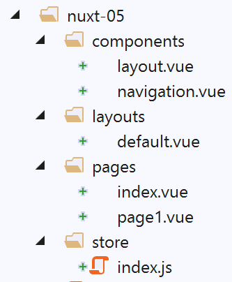
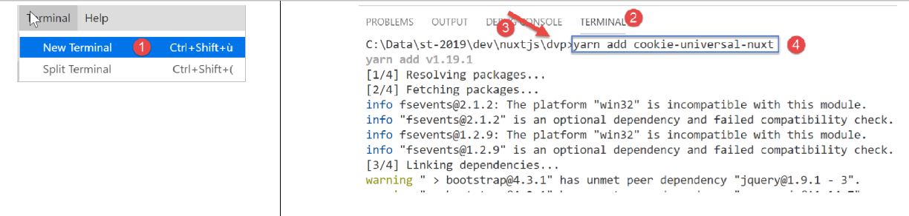
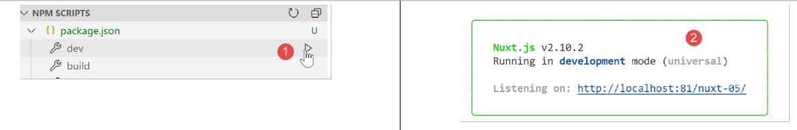
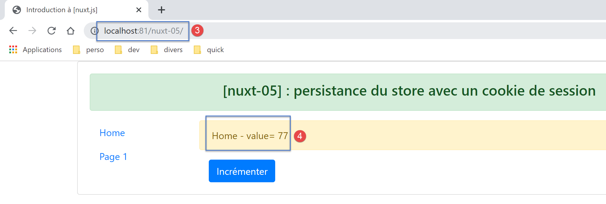
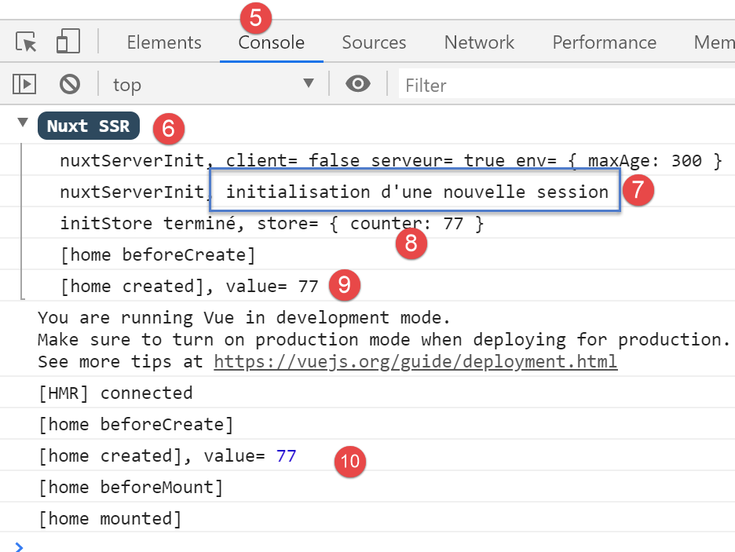
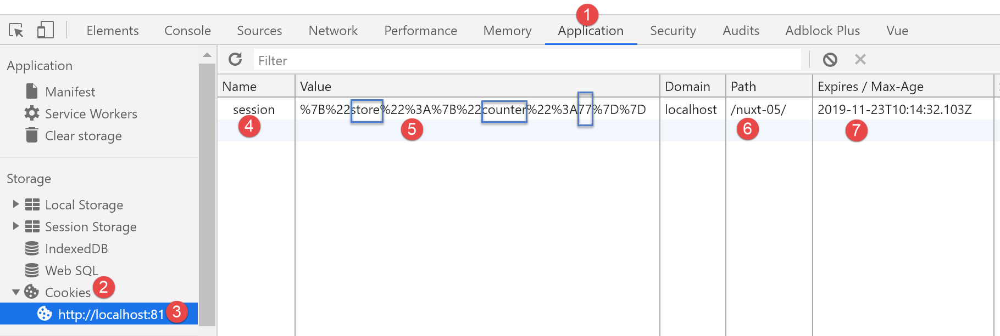
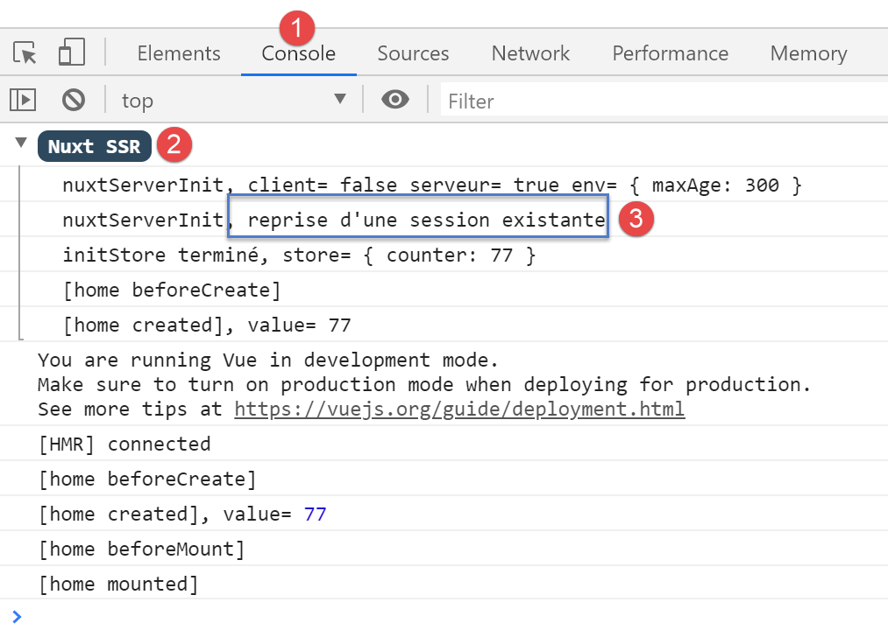
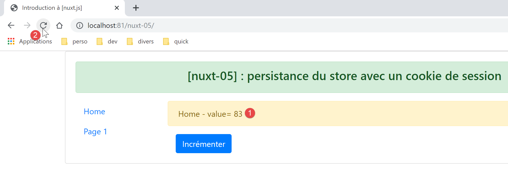
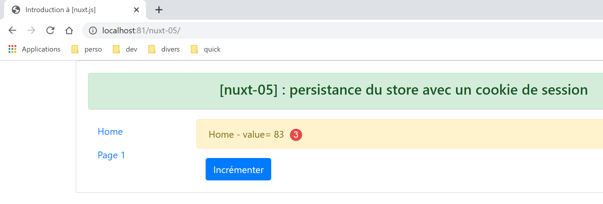
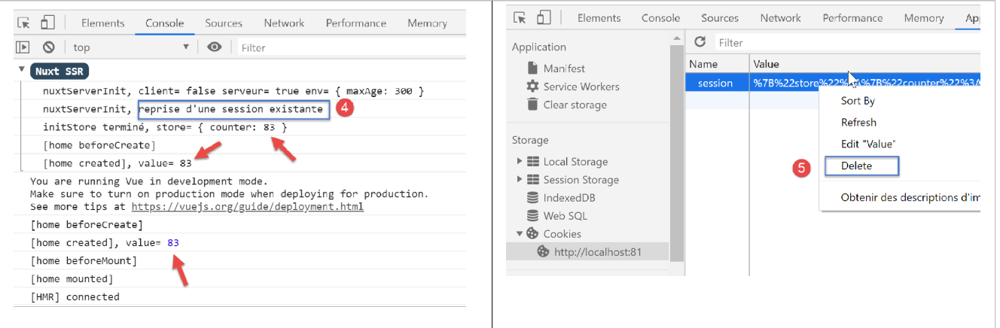
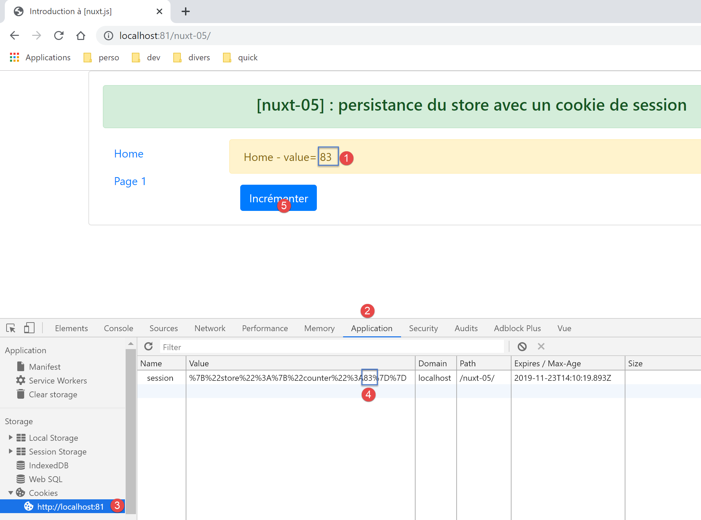

