Exemple [nuxt-06] : injection dans le contexte d’un gestionnaire de session
===========================================================================

Présentation
------------

L’exemple [nuxt-05] a montré qu’on pouvait persister le store même
lorsque l’utilisateur force des appels au serveur. Les éléments du store
sont réactifs pour que s’ils sont intégrés à des vues celles-ci soient
réactives aux changements du store. On peut vouloir aussi persister des
éléments au fil des échanges client / serveur sans pour autant vouloir
qu’ils soient réactifs, tout simplement parce qu’ils ne sont pas
affichés par des vues. On peut alors stocker ceux-ci dans la session
sans qu’ils soient pour autant dans le store.

Le store est accessible facilement au travers de propriétés telles que
[context.app.$store] en-dehors des vues ou [this.$store] dans les vues.
On voudrait quelque chose d’analogue pour la session, quelque chose
comme [context.app.$session] ou [this.$session]. On va voir que c’est
possible grâce au concept d’injection. Seulement on ne peut pas injecter
des objets dans le contexte, seulement des fonctions. Celle-ci sera
alors disponible au travers des expressions
[context.app.$session\ **()**] ou [this.$session\ **()**].

Enfin, nous allons présenter le concept [nuxt] de [plugin].

L’exemple [nuxt-06] est obtenu initialement par recopie du projet
[nuxt-05] :

|image0|

-  en [1], nous ajouterons un dossier [plugins] ;

La notion de plugin [nuxt]
--------------------------

[nuxt] nomme [plugin] tout code exécuté au démarrage de l’application,
avant même l’exécution de la fonction [nuxtServerInit] par le serveur
qui était jusqu’à maintenant la première fonction utilisateur à être
exécutée. Les plugins de l’application doivent être déclarés dans la clé
[plugins] du fichier de configuration [nuxt.config.js] :

.. code-block:: javascript 
   :linenos:

     /*
      ** Plugins to load before mounting the App
      */
     plugins: [
       { src: '~/plugins/client/session', mode: 'client' },
       { src: '~/plugins/server/session', mode: 'server' }
   ],

-  lignes 5-6 : un plugin est désigné par son chemin [src] et son mode
   d’exécution [mode]. [mode] peut avoir trois valeurs :

   -  [client] : le plugin doit être exécuté côté client uniquement ;

   -  [server] : le plugin doit être exécuté côté serveur uniquement ;

   -  absence de la clé [mode] : dans ce cas, le plugin doit être
      exécuté à la fois côté client et serveur ;

-  lignes 5-6 : nous avons placé nos deux plugins dans un dossier
   [plugins]. Il n’y a aucune obligation à cela. Les plugins peuvent
   être placés n’importe où dans l’arborescence du projet. De même les
   noms des sous-dossiers [client, server] sont ici arbitraires ;

|image1|

Le plugin [session] du serveur
------------------------------

Le plugin [server / session.js] est le suivant :

.. code-block:: javascript 
   :linenos:

   /* eslint-disable no-console */
   export default (context, inject) => {
     // gestion de la session serveur

     // y-a-t-il une session existante ?
     let value = context.app.$cookies.get('session')
     if (!value) {
       // nouvelle session
       console.log("[plugin session server], démarrage d'une nouvelle session")
       value = initValue
     } else {
       // session existante
       console.log("[plugin session server], reprise d'une session existante")
     }
     // définition de la session
     const session = {
       // contenu de la session
       value,
       // sauvegarde de la session dans un cookie
       save(context) {
         context.app.$cookies.set('session', this.value, { path: context.base, maxAge: context.env.maxAge })
       }
     }
     // on injecte une fonction dans [context, Vue] qui rendra la session courante
     inject('session', () => session)
   }

   // valeur initiale de la session
   const initValue = {
     initSessionDone: false
   }

-  ligne 2 : les plugins sont exécutés à chaque fois qu’il y a un appel
   au serveur : au démarrage et à chaque fois que l’utilisateur force un
   appel au serveur en tapant une URL à la main :

   -  c’est d’abord le (ou les) plugin(s) du serveur qui est (sont)
      exécuté(s) en premier ;

   -  lorsque le navigateur client a reçu la réponse du serveur, c’est
      au tour du (ou des) plugin(s) du client de s’exécuter ;

-  ligne 2 : tout plugin, client ou serveur, reçoit deux paramètres :

   -  [context] : le contexte du serveur ou du client selon qui exécute
      le plugin ;

   -  [inject] : une fonction qui permet d’injecter une fonction dans le
      contexte du serveur ou du client ;

-  le but du plugin [server / session] est double :

   -  définir une session (lignes 16-23) ;

   -  définir au sein du contexte, une fonction [$session] qui rendra
      comme résultat, la session de la ligne 16. C’est la ligne 25 qui
      fait cela ;

-  lignes 16-23 : la session encapsulera ses données dans l’objet
   [value] de la ligne 18 ;

-  lignes 20-22 : elle dispose d’une fonction [save] qui reçoit en
   paramètre un objet [context]. C’est le code appelant qui lui fournit
   ce contexte. Avec celui-ci, la fonction [save] sauvegarde la valeur
   de la session, l’objet [value], dans le cookie de session ;

-  ligne 6 : lorsque le plugin [server / session] s’exécute, il commence
   par regarder si le serveur a reçu un cookie de session ;

   -  si oui, l’objet [value] de la ligne 6 représente la valeur de la
      session, l’ensemble des données encapsulées dans celle-ci ;

   -  si non, lignes 7-11, on fixe la valeur initiale de la session.
      Celle-ci sera l’objet [initValue] des lignes 29-31. Les éléments
      de la session seront définis dans la fonction [nuxtServerInit] qui
      est exécutée après le plugin serveur ;

-  ligne 18 : la notation [value] est un raccourci pour la notation
   [value:value]. Le [value] de gauche est le nom d’une clé d’objet, le
   [value] de droite est l’objet [value] déclaré ligne 6 ;

-  ligne 25 : lorsqu’on arrive à cette ligne, la session a été soit
   créée parce qu’elle n’existait pas, soit récupérée dans la requête
   HTTP du navigateur client ;

-  ligne 25 : on injecte dans le contexte serveur une nouvelle
   fonction :

   -  le 1\ :sup:`er` paramètre de [inject] est le nom de la fonction
      qu’on crée, ici ‘session’. [nuxt] lui donnera en fait le nom
      ‘\ **$**\ session’ ;

   -  le 2ième paramètre est la définition de la fonction. Ici la
      fonction [$session]

      -  n’admettra aucun paramètre ;

      -  rendra l’objet [session] de la ligne 16 ;

-  une fois le plugin exécuté :

   -  la fonction [$session] est disponible dans
      [**context.app.$session**] là où l’objet [context] est disponible,
      ou [**this.$session**] dans une vue ou dans le store [vuex] ;

   -  la fonction [$session] rend un objet [session] avec une unique clé
      [value] ;

   -  à la création initiale de la session, l’objet [value] n’a qu’une
      clé [initStoreDone] (lignes 29-31). La clé [initStoreDone:false]
      sert à indiquer que le store n’a pas encore été placé dans la
      session. Cela va être fait par la fonction [nuxtServerInit] ;

Initialisation de la session
----------------------------

Une fois le plugin [session / server] exécuté par le serveur, celui-ci
va exécuter le script [store / index.js] suivant :

.. code-block:: javascript 
   :linenos:

   /* eslint-disable no-console */
   export const state = () => ({
     // compteur
     counter: 0
   })

   export const mutations = {
     // incrémentation du compteur d'une valeur [inc]
     increment(state, inc) {
       state.counter += inc
     },
     // remplacement du state
     replace(state, newState) {
       for (const attr in newState) {
         state[attr] = newState[attr]
       }
     }
   }

   export const actions = {
     async nuxtServerInit(store, context) {
       // qui exécute ce code ?
       console.log('nuxtServerInit, client=', process.client, 'serveur=', process.server, 'env=', context.env)
       // on attend la fin d'une promesse
       await new Promise(function(resolve, reject) {
         // on a normalement ici une fonction asynchrone
         // on la simule avec une attente d'une seconde
         setTimeout(() => {
           // init session
           initSession(store, context)
           // succès
           resolve()
         }, 1000)
       })
     }
   }

   function initSession(store, context) {
     // store est le store à initialiser

     // on récupère la session
     const session = context.app.$session()
     // la session a-t-elle été déjà initialisée ?
     if (!session.value.initSessionDone) {
       // on démarre un nouveau store
       console.log("nuxtServerInit, initialisation d'une nouvelle session")
       // on initialise le store
       store.commit('increment', 77)
       // on met le store dans la session
       session.value.store = store.state
       // on initialise une nouvelle session
       session.value.somethingImportant = { x: 2, y: 4 }
       // la session est désormais initialisée
       session.value.initSessionDone = true
     } else {
       console.log("nuxtServerInit, reprise d'un store existant")
       // on met à jour le store avec le store de la session
       store.commit('replace', session.value.store)
     }
     // on sauvegarde la session
     session.save(context)
     // log
     console.log('initSession terminé, store=', store.state, 'session=', session.value)
   }

Par rapport au store du projet [nuxt-05], seule la fonction
[initSession] (anciennement *initStore*) des lignes 38-60 change :

-  ligne 42 : on récupère la session grâce à la fonction [$session] qui
   a été injectée dans le contexte du serveur ;

-  ligne 44 : on regarde si la session a déjà été initialisée ;

-  lignes 45-54 : si ce n’est pas le cas :

   -  ligne 48 : le store est initialisé ;

   -  ligne 50 : l’état du store est mis dans la session ;

   -  ligne 52 : on ajoute un autre objet [somethingImportant] dans la
      session. Celui-ci ne fera pas partie du store ;

   -  ligne 54 : on note le fait que la session est désormais
      initialisée ;

-  lignes 55-59 : si la session était déjà initialisée :

   -  ligne 58 : le nouveau store est initialisé avec le contenu de la
      session ;

-  ligne 61 : la session est sauvegardée dans le cookie de session. On
   rappelle que cela consiste à placer le cookie dans la réponse HTTP
   que le serveur va faire au navigateur client ;

Le plugin [client / session] du client
--------------------------------------

Une fois que le serveur a exécuté les scripts [plugins / server /
session] et [store / index], il va envoyer l’une des pages [index,
page1] au navigateur client. Dans la réponse HTTP du serveur, il y aura
le cookie de session. Une fois la page reçue par le navigateur client,
les scripts client embarqués dans la page vont s’exécuter. Le plugin
[client / session] va alors s’exécuter :

.. code-block:: javascript 
   :linenos:

   /* eslint-disable no-console */
   export default (context, inject) => {
     // gestion de la session client

     // la session existe forcément, initialisée par le serveur
     console.log('[plugin session client], reprise de la session du serveur')

     // définition de la session
     const session = {
       // contenu de la session
       value: context.app.$cookies.get('session'),
       // sauvegarde de la session dans un cookie
       save(context) {
         context.app.$cookies.set('session', this.value, { path: context.base, maxAge: context.env.maxAge })
       }
     }

     // on injecte une fonction dans [context, Vue] qui rendra la session courante
     inject('session', () => session)
   }

-  lorsque le plugin client s’exécute, le cookie de session a déjà été
   reçu par le navigateur client ;

-  l’objectif du plugin [client] est d’injecter lui-aussi une fonction
   [$session] dans le contexte du client. Cette fonction rendrait la
   session envoyée par le serveur ;

-  ligne 19 : la fonction injectée [$session] rendra la session des
   lignes 9-16 ;

-  lignes 9-16 : l’objet [session] géré par le client. Ce sera une copie
   de la session envoyée par le serveur ;

-  ligne 11 : la valeur de la session client est prise dans le cookie de
   session envoyé par le serveur [nuxt] ;

-  lignes 13-15 : comme pour la session du serveur, la session du client
   a une fonction [save] qui permet de sauvegarder la valeur de la
   session, [this.value] ligne 14, dans le cookie de session stocké sur
   le navigateur ;

La page [index]
---------------

La page [index] évolue de la façon suivante :

.. code-block:: javascript 
   :linenos:

   <!-- page [index] -->
   <template>
     <Layout :left="true" :right="true">
       <!-- navigation -->
       <Navigation slot="left" />
       <!-- message-->
       <template slot="right">
         <b-alert show variant="warning"> Home - session= {{ jsonSession }}, counter= {{ $store.state.counter }} </b-alert>
         <!-- bouton -->
         <b-button @click="incrementCounter" class="ml-3" variant="primary">Incrémenter</b-button>
       </template>
     </Layout>
   </template>

   

Il faut se rappeler que cette page est exécutée aussi bien côté serveur
que côté client.

-  ligne 8 : on affiche maintenant et la session et le store ;

-  ligne 30 : [jsonSession] est une propriété calculée qui rend la
   chaîne jSON de la valeur de la session ;

-  ligne 41 : on affiche la valeur de la session à l’aide de la fonction
   injectée [this.$session]. Celle-ci existe aussi bien dans le contexte
   du serveur que dans celui du client ;

-  ligne 53 : la méthode [incrementCounter] n’est elle exécutée que côté
   client ;

-  ligne 56 : le compteur du store est incrémenté et affiché comme
   auparavant ;

-  ligne 58 : on récupère la session grâce à la fonction injectée
   [this.$session] ;

-  ligne 59 : le store de la session est mis à jour ;

-  lignes 60-61 : on incrémente les attributs [somethingImportant.x,
   somethingImportant.y] de la session. Cela juste pour montrer qu’une
   session peut servir à transporter autre chose que le store ;

-  ligne 63 : la session est sauvegardée dans le cookie de session
   stocké sur le navigateur. Dans une vue client, le contexte de
   celui-ci est disponible dans [this.$nuxt.context] ;

Le but de la page [index] est de montrer que la session n’est pas
réactive alors que le store l’est. Lorsqu’on va incrémenter les éléments
de la session, on découvrira que la vue n’est pas mise à jour. La vue
[page1] présente une solution à ce problème.

La page [page1]
---------------

La page [page1] est obtenue par recopie de la page [index] puis quelque
peu modifiée :

.. code-block:: javascript 
   :linenos:

   <!-- page [index] -->
   <template>
     <Layout :left="true" :right="true">
       <!-- navigation -->
       <Navigation slot="left" />
       <!-- message-->
       <template slot="right">
         <b-alert show variant="warning"> Page1 - session= {{ jsonSession }}, counter= {{ $store.state.counter }} </b-alert>
         <!-- bouton -->
         <b-button @click="incrementCounter" class="ml-3" variant="primary">Incrémenter</b-button>
       </template>
     </Layout>
   </template>

   

-  ligne 47 : la principale différence vient du fait qu’on met la
   session courante dans les propriétés de la page (lignes 29-33). Cela
   va avoir pour effet que désormais la session va devenir réactive.
   Lorsque la fonction [incrementCounter] va incrémenter les éléments de
   la session, la vue [page1] sera mise à jour ;

Exécution du projet
-------------------

Avant d’exécuter le projet, vérifiez le cookie de session de votre
navigateur et s’il existe supprimez-le pour que le serveur crée une
session neuve :

|image2|

Maintenant demandons l’URL [http://localhost:81/nuxt-06/] :

|image3|

Les logs dans le navigateur sont alors les suivants :

|image4|

-  en [2], le serveur démarre une nouvelle session dans le plugin
   [session] du serveur ;

-  en [3], cette nouvelle session est initialisée dans
   [nuxtServerInit] ;

-  en [4], la nouvelle session telle qu’elle est connue sur le serveur ;

-  en [5], le client a correctement récupéré cette session ;

Maintenant incrémentons le compteur trois fois :

|image5|

-  en [3], le compteur a bien été incrémenté mais pas la session en [2].
   Alors que [3] affiche le store qui est réactif, [2] affiche la
   session qui elle n’est pas réactive :

Maintenant rechargeons la page (F5). Les logs sont les suivants suite à
ce rechargement :

|image6|

-  en [2], on voit que le serveur a reçu un cookie de session envoyé par
   le navigateur client ;

-  en [4], on voit que le store n’est pas réinitialisé mais repris dans
   la session reçue ;

-  en [4-5] : on voit que les attributs de la session ont bien tous été
   incrémentés trois fois ;

La page envoyée par le serveur est alors la suivante ;

|image7|

La conclusion issue de cette page est que la session peut transporter
d’autres éléments que le store mais ceux-ci ne sont pas réactifs.

Maintenant cliquons sur le lien [Page 1] [4]. La nouvelle page affichée
est alors la suivante :

|image8|

Puis utilisons le bouton [Incrémenter] trois fois. La page devient la
suivante :

|image9|

Cette fois-ci la session s’affiche correctement en [2]. Elle est ici
réactive. Cela se voit dans les logs :

|image10|

-  en [1-3], les valeurs de la session ;

-  en [4-6], les getters et setters réactifs des éléments de la
   session ;

Maintenant cliquons sur le lien [Home] [4]. Nous obtenons la page
suivante :

|image11|

Puis cliquons deux fois sur le bouton [Incrémenter] [4]. La page devient
la suivante :

|image12|

On constate que là également la session est devenue réactive [2].

Demandons la valeur rendue par la fonction [this.$session()] :

|image13|

-  dans l’onglet [Vue], on sélectionne la page courante [Home] pour en
   obtenir la référence [$vm0] [3] ;

Puis dans l’onglet [Console] [4], demandons la valeur de la fonction
[$vm0.$session()] :

|image14|

-  en [5], on voit que la session est devenue réactive alors qu’elle ne
   l’était pas initialement ;

-  en [6], on demande à voir la valeur de la session ;

-  en [7-8], on découvre que cette valeur est elle également devenue
   réactive ;

On a donc là un résultat inattendu : si un élément devient réactif dans
une page parce qu’il a été placé dans les propriétés de la page, alors
il devient également réactif dans les pages où il ne fait pas partie des
propriétés.

Conclusion
----------

L’exemple [nuxt-05] a montré qu’on pouvait persister le store au fil des
requêtes faites au serveur. L’exemple [nuxt-06] fait la même chose avec
un objet qu’on a appelé [session] par analogie avec la session web. On a
vu que cette session pouvait avoir les mêmes propriétés que le store
[Vuex] et devenir réactive elle aussi alors que nativement elle ne
l’était pas.

Alors quel est l’intérêt du store [Vuex] ? Je dois avouer que pour
l’instant il ne m’est pas apparu. Il est probable que quelque chose m’a
échappé. Donc dans le doute, je conseillerai d’utiliser :

-  un **store [Vuex]** pour y mettre tout ce qui doit être partagé entre
   les pages du client, et ce qui éventuellement doit être partagé entre
   le client et le serveur ;

-  un **cookie de session** si le store doit être persisté lors d’un
   appel du client vers le serveur, la session ne contenant alors que le
   store ;

Les exemples [nuxt-05] et [nuxt-06] avaient pour but de montrer comment
on pouvait assurer la continuité de l’application lorsque l’utilisateur
force l’appel au serveur en tapant manuellement des URL. On rappelle que
le comportement par défaut dans ce cas est un redémarrage de
l’application, son état du moment étant alors perdu.

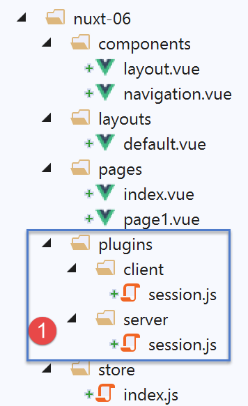
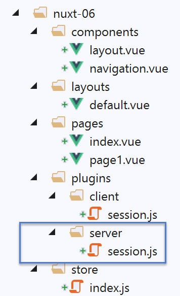
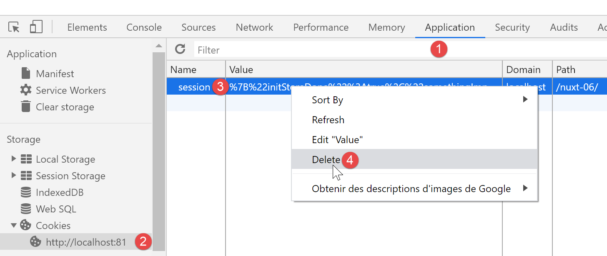
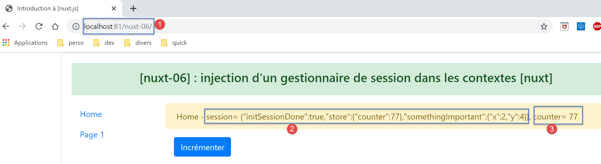
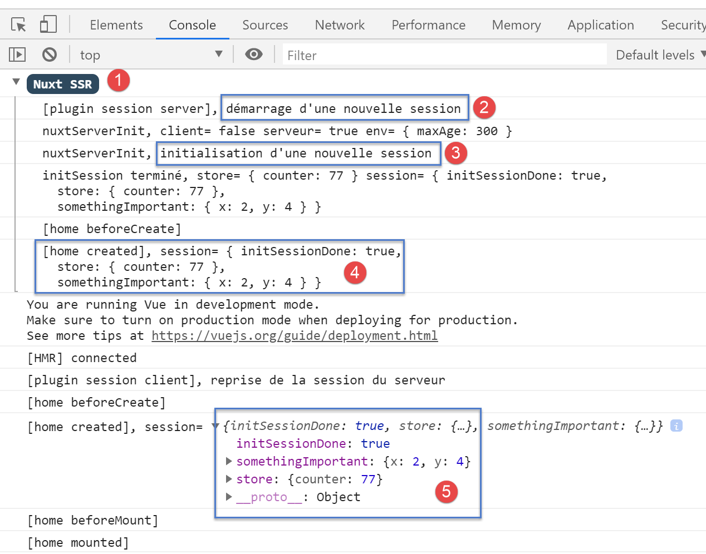
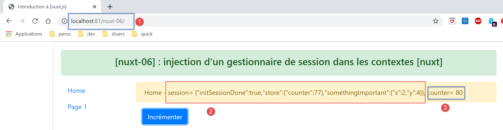
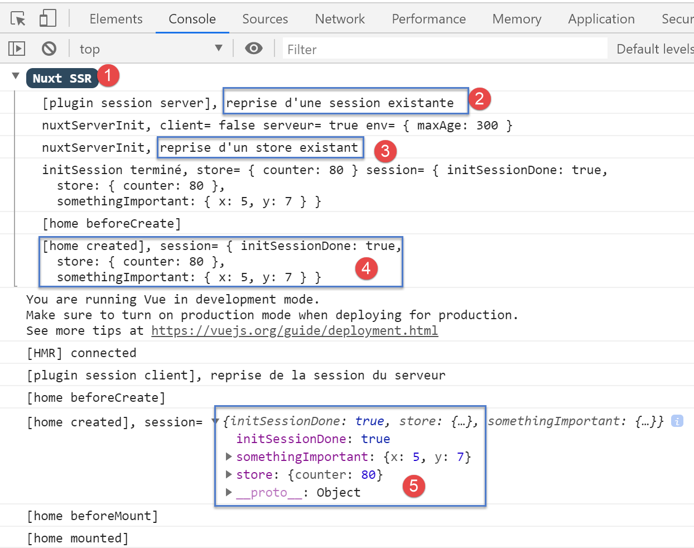
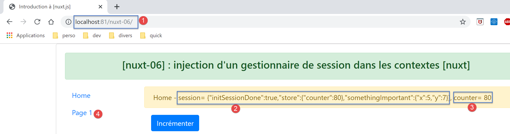
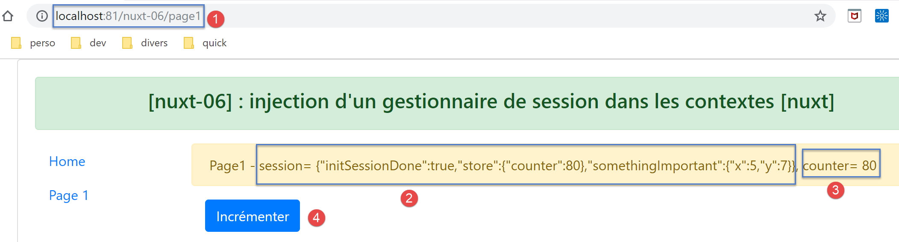
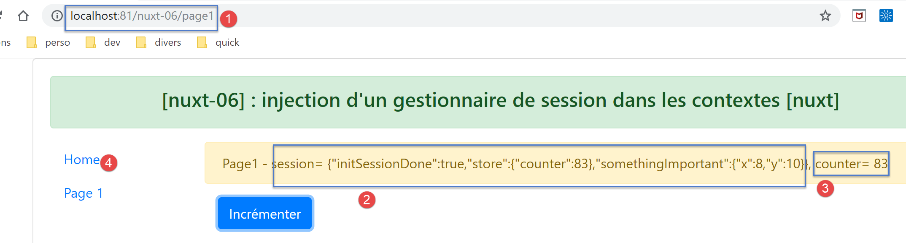
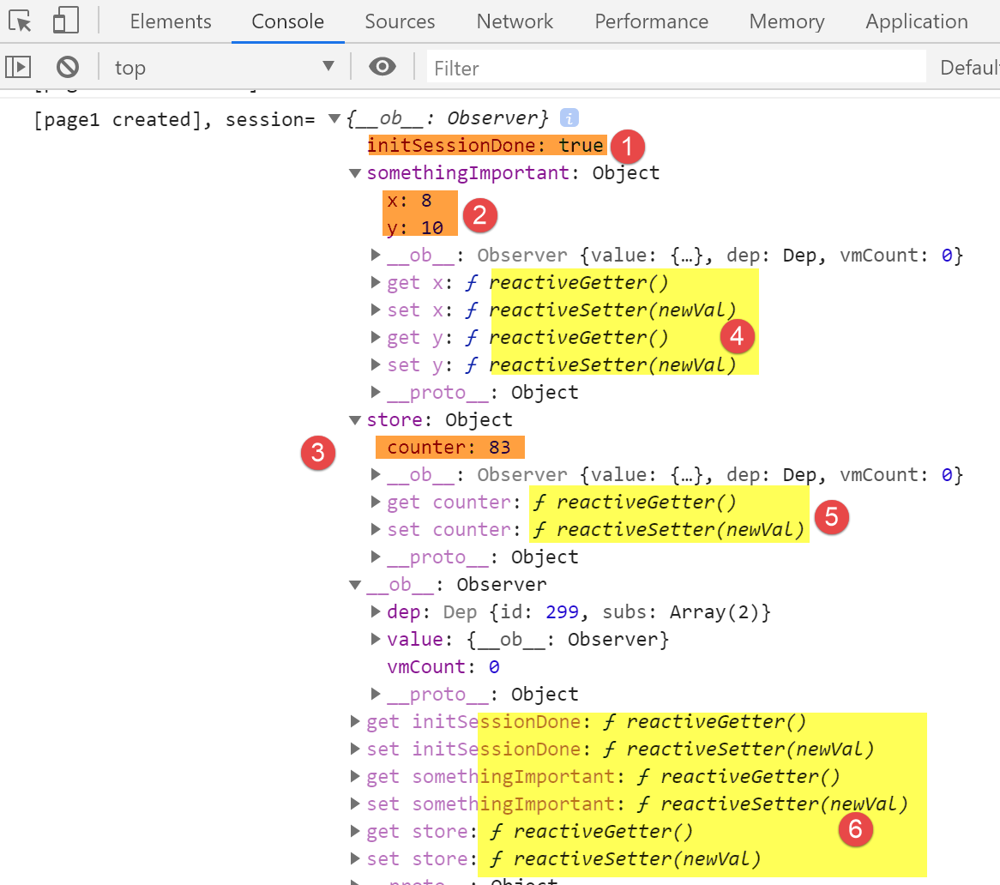
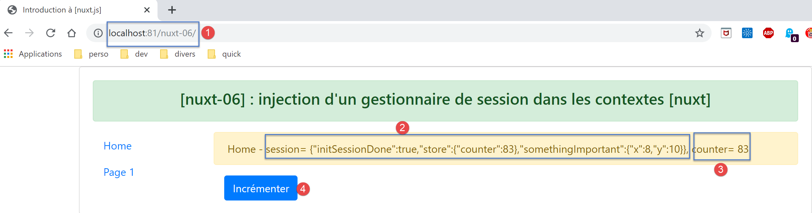
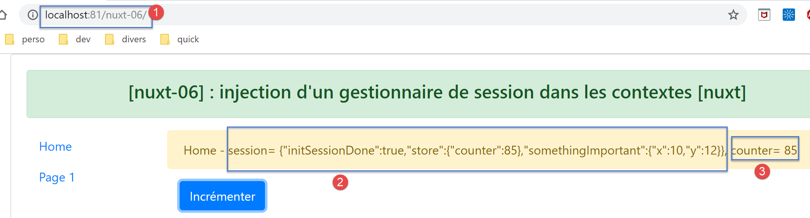
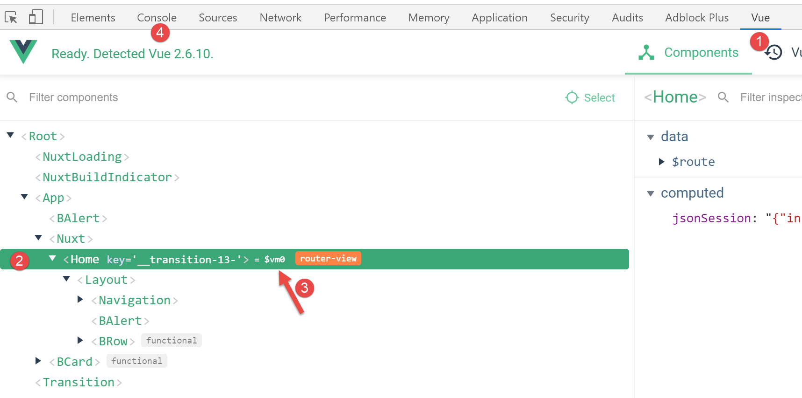
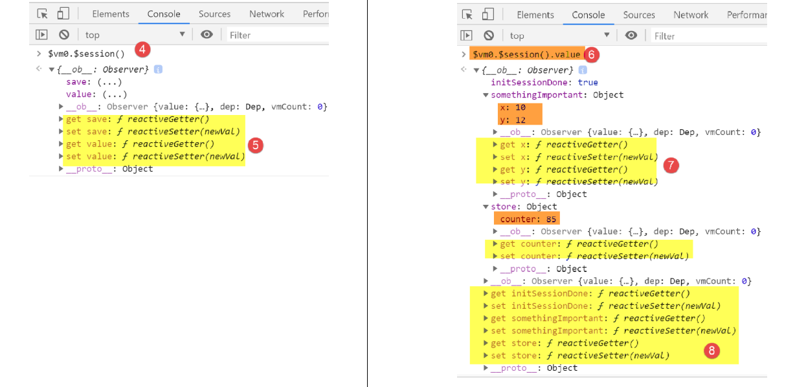
