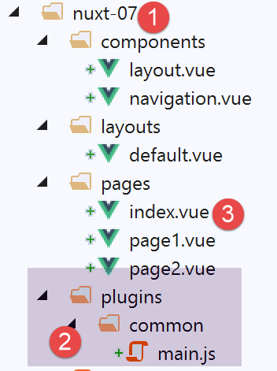

Exemple [nuxt-07] : les contextes client et serveur
===================================================

Présentation
------------

L’exemple [nuxt-07] vise à explorer l’objet [context] du côté serveur et
du côté client. Il ne faut pas oublier que ces deux acteurs des
applications [nuxt] sont séparés : **ils ne partagent** rien sauf :

-  ce que le serveur veut bien envoyer au client (dans la réponse HTTP
   et la page envoyée) ;

-  ce que le client veut bien envoyer au serveur (dans sa requête
   HTTP) ;

Si donc, comme on va le voir, les objets manipulés par le serveur et
ceux manipulés par le client **portent le même nom**, ils ne sont pas
identiques : ils peuvent parfois être des copies l’un de l’autre mais
n’ont jamais la même référence. Modifier un objet client n’a aucun effet
sur l’objet de même nom, côté serveur, et vice-versa.

L’exemple [nuxt-07] est obtenu initialement par recopie de l’exemple
[nuxt-01] :

|image0|

-  en [2], nous allons ajouter un plugin commun au client et au
   serveur ;

-  en [3], nous allons modifier quelque peu la page [index] ;

Le plugin [common / main.js]
----------------------------

Le plugin [common / main.js] est exécuté à la fois par le client et le
serveur : cela est dû à la configuration [nuxt.config.js] suivante :

.. code-block:: javascript 
   :linenos:

   /*
      ** Plugins to load before mounting the App
      */
   plugins: [{ src: '~/plugins/common/main.js' }],

-  ligne 4 : l’absence de la propriété [mode] fait que le plugin
   [~/plugins/common/main.js] sera exécuté à la fois par le client et le
   serveur : le serveur d’abord, le client ensuite ;

Ce plugin sera le suivant :

.. code-block:: javascript 
   :linenos:

   /* eslint-disable no-undef */
   /* eslint-disable no-console */
   export default function(...args) {
     // qui exécute ce code ?
     console.log('[main server], process.server=', process.server, 'process.client=', process.client)
     const who = process.server ? 'server' : 'client'
     const main = '[main ' + who + ']'
     // nbre d'arguments
     console.log(main + ', il y a', args.length, 'arguments')

     // 1er argument
     const context = args[0]
     // clés du contexte
     dumpkeys(main + ', context', context)
     // l'application
     dumpkeys(main + ', context.app', context.app)
     // la route
     dumpkeys(main + ', context.route', context.route)
     console.log(main + ', context.route=', context.route)
     // le router
     dumpkeys(main + ', context.app.router', context.app.router)
     // le router.options.routes
     dumpkeys(main + ', context.app.router.options.routes', context.app.router.options.routes)
     console.log(main + ', context.app.router.options.routes=', context.app.router.options.routes)

     // 2ième argument
     const inject = args[1]
     console.log('inject=', typeof inject)
   }

   function dumpkeys(message, object) {
     // liste des clés de [object]
     const ligne = 'Liste des clés [' + message + ']'
     console.log(ligne)
     // liste des clés
     if (object) {
       console.log(Object.keys(object))
     }
   }

-  lignes 31-39 : la fonction [dumpkeys] liste les propriétés de l’objet
   passé en 2ième paramètre. Cette liste est précédée du message passé
   en 1\ :sup:`er` paramètre ;

-  ligne 3 : on veut savoir combien d’arguments reçoit la fonction. Pour
   cela, on utilise la notation [...args] qui va avoir pour effet de
   mettre les paramètres effectifs de la fonction dans le tableau
   [args]. On va découvrir qu’il y a deux arguments ;

-  ligne 5 : on affiche qui exécute le code, du serveur ou du client ;

-  ligne 6 : l’exécuteur du code, client ou serveur ;

-  ligne 7 : une constante chaîne de caractères utilisée dans les logs ;

-  ligne 12 : on va découvrir que le 1\ :sup:`er` argument reçu par la
   plugin est le contexte de l’exécuteur ;

-  ligne 14 : liste des clés de l’objet [context] ;

-  ligne 16 : on va découvrir que l’objet [context] a une propriété
   [app] qui représente l’application [nuxt] ;

-  ligne 18 : on va découvrir que l’objet [context] a une propriété
   [route] qui représente la route courante du routeur ;

-  ligne 21 : on va découvrir que l’objet [app] a une propriété [router]
   qui représente le routeur ;

-  ligne 23 : l’objet [router.options.routes] représente les différentes
   routes de l’application ;

-  lignes 27-28 : le second argument du plugin est la fonction [inject]
   que nous avons utilisée dans l’exemple [nuxt-06] ;

Le plugin exécuté par le serveur
--------------------------------

A l’exécution, le serveur affiche la chose suivante :

.. code-block:: javascript 
   :linenos:

   [main server], process.server= true process.client= false
   [main server], il y a 2 arguments
   Liste des clés [[main server], context]
   [
     'isStatic',
     'isDev',
     'isHMR',
     'app',
     'payload',
     'error',
     'base',
     'env',
     'req',
     'res',
     'ssrContext',
     'redirect',
     'beforeNuxtRender',
     'route',
     'next',
     '_redirected',
     '_errored',
     'params',
     'query',
     '$axios'
   ]

-  lignes 11-12 : nous avons déjà eu l’occasion d’utiliser les
   propriétés [base] et [env] dont les valeurs proviennent du fichier
   [nuxt.config.js] ;

-  ligne 8 : la propriété [app] désigne l’application [nuxt] ;

-  ligne 18 : la propriété [route] désigne la route courante du routeur,
   ç-à-d la page que va envoyer le serveur ;

-  ligne 13 : la requête HTTP du navigateur client ;

-  ligne 14 : la réponse HTTP du serveur ;

La liste des propriétés de [context.app] est la suivante :

.. code-block:: javascript 
   :linenos:

   Liste des clés [[main server], context.app]
   [
     'router',
     'nuxt',
     'head',
     'render',
     'data',
     'beforeCreate',
     'created',
     'mounted',
     'watch',
     'computed',
     'methods',
     'components',
     'context',
     '$axios'
   ]

-  ligne 3 : la propriété [router] nous donne accès au router de
   l’application. C’est important sous [nuxt] puisque le routeur est
   défini par [nuxt] lui-même et non par le développeur. Cette propriété
   est un accès donné au développeur pour modifier le routeur ;

La liste des propriétés de [context.route] sont les suivantes :

.. code-block:: javascript 
   :linenos:

   Liste des clés [[main server], context.route]
   [
     'name',
     'meta',
     'path',
     'hash',
     'query',
     'params',
     'fullPath',
     'matched'
   ]

La route [context.route] au démarrage du serveur est la suivante :

.. code-block:: javascript 
   :linenos:

   [main server], context.route= {
     name: 'index',
     meta: [
       {}
     ],
     path: '/',
     hash: '',
     query: {},
     params: {},
     fullPath: '/',
     matched: [
       {
         path: '',
         regex: /^(?:\/(?=$))?$/i,
         components: [Object],
         instances: {},
         name: 'index',
         parent: undefined,
         matchAs: undefined,
         redirect: undefined,
         beforeEnter: undefined,
         meta: {},
         props: {}
       }
     ]
   }

-  ligne 2 : on voit que la prochaine page du serveur est [index] et que
   son chemin est [/] (ligne 10) ;

-  ligne 22 : la propriété [meta] permet d’ajouter des propriétés aux
   routes ;

Les propriétés du routeur [context.app.router] du serveur sont les
suivantes :

.. code-block:: javascript 
   :linenos:

   Liste des clés [[main server], context.app.router]
   [
     'app',
     'apps',
     'options',
     'beforeHooks',
     'resolveHooks',
     'afterHooks',
     'matcher',
     'fallback',
     'mode',
     'history'
   ]

C’est dans la propriété [context.app.router.options.routes] qu’on trouve
les différentes routes de l’application :

.. code-block:: javascript 
   :linenos:

   Liste des clés [[main server], context.app.router.options.routes]
   [
     '0',
     '1',
     '2'
   ]
   [main server], context.app.router.options.routes= [
     {
       path: '/page1',
       component: [Function: _d7b6c762],
       name: 'page1'
     },
     {
       path: '/page2',
       component: [Function: _d79a9860],
       name: 'page2'
     },
     {
       path: '/',
       component: [Function: _31eaad9f],
       name: 'index'
     }
   ]

Enfin le 2ième argument :

.. code-block:: javascript 
   :linenos:

   inject= function

La page [index] du serveur
--------------------------

La page [index] est la suivante :

.. code-block:: javascript 
   :linenos:

   <!-- page principale -->
   <template>
     <Layout :left="true" :right="true">
       <!-- navigation -->
       <Navigation slot="left" />
       <!-- message-->
       <b-alert slot="right" show variant="warning">
         Home
       </b-alert>
     </Layout>
   </template>

   

-  ligne 43 : on a déjà vu que le contexte d’une page pouvait être
   trouvé dans [this.$nuxt.context] ;

-  ligne 42 : on affiche également les propriétés de l’objet
   [this.$nuxt] ;

Exécutée par le serveur, cette page donne naissance aux logs suivants :

.. code-block:: javascript 
   :linenos:

   [home beforeCreate]
   [home server created]
   Liste des clés [[home server created], this.$nuxt]
   [
     '_uid',
     '_isVue',
     '$options',
     '_renderProxy',
     '_self',
     '$parent',
     '$root',
     '$children',
     '$refs',
     '_watcher',
     '_inactive',
     '_directInactive',
     '_isMounted',
     '_isDestroyed',
     '_isBeingDestroyed',
     '_events',
     '_hasHookEvent',
     '_vnode',
     '_staticTrees',
     '$vnode',
     '$slots',
     '$scopedSlots',
     '_c',
     '$createElement',
     '$attrs',
     '$listeners',
     '_routerRoot',
     '_router',
     '_route',
     '_bv__modal',
     '_bv__toast',
     '_vueMeta',
     'nuxt',
     '_watchers',
     'refreshOnlineStatus',
     'refresh',
     'errorChanged',
     'setLayout',
     'loadLayout',
     '_data',
     'layoutName',
     'layout',
     'isOnline',
     '_computedWatchers',
     'isOffline',
     'error',
     'context'
   ]

Les propriétés du contexte serveur dans la page [index] sont les
suivantes :

.. code-block:: javascript 
   :linenos:

   Liste des clés [[home server created], this.$nuxt.context]
   [
     'isStatic',
     'isDev',
     'isHMR',
     'app',
     'payload',
     'error',
     'base',
     'env',
     'req',
     'res',
     'ssrContext',
     'redirect',
     'beforeNuxtRender',
     'route',
     'next',
     '_redirected',
     '_errored',
     'params',
     'query',
     '$axios'
   ]

Ce sont les mêmes propriétés que dans l’objet [context] du plugin.

Le plugin exécuté par le client
-------------------------------

Une fois que le serveur a envoyé la page [index] au navigateur client,
les scripts client prennent la main. Le plugin [main.js] va alors être
exécuté. Ces logs sont les suivants :

.. code-block:: javascript 
   :linenos:

   [main server], process.server= false process.client= true
   [main client], il y a 2 arguments
   Liste des clés [[main client], context]
   Array(17)0: "isStatic"1: "isDev"2: "isHMR"3: "app"4: "payload"5: "error"6: "base"7: "env"8: "redirect"9: "nuxtState"10: "route"11: "next"12: "_redirected"13: "_errored"14: "params"15: "query"16: "$axios"length: 17__proto__: Array(0)
   Liste des clés [[main client], context.app]
   Array(14)0: "router"1: "nuxt"2: "head"3: "render"4: "data"5: "beforeCreate"6: "created"7: "mounted"8: "watch"9: "computed"10: "methods"11: "components"12: "context"13: "$axios"length: 14__proto__: Array(0)
   Liste des clés [[main client], context.route]
   Array(8)0: "name"1: "meta"2: "path"3: "hash"4: "query"5: "params"6: "fullPath"7: "matched"length: 8__proto__: Array(0)
   [main client], context.route= ObjectfullPath: "/"hash: ""matched: [{…}]meta: [{…}]name: "index"params: {}path: "/"query: {}__proto__: Object
   Liste des clés [[main client], context.app.router]
   Array(10)0: "app"1: "apps"2: "options"3: "beforeHooks"4: "resolveHooks"5: "afterHooks"6: "matcher"7: "fallback"8: "mode"9: "history"length: 10__proto__: Array(0)
   Liste des clés [[main client], context.app.router.options.routes]
   Array(3)0: "0"1: "1"2: "2"length: 3__proto__: Array(0)
   [main client], context.app.router.options.routes= Array(3)0: {path: "/page1", name: "page1", component: ƒ}1: {path: "/page2", name: "page2", component: ƒ}2: {path: "/", name: "index", component: ƒ}length: 3__proto__: Array(0)
   inject= function

On retrouve des propriétés analogues à celles trouvées côté serveur avec
certaines propriétés qui ont disparu et d’autres qui sont apparues.
Ainsi ligne 4, on ne retrouve pas les propriétés [req, res] qui étaient
les requêtes HTTP du navigateur client et la réponse HTTP du serveur.

La page [index] du client
-------------------------

La page [index] du client produit les logs suivants :

.. code-block:: javascript 
   :linenos:

   [home beforeCreate]
   [home client created]
   Liste des clés [[home client created], this.$nuxt]
   (51) ["_uid", "_isVue", "$options", "_renderProxy", "_self", "$parent", "$root", "$children", "$refs", "_watcher", "_inactive", "_directInactive", "_isMounted", "_isDestroyed", "_isBeingDestroyed", "_events", "_hasHookEvent", "_vnode", "_staticTrees", "$vnode", "$slots", "$scopedSlots", "_c", "$createElement", "$attrs", "$listeners", "_routerRoot", "_router", "_route", "_bv__modal", "_bv__toast", "_vueMeta", "nuxt", "_watchers", "refreshOnlineStatus", "refresh", "errorChanged", "setLayout", "loadLayout", "_data", "layoutName", "layout", "isOnline", "_computedWatchers", "isOffline", "error", "context", "_name", "setTransitions", "$loading", "$el"]
   Liste des clés [[home client created], this.$nuxt.context]
   (17) ["isStatic", "isDev", "isHMR", "app", "payload", "error", "base", "env", "redirect", "nuxtState", "route", "next", "_redirected", "_errored", "params", "query", "$axios"]
   [home client beforeMount]
   [home client mounted]

-  ligne 4 : les propriétés de l’objet [this.$nuxt]. C’est un objet
   riche avec 51 propriétés ;

-  ligne 6 : les propriétés de l’objet [this.$nuxt.context]. On retrouve
   les mêmes propriétés que dans l’objet [context] du plugin client ;

