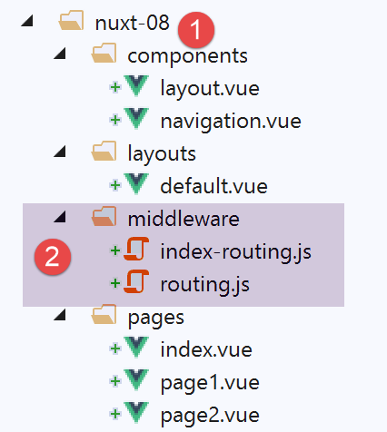

Exemple [nuxt-08] : middlewares de routage
==========================================

Dans cet exemple, nous introduisons la notion de middlewares de routage,
des scripts exécutés à chaque changement de route.

L’exemple [nuxt-08] est obtenu initialement par recopie du projet
[nuxt-01] :

|image0|

Les middlewares de routage doivent être dans un dossier appelé
[middleware] [2]. Il peut y avoir un routage à deux niveaux :

-  un routage appliqué à chaque navigation. Celui-ci fait alors l’objet
   d’une déclaration dans le fichier [nuxt.config.js] ;

-  un routage appliqué à une page particulière, lorsque celle-ci est la
   cible du routage. Ce routage est alors déclaré dans cette page
   cible ;

   1. .. rubric:: Routage général
         :name: routage-général

Le fichier [middleware / routing.js] assurera le routage général. Il
fait l’objet de la déclaration suivante dans le fichier
[nuxt.config.js] :

.. code-block:: javascript 
   :linenos:

     router: {
       base: '/nuxt-08/',
       middleware: ['routing']
   },

Les middlewares de routage général sont une propriété du routeur (ligne
1). Il peut y avoir plusieurs middlewares de routage. C’est pourquoi
ligne 3, la valeur de la propriété [middleware] est un tableau. On voit
qu’on n’utilise pas de chemin pour désigner le middleware. Il sera
automatiquement cherché dans le dossier [middleware] du projet ;

Le middleware [routing] ne fait ici que des logs :

.. code-block:: javascript 
   :linenos:

   /* eslint-disable no-undef */
   /* eslint-disable no-console */
   export default function(...args) {
     // qui exécute ce code ?
     console.log('[routing], process.server=', process.server, 'process.client=', process.client)
     const who = process.server ? 'server' : 'client'
     const routing = '[routing ' + who + ']'
     // nbre d'arguments
     console.log(routing + ', il y a', args.length, 'argument(s)')

     // 1er argument
     const context = args[0]
     // clés du contexte
     dumpkeys(routing + ', context', context)
     // l'application
     dumpkeys(routing + ', context.app', context.app)
     // la route
     dumpkeys(routing + ', context.route', context.route)
     console.log(routing + ', context.route=', context.route)
     // le router
     dumpkeys(routing + ', context.app.router', context.app.router)
     // le router.options.routes
     dumpkeys(routing + ', context.app.router.options.routes', context.app.router.options.routes)
     console.log(routing + ', context.app.router.options.routes=', context.app.router.options.routes)
   }

   function dumpkeys(message, object) {
     // liste des clés de [object]
     const ligne = 'Liste des clés [' + message + ']'
     console.log(ligne)
     // liste des clés
     if (object) {
       console.log(Object.keys(object))
     }
   }

-  ligne 3 : on va découvrir que le middleware reçoit un argument : le
   contexte de l’exécuteur (serveur ou client) ;

-  lignes 4-25 : on affiche les propriétés de différents objets pour
   savoir ce qui est utilisable. On va découvrir que le contexte du
   middleware est quasi identique au contexte du plugin ;

   1. .. rubric:: Routage pour une page particulière
         :name: routage-pour-une-page-particulière

On veut contrôler la façon dont on arrive à la page [index]. Pour cela,
il nous faut introduire la propriété [middleware] dans cette page
[index] :

.. code-block:: javascript 
   :linenos:

   

-  ligne 34 : la propriété [middleware] liste les scripts à exécuter à
   chaque fois que la prochaine page affichée est la page [index]. Là
   encore, ces scripts seront cherchés dans le dossier [middleware] du
   projet ;

Le middleware [index-routing] est le suivant :

.. code-block:: javascript 
   :linenos:

   /* eslint-disable no-undef */
   /* eslint-disable no-console */
   export default function(...args) {
     // qui exécute ce code ?
     console.log('[index-routing], process.server=', process.server, 'process.client=', process.client)
     const who = process.server ? 'server' : 'client'
     const indexRouting = '[index-routing ' + who + ']'
     // nbre d'arguments
     console.log(indexRouting + ', il y a', args.length, 'argument(s)')

     // 1er argument
     const context = args[0]
     // clés du contexte
     dumpkeys(indexRouting + ', context', context)
     // l'application
     dumpkeys(indexRouting + ', context.app', context.app)
     // la route
     dumpkeys(indexRouting + ', context.route', context.route)
     console.log(indexRouting + ', context.route=', context.route)
     // le router
     dumpkeys(indexRouting + ', context.app.router', context.app.router)
     // le router.options.routes
     dumpkeys(indexRouting + ', context.app.router.options.routes', context.app.router.options.routes)
     console.log(indexRouting + ', context.app.router.options.routes=', context.app.router.options.routes)
     // d'où vient-on ?
     if (context.from) {
       console.log('from=', context.from)
     }
   }

   function dumpkeys(message, object) {
     // liste des clés de [object]
     const ligne = 'Liste des clés [' + message + ']'
     console.log(ligne)
     // liste des clés
     if (object) {
       console.log(Object.keys(object))
     }
   }

Le code de [index-routing] est identique à celui de [routing] et produit
les mêmes résultats. Ce qui nous intéresse c’est de voir quand ces deux
middlewares sont exécutés.

Exécution du projet
-------------------

Nous exécutons le projet. Les logs sont alors les suivants :

C’est le script [routing] qui est exécuté en premier par le serveur :

.. code-block:: javascript 
   :linenos:

   [routing], process.server= true process.client= false
   [routing server], il y a 1 argument(s)
   Liste des clés [[routing server], context]
   [ 'isStatic',
     'isDev',
     'isHMR',
     'app',
     'payload',
     'error',
     'base',
     'env',
     'req',
     'res',
     'ssrContext',
     'redirect',
     'beforeNuxtRender',
     'route',
     'next',
     '_redirected',
     '_errored',
     'params',
     'query',
     '$axios' ]
   Liste des clés [[routing server], context.app]
   [ 'router',
     'nuxt',
     'head',
     'render',
     'data',
     'beforeCreate',
     'created',
     'mounted',
     'watch',
     'computed',
     'methods',
     'components',
     'context',
     '$axios' ]
   Liste des clés [[routing server], context.route]
   [ 'name',
     'meta',
     'path',
     'hash',
     'query',
     'params',
     'fullPath',
     'matched' ]
   [routing server], context.route= { name: 'index',
     meta: [ {} ],
     path: '/',
     hash: '',
     query: {},
     params: {},
     fullPath: '/',
     matched:
      [ { path: '',
          regex: /^(?:\/(?=$))?$/i,
          components: [Object],
          instances: {},
          name: 'index',
          parent: undefined,
          matchAs: undefined,
          redirect: undefined,
          beforeEnter: undefined,
          meta: {},
          props: {} } ] }
   Liste des clés [[routing server], context.app.router]
   [ 'app',
     'apps',
     'options',
     'beforeHooks',
     'resolveHooks',
     'afterHooks',
     'matcher',
     'fallback',
     'mode',
     'history' ]
   Liste des clés [[routing server], context.app.router.options.routes]
   [ '0', '1', '2' ]
   [routing server], context.app.router.options.routes= [ { path: '/page1',
       component: [Function: _61cefe10],
       name: 'page1' },
     { path: '/page2',
       component: [Function: _61dd1591],
       name: 'page2' },
     { path: '/', component: [Function: _00d5e140], name: 'index' } ]

On retrouve là ce qu’on avait obtenu avec les plugins.

-  ligne 15 : la propriété [redirect] est souvent utilisée dans les
   middlewares : elle permet de changer la cible du routage en cours ;

Puis, parce que la page qui va être affichée est la page [index], le
serveur exécute le script [index-routing] et affiche les logs suivants :

.. code-block:: javascript 
   :linenos:

   [index-routing], process.server= true process.client= false
   [index-routing server], il y a 1 argument(s)
   Liste des clés [[index-routing server], context]
   [ 'isStatic',
     'isDev',
     'isHMR',
     'app',
     'payload',
     'error',
     'base',
     'env',
     'req',
     'res',
     'ssrContext',
     'redirect',
     'beforeNuxtRender',
     'route',
     'next',
     '_redirected',
     '_errored',
     'params',
     'query',
     '$axios' ]
   Liste des clés [[index-routing server], context.app]
   [ 'router',
     'nuxt',
     'head',
     'render',
     'data',
     'beforeCreate',
     'created',
     'mounted',
     'watch',
     'computed',
     'methods',
     'components',
     'context',
     '$axios' ]
   Liste des clés [[index-routing server], context.route]
   [ 'name',
     'meta',
     'path',
     'hash',
     'query',
     'params',
     'fullPath',
     'matched' ]
   [index-routing server], context.route= { name: 'index',
     meta: [ {} ],
     path: '/',
     hash: '',
     query: {},
     params: {},
     fullPath: '/',
     matched:
      [ { path: '',
          regex: /^(?:\/(?=$))?$/i,
          components: [Object],
          instances: {},
          name: 'index',
          parent: undefined,
          matchAs: undefined,
          redirect: undefined,
          beforeEnter: undefined,
          meta: {},
          props: {} } ] }
   Liste des clés [[index-routing server], context.app.router]
   [ 'app',
     'apps',
     'options',
     'beforeHooks',
     'resolveHooks',
     'afterHooks',
     'matcher',
     'fallback',
     'mode',
     'history' ]
   Liste des clés [[index-routing server], context.app.router.options.routes]
   [ '0', '1', '2' ]
   [index-routing server], context.app.router.options.routes= [ { path: '/page1',
       component: [Function: _61cefe10],
       name: 'page1' },
     { path: '/page2',
       component: [Function: _61dd1591],
       name: 'page2' },
     { path: '/', component: [Function: _00d5e140], name: 'index' } ]

Les résultats obtenus avec le script [index-routing] sont analogues à
ceux obtenus avec le script [routing].

Une fois la page [index] reçue par le navigateur client, les scripts
client prennent la main. Les logs deviennent les suivants :

.. code-block:: javascript 
   :linenos:

   [home beforeCreate]
   [home created]
   [home beforeMount]
   [home mounted]

On voit donc qu’au démarrage de l’application **le client n’exécute
aucun middleware**. Cela veut dire que cela se produira à chaque fois
que l’utilisateur forcera un appel au serveur. Les middlewares ne sont
exécutés par le client que lors d’une navigation au sein du client.
Naviguons par exemple vers la page [page1] (nous sommes sur la page
[index]) avec le lien [Page 1]. Les logs sont alors les suivants :

.. code-block:: javascript 
   :linenos:

   [routing], process.server= false process.client= true
   [routing client], il y a 1 argument(s)
   Liste des clés [[routing client], context]
   (18) ["isStatic", "isDev", "isHMR", "app", "payload", "error", "base", "env", "redirect", "nuxtState", "route", "next", "_redirected", "_errored", "params", "query", "$axios", "from"]
   Liste des clés [[routing client], context.app]
   (14) ["router", "nuxt", "head", "render", "data", "beforeCreate", "created", "mounted", "watch", "computed", "methods", "components", "context", "$axios"]
   Liste des clés [[routing client], context.route]
   (8) ["name", "meta", "path", "hash", "query", "params", "fullPath", "matched"]
   [routing client], context.route= {name: "page1", meta: Array(1), path: "/page1", hash: "", query: {…}, …}
   Liste des clés [[routing client], context.app.router]
   (10) ["app", "apps", "options", "beforeHooks", "resolveHooks", "afterHooks", "matcher", "fallback", "mode", "history"]
   Liste des clés [[routing client], context.app.router.options.routes]
   (3) ["0", "1", "2"]
   [routing client], context.app.router.options.routes= (3) [{…}, {…}, {…}]0: {path: "/page1", name: "page1", component: ƒ}1: {path: "/page2", name: "page2", component: ƒ}2: {path: "/", name: "index", component: ƒ}length: 3__proto__: Array(0)
   [page1 beforeCreate]
   [page1 created]
   [page1 beforeMount]
   [page1 mounted]

-  ligne 2 : le middleware [routing] est exécuté par le client ;

-  ligne 4 : notez la propriété [from] : c’est la route d’où l’on
   vient ;

-  ligne 9 : [context.route] est la route où l’on va ;

-  lignes 15-18 : affichage de la page [page1] ;

Maintenant revenons à la page [index] avec le lien [Home]. Les logs sont
alors les suivants :

.. code-block:: javascript 
   :linenos:

   [routing], process.server= false process.client= true
   [routing client], il y a 1 argument(s)
   Liste des clés [[routing client], context]
   (18) ["isStatic", "isDev", "isHMR", "app", "payload", "error", "base", "env", "redirect", "nuxtState", "route", "next", "_redirected", "_errored", "params", "query", "$axios", "from"]
   Liste des clés [[routing client], context.app]
   (14) ["router", "nuxt", "head", "render", "data", "beforeCreate", "created", "mounted", "watch", "computed", "methods", "components", "context", "$axios"]
   Liste des clés [[routing client], context.route]
   (8) ["name", "meta", "path", "hash", "query", "params", "fullPath", "matched"]
   [routing client], context.route= {name: "index", meta: Array(1), path: "/", hash: "", query: {…}, …}
   Liste des clés [[routing client], context.app.router]
   (10) ["app", "apps", "options", "beforeHooks", "resolveHooks", "afterHooks", "matcher", "fallback", "mode", "history"]
   Liste des clés [[routing client], context.app.router.options.routes]
   (3) ["0", "1", "2"]
   [routing client], context.app.router.options.routes= (3) [{…}, {…}, {…}]0: {path: "/page1", name: "page1", component: ƒ}1: {path: "/page2", name: "page2", component: ƒ}2: {path: "/", name: "index", component: ƒ}length: 3__proto__: Array(0)
   [index-routing], process.server= false process.client= true
   [index-routing client], il y a 1 argument(s)
   Liste des clés [[index-routing client], context]
   (18) ["isStatic", "isDev", "isHMR", "app", "payload", "error", "base", "env", "redirect", "nuxtState", "route", "next", "_redirected", "_errored", "params", "query", "$axios", "from"]
   Liste des clés [[index-routing client], context.app]
   (14) ["router", "nuxt", "head", "render", "data", "beforeCreate", "created", "mounted", "watch", "computed", "methods", "components", "context", "$axios"]
   Liste des clés [[index-routing client], context.route]
   (8) ["name", "meta", "path", "hash", "query", "params", "fullPath", "matched"]
   [index-routing client], context.route= {name: "index", meta: Array(1), path: "/", hash: "", query: {…}, …}
   Liste des clés [[index-routing client], context.app.router]
   (10) ["app", "apps", "options", "beforeHooks", "resolveHooks", "afterHooks", "matcher", "fallback", "mode", "history"]
   Liste des clés [[index-routing client], context.app.router.options.routes]
   (3) ["0", "1", "2"]
   [index-routing client], context.app.router.options.routes= (3) [{…}, {…}, {…}]0: {path: "/page1", name: "page1", component: ƒ}1: {path: "/page2", name: "page2", component: ƒ}2: {path: "/", name: "index", component: ƒ}length: 3__proto__: Array(0)
   from= {name: "page1", meta: Array(1), path: "/page1", hash: "", query: {…}, …}
   [home beforeCreate]
   [home created]
   [home beforeMount]
   [home mounted]

-  lignes 1-15 : le client exécute le middleware [routing]. C’est
   normal. Il est exécuté à chaque changement de route;

-  lignes 16-29 : le client exécute le middleware [index-routing], ceci
   parce que :

   -  [index] est la cible de la route courante (cf ligne 23) ;

   -  la page [index] a défini un middleware, nommément
      [index-routing] ;

On voit donc que les middlewares de routage général sont exécutés par le
client avant les middlewares attachés aux pages.

