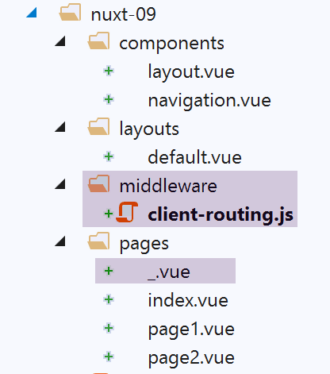
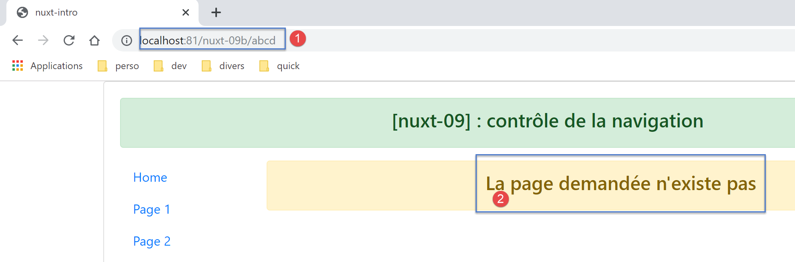

Exemple [nuxt-09] : contrôle de la navigation
=============================================

L’exemple [nuxt-09] utilise un middleware pour contrôler la navigation
du client. Par ailleurs, on ajoute une nouvelle vue pour les cas où
l’utilisateur demande au serveur une URL qui n’existe pas dans
l’application.

L’exemple [nuxt-09] est initialement obtenu par recopie de l’exemple
[nuxt-01] :

|image0|

La page [_.vue]
---------------

Nous avons dit que les routes de l’application étaient construites à
partir du contenu du dossier [pages]. Ici, nous avons ajouté dans ce
dossier la page [_.vue]. Cette page particulière est affichée à chaque
fois que l’application est routée vers une page qui n’existe pas. Dans
notre exemple ici, cela ne peut pas arriver pour le client. Mais cela
peut arriver pour le serveur si par exemple on lui demande l’URL
[/nuxt-09/**abcd**]. La page [abcd] n’existant pas, c’est la page
[_.vue] qui va être affichée. Ici, ce sera la suivante :

|image1|

Le code de la page [_.vue] est le suivant :

.. code-block:: javascript 
   :linenos:

   <!-- définition HTML de la vue -->
   <template>
     <!-- mise en page -->
     <Layout :left="true" :right="true">
       <!-- alerte dans la colonne de droite -->
       <template slot="right">
         <!-- message sur fond jaune -->
         <b-alert show variant="warning" align="center">
           <h4>La page demandée n'existe pas</h4>
         </b-alert>
       </template>
       <!-- menu de navigation dans la colonne de gauche -->
       <Navigation slot="left" />
     </Layout>
   </template>

   

Le middleware du client
-----------------------

Le code du middleware du client [client-routing] est le suivant :

.. code-block:: javascript 
   :linenos:

   /* eslint-disable no-undef */
   /* eslint-disable no-console */
   export default function({ route, from, redirect }) {
     // seulement le client
     if (process.client) {
       console.log('[client-routing]')
       // ordre de navigation souhaité
       const routes = ['index', 'page1', 'page2', 'index']
       // route courante
       const current = route.name
       // route précédente
       const previous = from.name
       // on veut une navigation circulaire
       // routes[i] vers routes[i+1]
       for (let i = 0; i < routes.length - 1; i++) {
         if (previous === routes[i] && current !== routes[i + 1]) {
           // on reste sur la même page
           redirect({ name: routes[i] })
           return
         }
       }
     }
   }

-  ligne 3 : nous savons que la fonction de routing ne reçoit qu’un
   paramètre, l’objet [context] de celui qui l’exécute, serveur ou
   client. La notation [function({ route, from, redirect })]

   -  est équivalente à [function({ route:route, from:from,
      redirect:redirect })] ;

   -  ce qui fait que { route:route, from:from, redirect:redirect } <--
      context ;

   -  ce qui crée trois paramètres [route, from, redirect] tels que :

      -  route=context.route ;

      -  redirect=context.redirect ;

      -  from=context.from ;

..

   La documentation de [nuxt] utilise abondamment cette notation. Il
   faut la connaître ;

-  ligne 8 : un tableau des noms de pages dans l’ordre de navigation
   souhaité

-  ligne 10 : le nom de la page de destination du routage courant ;

-  lignes 12 : le nom de la page précédente du routage courant ;

-  ligne 14 : comme exercice, on ne va autoriser qu’une navigation
   circulaire [index --> page1 --> page2 --> index] ;

-  lignes 15-21 : on parcourt le tableau donnant l’ordre de navigation
   souhaité ;

-  ligne 16 : si on découvre que routes[i] était la dernière page routée
   alors la suivante doit être routes[i+1] ;

-  lignes 18-19 : si ce n’est pas le cas, on redirige l’application vers
   routes[i], ç-à-d qu’on ne change pas de page : on refuse la
   navigation ;

   1. .. rubric:: Exécution
         :name: exécution

On exécute l’exemple avec le fichier [nuxt.config.js] suivant :

.. code-block:: javascript 
   :linenos:

   export default {
     mode: 'universal',
     /*
      ** Headers of the page
      */
     head: {
       title: process.env.npm_package_name || "Introduction à nuxt.js par l'exemple",
       meta: [
         { charset: 'utf-8' },
         { name: 'viewport', content: 'width=device-width, initial-scale=1' },
         { hid: 'description', name: 'description', content: process.env.npm_package_description || '' }
       ],
       link: [{ rel: 'icon', type: 'image/x-icon', href: '/favicon.ico' }]
     },
     /*
      ** Customize the progress-bar color
      */
     loading: { color: '#fff' },
     /*
      ** Global CSS
      */
     css: [],
     /*
      ** Plugins to load before mounting the App
      */
     plugins: [],
     /*
      ** Nuxt.js dev-modules
      */
     buildModules: [
       // Doc: https://github.com/nuxt-community/eslint-module
       '@nuxtjs/eslint-module'
     ],
     /*
      ** Nuxt.js modules
      */
     modules: [
       // Doc: https://bootstrap-vue.js.org
       'bootstrap-vue/nuxt',
       // Doc: https://axios.nuxtjs.org/usage
       '@nuxtjs/axios'
     ],
     /*
      ** Axios module configuration
      ** See https://axios.nuxtjs.org/options
      */
     axios: {},
     /*
      ** Build configuration
      */
     build: {
       /*
        ** You can extend webpack config here
        */
       extend(config, ctx) {}
     },
     // répertoire du code source
     srcDir: 'nuxt-09',
     router: {
       base: '/nuxt-09/',
       middleware: ['client-routing']
     },
     // serveur
     server: {
       port: 81, // default: 3000
       host: 'localhost' // default: localhost
     }
   }

Vérifiez les points suivants :

-  lorsque vous êtes sur la page [Home], vous ne pouvez naviguer que
   vers la page [Page 1] ;

-  lorsque vous êtes sur la page [Page 1], vous ne pouvez naviguer que
   vers la page [Page 2] ;

-  lorsque vous êtes sur la page [Page 2], vous ne pouvez naviguer que
   vers la page [Home] ;

-  lorsque vous demandez une URL incorrecte telle que
   [http://localhost:81/nuxt-09b/**abcd**] alors vous obtenez la vue qui
   indique que la page demandée n’existe pas ;

