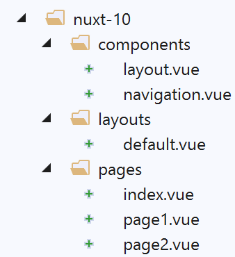
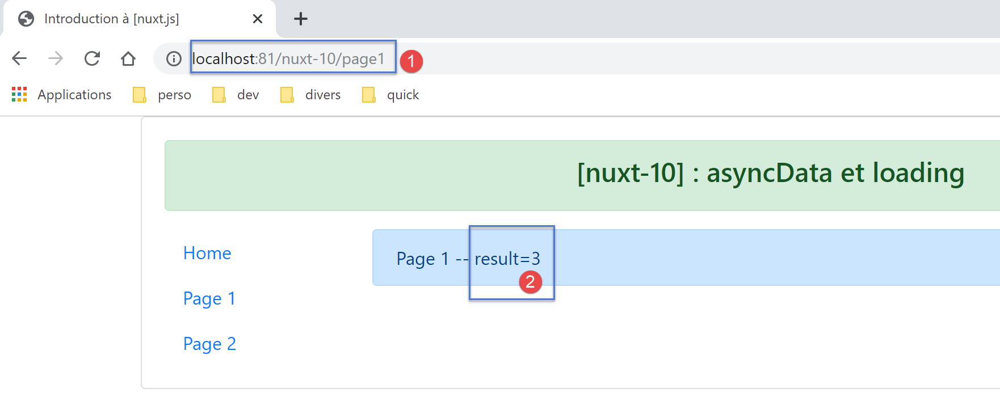
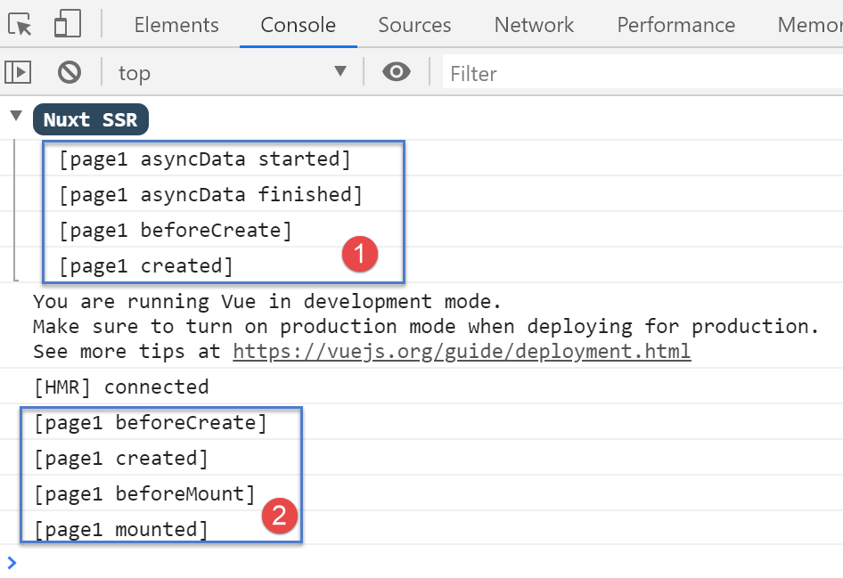
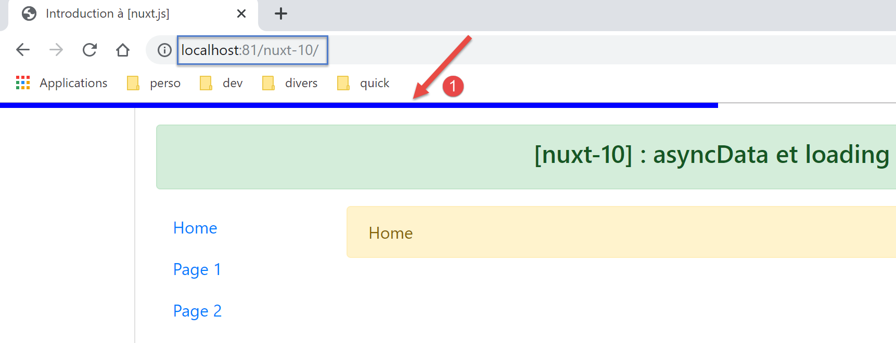
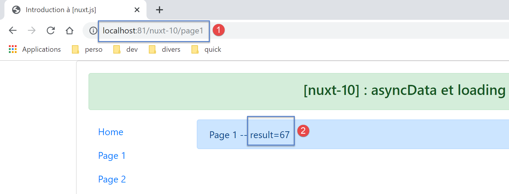
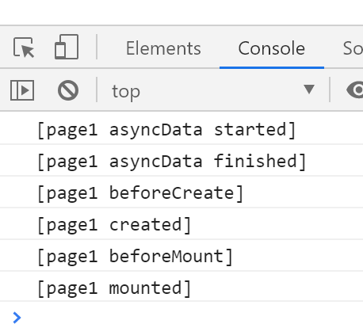

Exemple [nuxt-10] : asyncData et loading
========================================

La fonction [asyncData] dans une page permet de charger de façon
asynchrone des données souvent externes. [nuxt] attend la fin de la
fonction [asyncData] avant de commencer le cycle de vie de la page.
Celle-ci n’est donc rendue qu’une fois les données externes obtenues.
Elle est exécutée aussi bien par le serveur que par le client avec les
règles suivantes :

-  lorsque la page est demandée directement au serveur, seul le serveur
   exécute la fonction [asyncData] ;

-  ensuite lors de la navigation client, seul le client exécute la
   fonction [asyncData] ;

Au final seul l’un des deux, client ou serveur, exécute la fonction. Par
ailleurs, quand c’est le client qui exécute la fonction [asyncData],
[nuxt] affiche une barre de progression qui peut être paramétrée.

La fonction [asyncData] permet de délivrer aux moteurs de recherche des
pages avec leurs données ce qui les rend plus signifiantes.

L’exemple [nuxt-10] est obtenu initialement par recopie du projet
[nuxt-01] :

|image0|

Seule la page [page1] évolue.

La page [page1]
---------------

Le code de la page [page1] est le suivant :

.. code-block:: javascript 
   :linenos:

   <!-- vue n° 1 -->
   <template>
     <Layout :left="true" :right="true">
       <!-- navigation -->
       <Navigation slot="left" />
       <!-- message-->
       <b-alert slot="right" show variant="primary"> Page 1 -- result={{ result }} </b-alert>
     </Layout>
   </template>

   

-  lignes 26-39 : la fonction [asyncData]. Nous avons déjà étudié cette
   fonction (cf paragraphe `lien <chap-05.html#nuxt02_page2>`__). Elle
   est exécutée **avant** le cycle de vie de la page. Pour cette raison,
   on ne peut utiliser le mot clé [this] dans la fonction ;

-  ligne 30 : elle doit rendre une promesse [Promise] ou utiliser la
   syntaxe async / await ;

-  lignes 32-37 : la fonction asynchrone de la promesse est simulée avec
   une attente de 5 secondes (ligne 37) ;

-  ligne 34 : le résultat de la fonction asynchrone est rendu sous la
   forme d’un objet {result :...}. L’objet asynchrone rendu par la
   fonction [asyncData] **est intégré dans l’objet [data] de la page**.
   C’est pourquoi l’objet [result] est-il disponible ligne 7 du template
   alors même que la page n’avait pas défini d’objet [data] ;

   1. .. rubric:: Configuration de la barre de progression de
         [asyncData]
         :name: configuration-de-la-barre-de-progression-de-asyncdata

Lorsque la page [page1] est la cible d’une navigation au sein du client
(mode SPA), le client exécute la fonction [asyncData] et [nuxt] affiche
alors une barre de progression qu’elle cache lorsque la fonction
[asyncData] a rendu son résultat. La propriété [loading] du fichier
[nuxt.config.js] permet de configurer cette barre :

.. code-block:: javascript 
   :linenos:

   loading: {
       color: 'blue',
       height: '5px',
       throttle: 200,
       continuous: true
   },

Par défaut, l’image d’attente de [nuxt] est une barre de progression,
faisant la largeur de la page. Cette barre a une couleur et une
épaisseur. Le trait coloré grandit progressivement de 0 % à 100 % de sa
taille, plus ou moins vite donc selon la durée de l’attente.

-  ligne 2 : fixe la couleur de la barre de progression ;

-  ligne 3 : fixe l’épaisseur de la barre en pixels ;

-  ligne 4 : [throttle] est le délai en millisecondes avant que
   l’animation ne démarre. Cela permet de ne pas avoir d’image
   d’animation lorsque la fonction [asyncData] rend son résultat
   rapidement ;

-  ligne 5 : [continuous] fixe le comportement de l’animation de la
   barre de progression. Par défaut, la barre grandit progressivement de
   0 % à 100 % de sa taille, plus ou moins vite selon la durée de
   l’attente. Avec [continuous:true], le barre colorée grandit à vitesse
   constante de 0 à 100 % de sa taille, puis recommence tant que la
   fonction [asyncData] n’a pas rendu son résultat ;

   1. .. rubric:: Exécution
         :name: exécution

Lançons l’application, puis demandons, **à la main**, au serveur la page
[page1] :

|image1|

Les logs sont les suivants :

|image2|

-  on voit que seul le serveur [1] a exécuté la fonction [asyncData] et
   il l’a fait avant le cycle de la page ;

Maintenant examinons la page envoyée par le serveur (code source) :

.. code-block:: javascript 
   :linenos:

   <!doctype html>
   <html data-n-head-ssr>
   <head>
     <title>Introduction à [nuxt.js]</title>
     <meta data-n-head="ssr" charset="utf-8">
     <meta data-n-head="ssr" name="viewport" content="width=device-width, initial-scale=1">
     <meta data-n-head="ssr" data-hid="description" name="description" content="ssr routing loading asyncdata middleware plugins store">
     <link data-n-head="ssr" rel="icon" type="image/x-icon" href="/favicon.ico">
     <base href="/nuxt-10/">
     <link rel="preload" href="/nuxt-10/_nuxt/runtime.js" as="script">
     <link rel="preload" href="/nuxt-10/_nuxt/commons.app.js" as="script">
     <link rel="preload" href="/nuxt-10/_nuxt/vendors.app.js" as="script">
     <link rel="preload" href="/nuxt-10/_nuxt/app.js" as="script">
   ...
   </head>
   <body>
     

       

         

           

             

               

               <h4>[nuxt-10] : asyncData et loading</h4>
                 

               

                 

                   

                     <ul class="nav flex-column">
                       <li class="nav-item">
                         <a href="/nuxt-10/" target="_self" class="nav-link">
                           Home
                         </a>
                       </li>
                       <li class="nav-item">
                         <a href="/nuxt-10/page1" target="_self" class="nav-link active nuxt-link-active">
                           Page 1
                         </a>
                       </li>
                       <li class="nav-item">
                         <a href="/nuxt-10/page2" target="_self" class="nav-link">
                           Page 2
                         </a>
                       </li>
                     </ul>
                   
 

 Page 1 -- result=3 

                 

               

             

           

         

       

     

     
     
     
     
     
   </body>
   </html>

-  ligne 55 : on voit que le serveur a envoyé au client un tableau
   [data] qui contient l’objet [result:3] qui a été intégré à l’objet
   [data] de la page [page1] du serveur. Afin que le client puisse faire
   de même et donc afficher la même page que le serveur, celui-ci lui
   transmet l’objet [result]. On rappelle que le client ne va pas
   exécuter la fonction [asyncData]. Il va simplement utiliser les
   données calculées par le serveur ;

Maintenant naviguons de la page [Home] à la page [Page 1] en utilisant
le menu de navigation :

|image3|

-  en [1], on voit apparaître la barre de progression ;

Au bout de 5 secondes, on a la page [Page 1] :

|image4|

Les logs sont les suivants :

|image5|

On voit que le client a exécuté la fonction [asyncData] avant le cycle
de vie de la page.

