Exemple [nuxt-11] : personnalisation de l’image d’attente
=========================================================

Par défaut, l’image d’attente de [nuxt] est une barre de progression.
L’exemple [nuxt-11] montre qu’on peut la remplacer par sa propre image
d’attente :

|image0|

L’exemple [nuxt-11] montre également comment gérer des erreurs de
chargement.

|image1|

L’exemple [nuxt-11] est obtenu initialement par recopie de
:sup:`l’exemple` [nuxt-10] :

|image2|

Nous allons ajouter en [1], un plugin pour le client dont le rôle sera
de gérer des événements entre composants.

Le plugin [event-bus]
---------------------

Le plugin [event-bus] sera exécuté par le client et le serveur, mais on
verra qu’il ne fonctionne pas côté serveur. Son code est le suivant :

.. code-block:: javascript 
   :linenos:

   // on crée un bus d'événements entre les vues
   import Vue from 'vue'
   export default (context, inject) => {
     // le bus d'événements
     const eventBus = new Vue()
     // injection d'une fonction [eventBus] dans le contexte
     inject('eventBus', () => eventBus)
   }

-  ligne 5 : le bus d’événements est une instance de la classe [Vue]. En
   effet, celle-ci a les méthodes pour gérer des événements :

   -  [$emit] : pour émettre un événement ;

   -  [$on] : pour se mettre à l’écoute d’un événement particulier ;

..

   Ce bus d’événements ne gèrera qu’un événement, [loading], qui sera
   utilisé par les pages pour démarrer / arrêter l’animation d’attente
   de la fin d’une fonction asynchrone ;

-  ligne 7 : on crée une fonction [$eventBus] (1\ :sup:`er` argument)
   dont le rôle sera de rendre l’objet [eventBus] que l’on vient de
   créer (2ième argument). Cette fonction est injectée dans le contexte
   pour qu’elle soit disponible dans les objets [context.app] et l’objet
   [this] des pages ;

   1. .. rubric:: Le layout [default.vue]
         :name: le-layout-default.vue

Le layout [default.vue] évolue de la façon suivante :

.. code-block:: javascript 
   :linenos:

   <template>
     

       <b-card>
         <!-- un message -->
         <b-alert show variant="success" align="center">
           <h4>[nuxt-11] : personnalisation de l'attente, gestion des erreurs</h4>
         </b-alert>
         <!-- la vue courante du routage -->
         <nuxt />
         <!-- loading -->
         <b-alert v-if="showLoading" show variant="light">
           <strong>Requête au serveur de données en cours...</strong>
           

         </b-alert>
         <!-- erreur de chargement -->
         <b-alert v-if="showErrorLoading" show variant="danger">
           <strong>La requête au serveur de données a échoué : {{ errorLoadingMessage }}</strong>
         </b-alert>
       </b-card>
     

   </template>

   

-  lignes 11-14 : l’animation d’attente. Elle n’est affichée que si la
   propriété [showLoading] est vraie (ligne 29) ;

-  lignes 16-18 : le message d’erreur du chargement. Il n’est affiché
   que si la propriété [showErrorLoading] (ligne 30) est vraie ;

-  lignes 29-30 : au chargement initial du composant, l’animation
   d’attente est cachée ainsi que le message d’erreur ;

-  lignes 37-43 : lorsqu’elle est créée, la page écoute l’événement
   [loading] (1\ :sup:`er` argument) sur le bus d’événements créé par le
   plugin. A sa réception, elle fait exécuter la méthode [mShowLoading]
   des lignes 52-55 (2ième argument) ;

-  lignes 52-55 : la valeur reçue par la méthode [mShowLoading] sera un
   booléen true / false. Elle sert à montrer / cacher le message
   d’attente ;

-  lignes 41-42 : lorsqu’elle est créée, la page écoute l’événement
   [errorLoading] (1\ :sup:`er` argument) sur le bus d’événements créé
   par le plugin. A sa réception, elle fait exécuter la méthode
   [mShowErrorLoading] des lignes 57-61 (2ième argument) ;

-  ligne 57 : la méthode [mShowErrorLoading] reçoit deux arguments :

   -  le 1\ :sup:`er` argument est un booléen true / false pour montrer
      / cacher le message d’erreur ;

   -  le 2ième argument n’est présent que s’il y a eu erreur. Il
      représente le message d’erreur à afficher ;

-  les logs des lignes 53 et 58 vont nous montrer que les méthodes
   [showLoading] et [showErrorLoading] **ne sont pas exécutées** côté
   serveur ;

   1. .. rubric:: La page [page1]
         :name: la-page-page1

Le code de la page [page1] évolue de la façon suivante :

.. code-block:: javascript 
   :linenos:

   <!-- vue n° 1 -->
   <template>
     <Layout :left="true" :right="true">
       <!-- navigation -->
       <Navigation slot="left" />
       <!-- message-->
       <b-alert slot="right" show variant="primary"> Page 1 -- result={{ result }} </b-alert>
     </Layout>
   </template>

   

-  les modifications ont lieu dans la fonction [asyncData] des lignes
   26-47 ;

-  lignes 29-30 : avant que ne commence la fonction asynchrone on émet
   l’événement [loading] à destination des autres pages de
   l’application. On rappelle que dans [asyncData], on n’a pas accès à
   l’objet [this] pas encore créé. On utilise alors le contexte que
   reçoit en argument la fonction [asyncData] (ligne 26) ;

-  ligne 30 : on utilise le bus d’événements pour indiquer que le
   chargement va commencer ;

-  ligne 38 : on utilise le bus d’événements pour indiquer que le
   chargement est terminé ;

**Note** : A l’exécution, lorsque la page [page1] est demandée au
serveur, on ne voit pas l’image d’attente. Dans les logs on voit que
côté serveur la méthode [default.mShowLoading] n’est pas appelée. De
toute façon, voir l’image d’attente n’a pas de sens lorsque la page est
demandée au serveur. Celui-ci n’envoie la page au navigateur client
qu’une fois la fonction [asyncData] terminée. L’image d’attente est
alors inutile. Ce sera le cas pour toutes les pages de l’application
demandées directement au serveur.

La page [index]
---------------

Le code de la page [index] est le suivant :

.. code-block:: javascript 
   :linenos:

   <!-- page principale -->
   <template>
     <Layout :left="true" :right="true">
       <!-- navigation -->
       <Navigation slot="left" />
       <!-- message-->
       <b-alert slot="right" show variant="warning">
         Home
       </b-alert>
     </Layout>
   </template>

   

-  lignes 30-49 : la fonction [asyncData] est identique à celle de la
   page [page1] à un détail près : ligne 46, on termine la fonction
   asynchrone sur un échec (utilisation de la méthode [reject]) ;

-  ligne 46 : le paramètre de la fonction [reject] est une instance de
   la classe [Error]. Le paramètre du constructeur [Error] est le
   message de l’erreur ;

-  ligne 48 : cette erreur est interceptée par la méthode [catch] de la
   [Promise] qui reçoit l’erreur en paramètre. On utilise alors la
   fonction [context.error] pour déclarer l’erreur. Le paramètre de la
   fonction [context.error] est un objet avec ici deux propriétés :

   -  [statusCode] : un code HTTP d’erreur ;

   -  [message] : un message d’erreur ;

Que [asyncData] soit exécutée par le client ou le serveur, en cas
d’erreur [context.error], [nuxt] affiche la page [layouts /
**error.vue**] :

|image3|

Bien que ce soit une page, la page [error.vue] est cherchée dans le
dossier [layouts] (peut-être pour éviter qu’elle soit incluse dans les
routes de l’application ?). Ici, la page [error.vue] est la suivante :

.. code-block:: javascript 
   :linenos:

   <!-- définition HTML de la vue -->
   <template>
     <!-- mise en page -->
     <Layout :left="true" :right="true">
       <!-- alerte dans la colonne de droite -->
       <template slot="right">
         <!-- message sur fond jaune -->
         <b-alert show variant="danger" align="center">
           <h4>L'erreur suivante s'est produite : {{ JSON.stringify(error) }}</h4>
         </b-alert>
       </template>
       <!-- menu de navigation dans la colonne de gauche -->
       <Navigation slot="left" />
     </Layout>
   </template>

   

Lorsque [nuxt] affiche la page [error.vue], elle lui passe en propriété
[props], l’erreur qui s’est produite (ligne 33). Si l’erreur a été
provoquée par [context.error(**objet1**)], la propriété [props] de la
page [error.vue] aura la valeur [**objet1**]. La documentation [nuxt]
indique que [objet1] doit avoir au moins les attributs [statusCode,
message]. La ligne 9 affiche la chaîne jSON de l’objet [objet1] reçu.

La page [page2]
---------------

La page [page2] montre une autre façon de gérer l’erreur :

-  dans [page1], l’erreur est affichée dans une page à part
   [error.vue] ;

-  dans [page2], l’erreur sera affichée dans la page [page2] qui a
   provoqué l’erreur ;

Le code de [page2] est le suivant :

.. code-block:: javascript 
   :linenos:

   <!-- vue n° 2 -->
   <template>
     <Layout :left="true" :right="true">
       <!-- navigation -->
       <Navigation slot="left" />
       <!-- message -->
       <b-alert slot="right" show variant="secondary">
         Page 2
       </b-alert>
     </Layout>
   </template>

   

De nouveau, on insère une fonction [asyncData] dans le code de la page
et comme [index], [page2] va générer une erreur qu’on va cette fois
gérer différemment.

-  ligne 44 : le serveur comme le client terminent la promesse sur un
   succès en rendant le résultat [{ showErrorLoading: true,
   errorLoadingMessage }]. On sait que cela va avoir pour effet
   d’inclure les propriétés [showerrorLoading, errorLoadingMessage] dans
   les propriétés [data] de la page et que le client va recevoir ces
   propriétés ;

-  lignes 60-67 : on sait que la fonction [mounted] n’est exécutée que
   par le client ;

-  ligne 63 : le client teste si la propriété [showErrorLoading] a été
   positionnée (par le serveur ou le client selon les cas). Si oui, il
   émet l’événement [‘errorLoading’] (ligne 65) pour que la page
   [default] affiche le message d’erreur [this.errorLoadingMessage]. Au
   final, le serveur envoie une page **sans message d’erreur affiché**.
   Celui-ci est affiché au dernier moment par le client lorsque la page
   est ‘montée’ ;

   1. .. rubric:: Exécution
         :name: exécution

      1. .. rubric:: [nuxt.config]
            :name: nuxt.config

Le fichier [nuxt.config.js] d’exécution est le suivant :

.. code-block:: javascript 
   :linenos:

   export default {
     mode: 'universal',
     /*
      ** Headers of the page
      */
     head: {
       title: 'Introduction à [nuxt.js]',
       meta: [
         { charset: 'utf-8' },
         { name: 'viewport', content: 'width=device-width, initial-scale=1' },
         {
           hid: 'description',
           name: 'description',
           content: 'ssr routing loading asyncdata middleware plugins store'
         }
       ],
       link: [{ rel: 'icon', type: 'image/x-icon', href: '/favicon.ico' }]
     },
     /*
      ** Customize the progress-bar color
      */
     loading: false,

     /*
      ** Global CSS
      */
     css: [],
     /*
      ** Plugins to load before mounting the App
      */
     plugins: [{ src: '@/plugins/event-bus' }],
     /*
      ** Nuxt.js dev-modules
      */
     buildModules: [
       // Doc: https://github.com/nuxt-community/eslint-module
       '@nuxtjs/eslint-module'
     ],
     /*
      ** Nuxt.js modules
      */
     modules: [
       // Doc: https://bootstrap-vue.js.org
       'bootstrap-vue/nuxt',
       // Doc: https://axios.nuxtjs.org/usage
       '@nuxtjs/axios'
     ],
     /*
      ** Axios module configuration
      ** See https://axios.nuxtjs.org/options
      */
     axios: {},
     /*
      ** Build configuration
      */
     build: {
       /*
        ** You can extend webpack config here
        */
       extend(config, ctx) {}
     },
     // répertoire du code source
     srcDir: 'nuxt-11',
     // routeur
     router: {
       // racine des URL de l'application
       base: '/nuxt-11/'
     },
     // serveur
     server: {
       // port de service, 3000 par défaut
       port: 81,
       // adresses réseau écoutées, par défaut localhost : 127.0.0.1
       // 0.0.0.0 = toutes les adresses réseau de la machine
       host: 'localhost'
     }
   }

-  ligne 22 : on met la propiété [loading] à [false] pour que [nuxt]
   n’utilise pas son image d’attente par défaut ;

-  ligne 31 : le plugin qui définit le bus d’événements ;

   1. .. rubric:: *L*\ a page [index] *exécutée par le* serveur
         :name: la-page-index-exécutée-par-le-serveur

Demandons la page [index] au serveur (on tape l’URL
[http://localhost:81/nuxt-11/] à la main). La page affichée par le
navigateur client est la suivante :

|image4|

Les logs sont les suivants :

|image5|

-  en [3], on voit que le serveur envoie la page [error.vue] ;

-  en [4], on voit que le client affiche lui aussi la page [error] avec
   la même erreur que le serveur ;

-  on peut remarquer que la méthode [mShowLoading] de la page [default]
   n’a pas été appelée côté serveur alors même que la page [index] avait
   activé une attente. Cette méthode est appelée à réception d’un
   événement et visiblement la gestion événementielle n’est pas
   implémentée côté serveur ;

Examinons le code source de la page reçue par le navigateur client :

.. code-block:: javascript 
   :linenos:

   <!doctype html>
   <html data-n-head-ssr>
   <head>
     <title>Introduction à [nuxt.js]</title>
     <meta data-n-head="ssr" charset="utf-8">
     <meta data-n-head="ssr" name="viewport" content="width=device-width, initial-scale=1">
     <meta data-n-head="ssr" data-hid="description" name="description" content="ssr routing loading asyncdata middleware plugins store">
     <link data-n-head="ssr" rel="icon" type="image/x-icon" href="/favicon.ico">
     <base href="/nuxt-11/">
     <link rel="preload" href="/nuxt-11/_nuxt/runtime.js" as="script">
     <link rel="preload" href="/nuxt-11/_nuxt/commons.app.js" as="script">
     <link rel="preload" href="/nuxt-11/_nuxt/vendors.app.js" as="script">
     <link rel="preload" href="/nuxt-11/_nuxt/app.js" as="script">
     ...
   </head>
   <body>
     

       

         

           

             

               

               <h4>[nuxt-11] : personnalisation de l'attente, gestion des erreurs</h4>
                 

               

                 

                   

                     <ul class="nav flex-column">
                       <li class="nav-item">
                         <a href="/nuxt-11/" target="_self" class="nav-link active nuxt-link-active">
                           Home
                         </a>
                       </li>
                       <li class="nav-item">
                         <a href="/nuxt-11/page1" target="_self" class="nav-link">
                           Page 1
                         </a>
                       </li>
                       <li class="nav-item">
                         <a href="/nuxt-11/page2" target="_self" class="nav-link">
                           Page 2
                         </a>
                       </li>
                     </ul>
                   
 

                   <h4>L'erreur suivante s'est produite : {&quot;statusCode&quot;:500,&quot;message&quot;:&quot;le serveur n'a pas répondu assez vite&quot;}</h4>
                       

                   

                 

               
  
             

           

         

       

     

     
     
     
     
     
   </body>
   </html>

-  ligne 57 : on voit que le serveur a envoyé un objet [d] qui
   représente l’erreur qui s’est produite côté serveur ;

-  ligne 59 : on voit une propriété [error] ayant pour valeur l’objet
   [d]. On peut imaginer que c’est la présence de la propriété [error]
   dans la page envoyée par le serveur qui fait que les scripts client
   vont afficher la page [error.vue] avec l’erreur [error] ;

   1. .. rubric:: La page [page1] exécutée par le serveur
         :name: la-page-page1-exécutée-par-le-serveur

On tape à la main l’URL [http://localhost:81/nuxt-11/page1]. Au bout de
5 secondes, le navigateur affiche la page suivante :

|image6|

Les logs affichés sont les suivants :

|image7|

-  en [1], les logsdu serveur. On peut remarquer que la méthode
   [mShowLoading] de la page [default] n’a pas été appelée ;

-  en [2], les logs du client ;

   1. .. rubric:: La page [page2] exécutée par le serveur
         :name: la-page-page2-exécutée-par-le-serveur

Nous tapons à la main l’URL [http://localhost:81/nuxt-11/page2]. Au bout
de 5 secondes, le navigateur affiche la page suivante :

|image8|

Examinons les logs affichés dans le navigateur :

|image9|

-  en [1], les logs du serveur. On rappelle que le serveur a mis les
   propriétés [showErrorLoading, errorLoadingMessage] dans la page
   envoyée au navigateur client. On sait qu’alors ces propriétés vont
   être intégrées dans les [data] de la page affichée par le client

-  en [3], lorsque la page [page2] est montée, elle trouve la propriété
   [showErrorLoading] à vrai. Elle envoie alors un événement à la page
   [default], pour qu’elle affiche le message d’erreur envoyé par le
   serveur [4] ;

   1. .. rubric:: La page [index] exécutée par le client
         :name: la-page-index-exécutée-par-le-client

On utilise maintenant les liens de navigation pour afficher les trois
pages. Toutes les pages affichées par le client sont identiques à celles
affichées par le serveur. La seule différence est que l’image d’attente
de la fin des 5 secondes est affichée à chaque fois.

On commence par la page [index]. L’image d’attente est alors affichée :

|image10|

puis au bout de 5 secondes, on obtient la page suivante :

|image11|

La page finale est donc identique à celle obtenue côté serveur.

|image12|

Rappelons la fonction [asyncData] de la page [index] :

.. code-block:: javascript 
   :linenos:

   asyncData(context) {
       // log
       console.log('[page1 asyncData started]')
       // début attente
       context.app.$eventBus().$emit('loading', true)
       // pas d'erreur
       context.app.$eventBus().$emit('errorLoading', false)
       // on rend une promesse
       return new Promise(function(resolve, reject) {
         // on simule une fonction asynchrone
         setTimeout(function() {
           // fin attente
           context.app.$eventBus().$emit('loading', false)
           // log
           console.log('[page1 asyncData finished]')
           // on rend une erreur
           reject(new Error("le serveur n'a pas répondu assez vite"))
         }, 5000)
       }).catch((e) => context.error({ statusCode: 500, message: e.message }))
   }

Les logs du client sont les suivants :

|image13|

-  en [1], la fonction [asyncData] démarre ;

-  en [2], on met en route l’image d’attente ;

-  en [2-3], on voit que la page [default] a reçu les événements
   [loading, true] [2] et [errorLoading, false] envoyés par la fonction
   [asyncData] de la page [index] (lignes 5 et 7);

-  en [4], fin de l’attente. La page [default] a reçu l’événement
   [loading, false] envoyé par la page [index] (ligne 13);

-  en [5], la fonction [asyncData] a terminé son travail ;

-  parce que la fonction [asyncData] a créé une erreur avec
   [context.error] (ligne 19), la page [error] est affichée [6];

   1. .. rubric:: La page [*page1*] exécutée par le client
         :name: la-page-page1-exécutée-par-le-client

Après l’attente de 5 secondes, le client affiche la page suivante :

|image14|

Rappelons le code de la fonction [asyncData] de [page1] :

.. code-block:: javascript 
   :linenos:

   asyncData(context) {
       // log
       console.log('[page1 asyncData started]')
       // début attente
       context.app.$eventBus().$emit('loading', true)
       // pas d'erreur
       context.app.$eventBus().$emit('errorLoading', false)
       // on rend une promesse
       return new Promise(function(resolve, reject) {
         // on simule une fonction asynchrone
         setTimeout(function() {
           // fin attente
           context.app.$eventBus().$emit('loading', false)
           // log
           console.log('[page1 asyncData finished]')
           // on rend le résultat asynchrone - un nombre aléatoire ici
           resolve({ result: Math.floor(Math.random() * Math.floor(100)) })
         }, 5000)
       })
   },

Les logs sont les suivants :

|image15|

La page [*page2*] exécutée par le client
~~~~~~~~~~~~~~~~~~~~~~~~~~~~~~~~~~~~~~~~

Après l’attente de 5 secondes, le client affiche la page suivante :

|image16|

Rappelons le code des fonctions [asyncData] et [mounted] de [page2] :

.. code-block:: javascript 
   :linenos:

   asyncData(context) {
       // log
       console.log('[page2 asyncData started]')
       // début attente
       context.app.$eventBus().$emit('loading', true)
       // pas d'erreur
       context.app.$eventBus().$emit('errorLoading', false)
       // on rend une promesse
       return new Promise(function(resolve, reject) {
         // on simule une fonction asynchrone
         setTimeout(function() {
           // fin attente
           context.app.$eventBus().$emit('loading', false)
           // on génére arbitrairement une erreur
           const errorLoadingMessage = "le serveur n'a pas répondu assez vite"
           // fin avec succès
           resolve({ showErrorLoading: true, errorLoadingMessage })
           // log
           console.log('[page2 asyncData finished]')
         }, 5000)
       })
     }

   mounted() {
       console.log('[page2 mounted]')
       // client
       if (this.showErrorLoading) {
         console.log('[page2 mounted, showErrorLoading=true]')
         this.$eventBus().$emit('errorLoading', true, this.errorLoadingMessage)
       }
   }

Les logs sont les suivants :

|image17|

-  en [1], la page [default] a reçu l’événement [showErrorLoading, true]
   envoyé par [page2] (ligne 29) qui lui demande d’afficher le message
   d’erreur ;

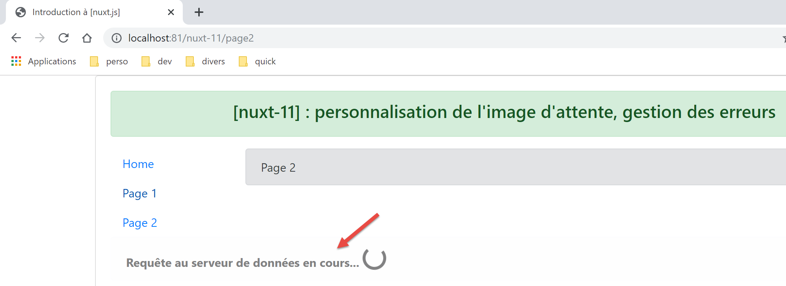
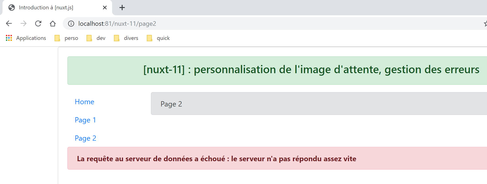
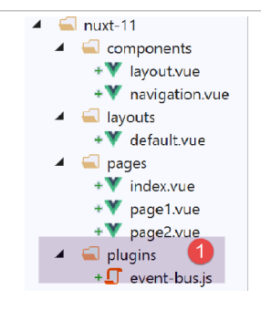
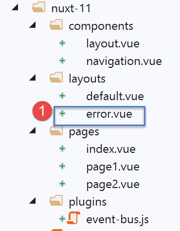
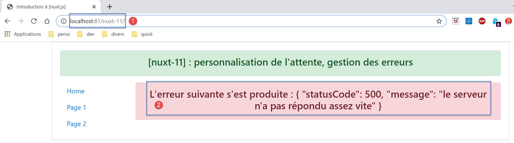
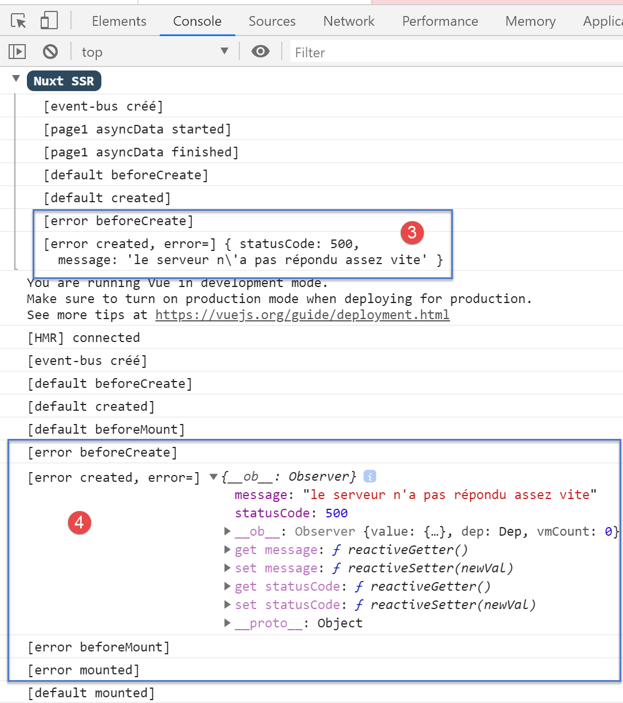
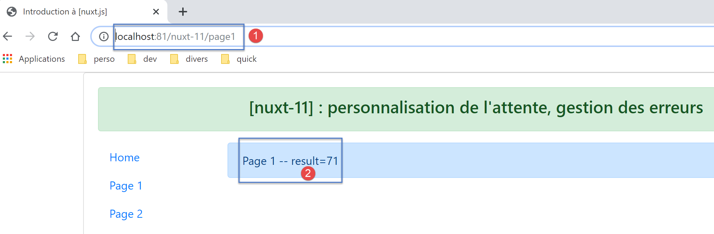
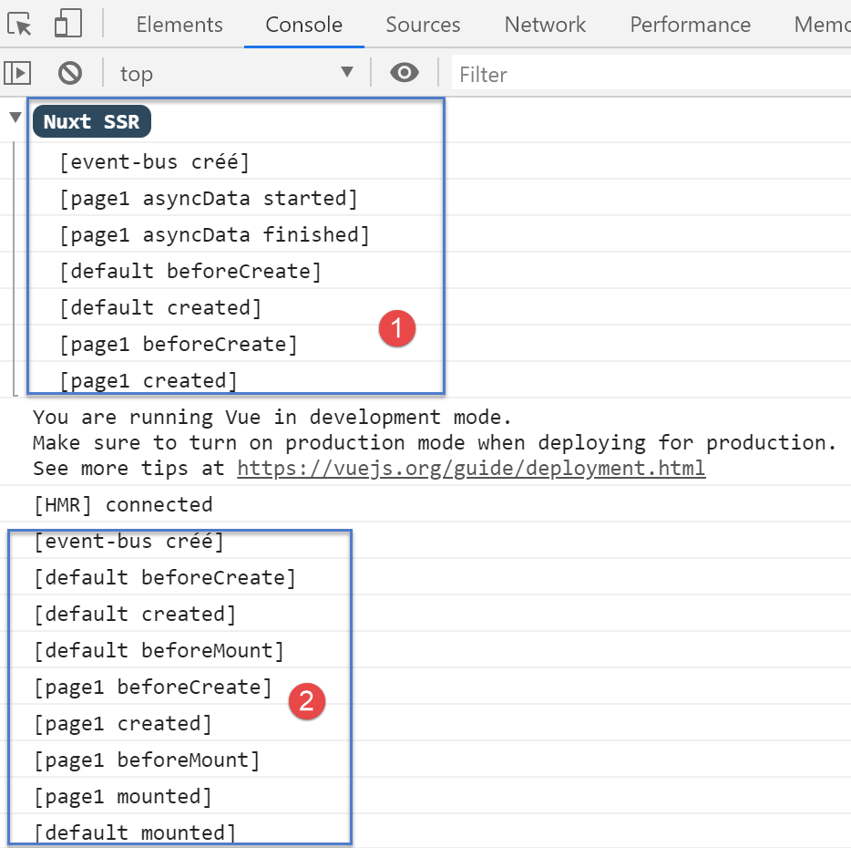
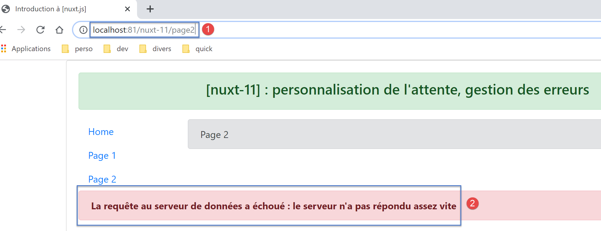
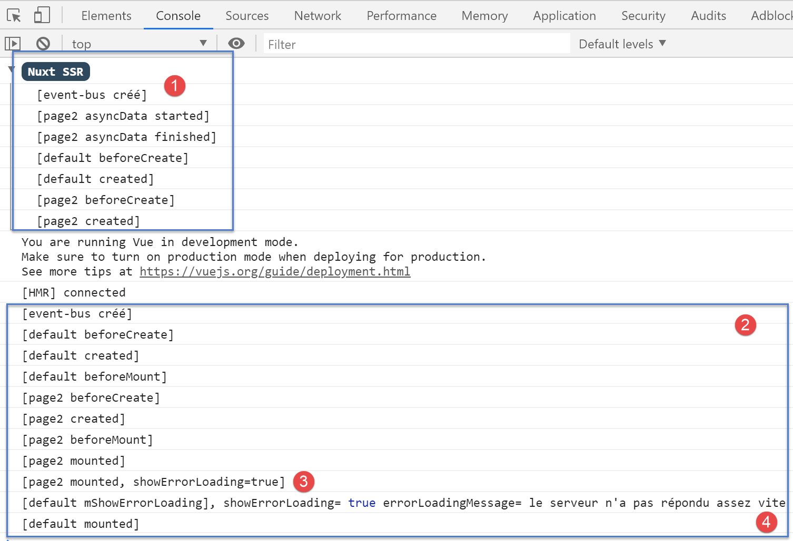
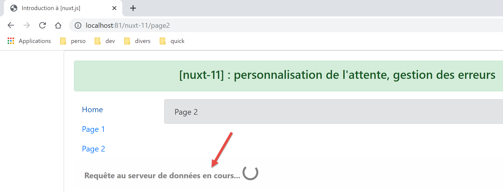
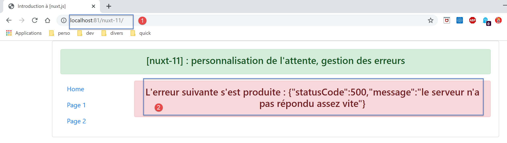
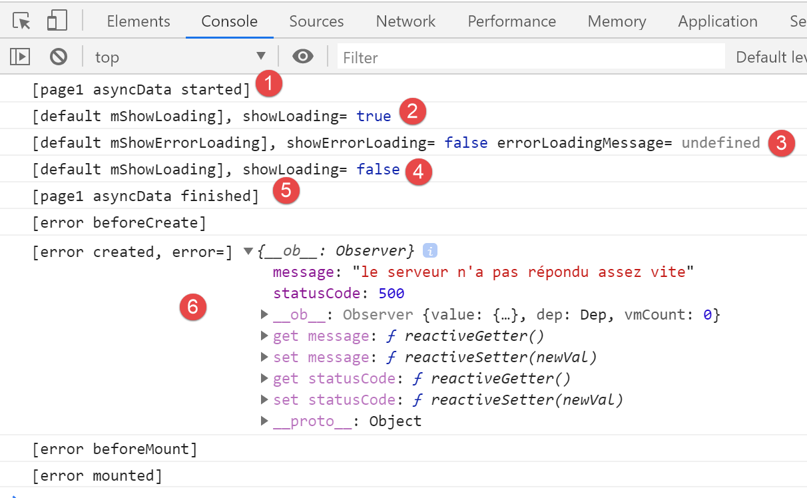

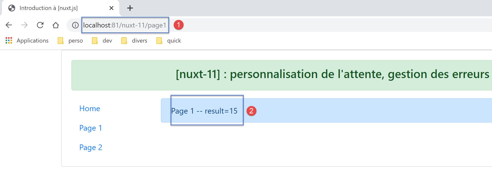
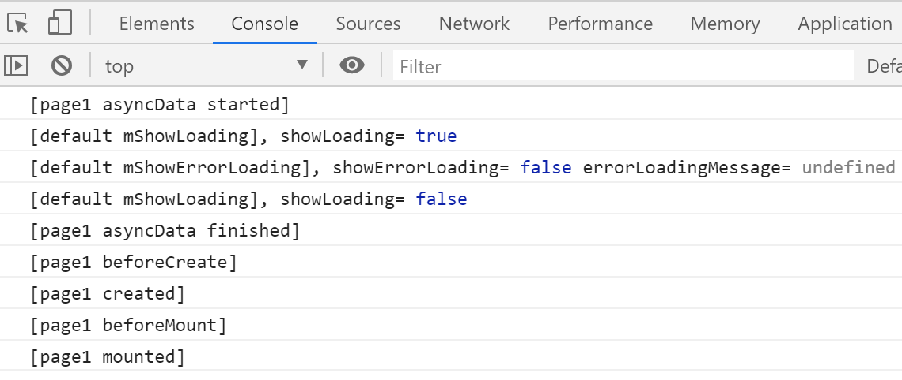
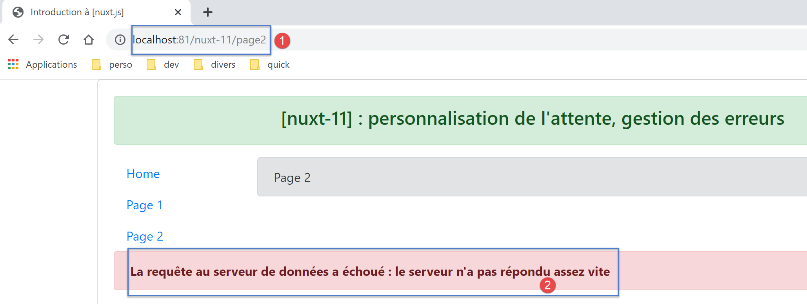
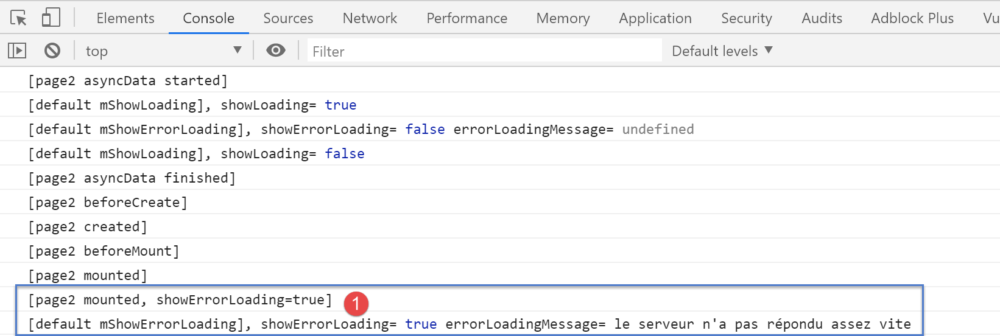
