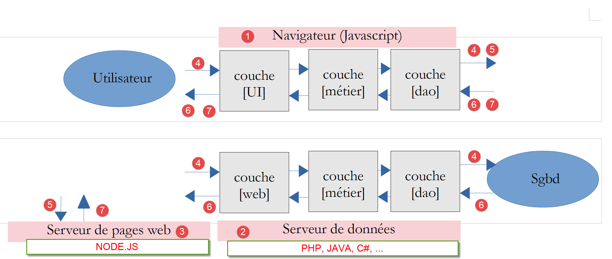
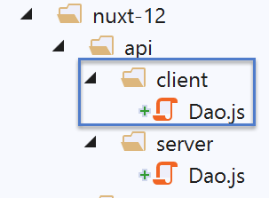

Exemple [nuxt-12] : requêtes HTTP avec axios
============================================

Présentation
------------

Dans ce nouvel exemple, nous allons découvrir comment dans les fonctions
[asyncData] on peut faire des requêtes HTTP avec la bibliothèque
[axios]. Par ailleurs, nous allons utiliser des notions déjà acquises :

-  l’utilisation de plugins de l’exemple [nuxt-06] :

-  la persistance du store dans un cookie de session de l’exemple
   [nuxt-06] ;

-  le contrôle de la navigation avec des middlewares de l’exemple
   [nuxt-09] ;

-  la gestion des erreurs  de l’exemple [nuxt-11] ;

L’architecture de l’exemple sera le suivant :

|image0|

-  l’application [nuxt] sera stockée sur le serveur [node.js] [3],
   téléchargée par le navigateur [1] qui l’exécutera ensuite ;

-  le client [nuxt] [1] aussi bien que le serveur [nuxt] [3] feront des
   requêtes HTTP au serveur de données [2]. Ce serveur sera le serveur
   de calcul de l’impôt développé dans la partie PHP 7. Nous utiliserons
   sa dernière version, la version 14, avec les requêtes CORS
   autorisées ;

L’architecture de l’exemple peut être simplifiée de la façon suivante :

|image1|

-  en [1], le serveur [node.js] délivre les pages [nuxt] au navigateur
   [2]. C’est la couche [web] [8] du serveur qui délivre ces pages. Pour
   délivrer la page, le serveur a pu demander des données externes au
   serveur de données [3]. C’est la couche [DAO] [9] qui fait les
   requêtes HTTP nécessaires ;

-  à chaque appel de page au serveur [node.js][1], le navigateur [2]
   reçoit la totalité de l’application [nuxt] qui va alors s’exécuter en
   mode SPA. Le bloc [UI] (User Interface) [4] présente des pages
   [vue.js] à l’utilisateur. Les actions de celui-ci ou le cycle de vie
   naturel des pages peuvent provoquer des appels de données externes au
   serveur de données [3]. C’est la couche [DAO] [5] qui fait alors les
   requêtes HTTP nécessaires ;

Arborescence du projet
----------------------

|image2|

Le fichier de configuration [nuxt.config.js]
--------------------------------------------

Le projet sera contrôlé par le fichier [nuxt.config.js] suivant :

.. code-block:: javascript 
   :linenos:

   export default {
     mode: 'universal',
     /*
      ** Headers of the page
      */
     head: {
       title: 'Introduction à [nuxt.js]',
       meta: [
         { charset: 'utf-8' },
         { name: 'viewport', content: 'width=device-width, initial-scale=1' },
         {
           hid: 'description',
           name: 'description',
           content: 'ssr routing loading asyncdata middleware plugins store'
         }
       ],
       link: [{ rel: 'icon', type: 'image/x-icon', href: '/favicon.ico' }]
     },
     /*
      ** Customize the progress-bar color
      */
     loading: false,

     /*
      ** Global CSS
      */
     css: [],
     /*
      ** Plugins to load before mounting the App
      */
     plugins: [
       { src: '@/plugins/client/plgSession', mode: 'client' },
       { src: '@/plugins/server/plgSession', mode: 'server' },
       { src: '@/plugins/client/plgDao', mode: 'client' },
       { src: '@/plugins/server/plgDao', mode: 'server' },
       { src: '@/plugins/client/plgEventBus', mode: 'client' }
     ],
     /*
      ** Nuxt.js dev-modules
      */
     buildModules: [
       // Doc: https://github.com/nuxt-community/eslint-module
       '@nuxtjs/eslint-module'
     ],
     /*
      ** Nuxt.js modules
      */
     modules: [
       // Doc: https://bootstrap-vue.js.org
       'bootstrap-vue/nuxt',
       // Doc: https://axios.nuxtjs.org/usage
       '@nuxtjs/axios',
       // https://www.npmjs.com/package/cookie-universal-nuxt
       'cookie-universal-nuxt'
     ],
     /*
      ** Axios module configuration
      ** See https://axios.nuxtjs.org/options
      */
     axios: {},
     /*
      ** Build configuration
      */
     build: {
       /*
        ** You can extend webpack config here
        */
       extend(config, ctx) { }
     },
     // répertoire du code source
     srcDir: 'nuxt-12',
     // routeur
     router: {
       // racine des URL de l'application
       base: '/nuxt-12/',
       // middleware de routage
       middleware: ['routing']
     },
     // serveur
     server: {
       // port de service, 3000 par défaut
       port: 81,
       // adresses réseau écoutées, par défaut localhost : 127.0.0.1
       // 0.0.0.0 = toutes les adresses réseau de la machine
       host: 'localhost'
     },
     // environnement
     env: {
       // configuration axios
       timeout: 2000,
       withCredentials: true,
       baseURL: 'http://localhost/php7/scripts-web/impots/version-14',
       // configuration du cookie de session [nuxt]
       maxAge: 60 * 5
     }
   }

-  ligne 22 : nous gérons nous-mêmes l’alerte d’attente de fin d’une
   action asynchrone ;

-  ligne 31 : nous allons utiliser divers plugins qui seront spécialisés
   soit pour le client soit pour le serveur mais pas pour les deux à la
   fois ;

-  ligne 52 : le module [axios] est intégré à [nuxt]. Cela va avoir pour
   conséquence que l’objet [axios] qui fera les requêtes HTTP de
   l’application [nuxt] vers le serveur PHP de calcul de l’impôt sera
   disponible dans [**context.$axios**] ;

-  ligne 54 : le module [cookie-universal-nuxt] va nous permettre de
   sauvegarder la session [nuxt] dans un cookie ;

-  ligne 60 : la propriété [axios] nous permet de configurer le module
   [@nuxtjs/axios] de la ligne 52. Nous n’utiliserons pas cette
   possibilité à laquelle nous préfèrerons la propriété [env] de la
   ligne 88 ;

-  ligne 90 : durée d’attente maximale de la réponse du serveur de
   calcul de l’impôt ;

-  ligne 91 : nécessaire au client [nuxt] - autorise l’utilisation de
   cookies dans les échanges avec le serveur de calcul de l’impôt ;

-  ligne 92 : l’URL de base du serveur de calcul de l’impôt ;

-  ligne 94 : durée de vie de la session nuxt (5 mn) ;

-  ligne 77 : la navigation des client et serveur [nuxt] sera contrôlée
   par un middleware de routage ;

La couche [UI] de l’application
-------------------------------

|image3|

Nous allons donner à l’application [nuxt] l’accès à l’API du serveur de
calcul de l’impôt via la vue suivante :

|image4|

-  en [2], le menu qui donne accès à l’API du serveur de calcul de
   l’impôt :

   -  [Authentification] : correspond à la page [authentification].
      Cette page fait une requête d’authentification auprès du serveur
      de calcul de l’impôt avec les identifiants [admin, admin] qui sont
      pour l’instant les seuls autorisés. Le résultat affiché est
      analogue à [3] ;

   -  [Requête AdminData] : correspond à la page [get-admindata]. Cette
      page demande au serveur de calcul de l’impôt, les données,
      appelées ici [adminData], qui permettent le calcul de l’impôt. Le
      résultat affiché est analogue à [3] ;

   -  [Fin session impôt] : correspond à la page [fin-session]. Cette
      page fait une requête de fin de session PHP auprès du serveur de
      calcul de l’impôt. Le serveur annule alors la session PHP courante
      et en initialise une nouvelle vierge ;

Les couches [dao] de l’application [nuxt]
-----------------------------------------

Comme indiqué plus haut, l’architecture de l’application [nuxt] sera la
suivante :

|image5|

-  en [1], le serveur [node.js] délivre les pages [nuxt] au navigateur
   [2]. C’est la couche [web] [8] du serveur qui délivre ces pages. Pour
   délivrer la page, le serveur a pu demander des données externes au
   serveur de données [3]. C’est la couche [DAO] [9] qui fait les
   requêtes HTTP nécessaires ;

-  à chaque appel de page au serveur [node.js][1], le navigateur [2]
   reçoit la totalité de l’application [nuxt] qui va alors s’exécuter en
   mode SPA. Le bloc [UI] (User Interface) [4] présente des pages
   [vue.js] à l’utilisateur. Les actions de celui-ci ou le cycle de vie
   des pages peuvent provoquer des appels de données externes au serveur
   de données [3]. C’est la couche [DAO] [5] qui fait alors les requêtes
   HTTP nécessaires ;

Nous utiliserons la version 14 du serveur de calcul de l’impôt développé
dans le document \|\ `Introduction au langage PHP7 par
l’exemple <https://tahe.developpez.com/tutoriels-cours/php7>`__\ \|.
Nous utiliserons une partie seulement de son API (**A**\ pplication
**P**\ rogramming **I**\ nterface) jSON :

+----------------------------------+----------------------------------+
| **Requête**                      | **Réponse**                      |
+----------------------------------+----------------------------------+
| ::                               | ::                               |
|                                  |                                  |
|    [initial                      |    {                             |
| isation d’une session jSON avec  |        "action": "init-session", |
| le serveur de calcul de l’impôt] |        "état": 700,              |
|                                  |        "réponse": "se            |
| [une session PHP est créée avec  | ssion démarrée avec type [json]" |
| le serveur de calcul de l’impôt] |    }                             |
|                                  |                                  |
|    GET main.p                    |                                  |
| hp?action=init-session&type=json |                                  |
+----------------------------------+----------------------------------+
| ::                               | ::                               |
|                                  |                                  |
|    [au                           |    {                             |
| thentification de l’utilisateur] |        "acti                     |
|    [l’authentification           | on": "authentifier-utilisateur", |
| est stockée dans la session PHP] |        "état": 200,              |
|                                  |        "réponse": "Authenti      |
|    POST main.php                 | fication réussie [admin, admin]" |
| ?action=authentifier-utilisateur |    }                             |
|                                  |                                  |
|  paramètres postés : user, admin |                                  |
+----------------------------------+----------------------------------+
| ::                               | ::                               |
|                                  |                                  |
|    [demande des donn             |    {                             |
| ées de l’administration fiscale] |                                  |
|    [les données reçues so        |       "action": "get-admindata", |
| nt stockées dans la session PHP] |        "état": 1000,             |
|                                  |        "réponse": {              |
|    G                             |            "limites": [          |
| ET main.php?action=get-admindata |                9964,             |
|                                  |                27519,            |
|                                  |                73779,            |
|                                  |                156244,           |
|                                  |                0                 |
|                                  |            ],                    |
|                                  |            "coeffR": [           |
|                                  |                0,                |
|                                  |                0.14,             |
|                                  |                0.3,              |
|                                  |                0.41,             |
|                                  |                0.45              |
|                                  |            ],                    |
|                                  |            "coeffN": [           |
|                                  |                0,                |
|                                  |                1394.96,          |
|                                  |                5798,             |
|                                  |                13913.69,         |
|                                  |                20163.45          |
|                                  |            ],                    |
|                                  |                                  |
|                                  |       "plafondQfDemiPart": 1551, |
|                                  |            "plafondRevenusC      |
|                                  | elibatairePourReduction": 21037, |
|                                  |            "plafondRev           |
|                                  | enusCouplePourReduction": 42074, |
|                                  |                                  |
|                                  |     "valeurReducDemiPart": 3797, |
|                                  |            "                     |
|                                  | plafondDecoteCelibataire": 1196, |
|                                  |                                  |
|                                  |     "plafondDecoteCouple": 1970, |
|                                  |            "plaf                 |
|                                  | ondImpotCouplePourDecote": 2627, |
|                                  |            "plafondIm            |
|                                  | potCelibatairePourDecote": 1595, |
|                                  |            "a                    |
|                                  | battementDixPourcentMax": 12502, |
|                                  |                                  |
|                                  |  "abattementDixPourcentMin": 437 |
|                                  |        }                         |
|                                  |    }                             |
+----------------------------------+----------------------------------+
| ::                               | ::                               |
|                                  |                                  |
|    [fin de la session PHP avec   |    {                             |
| le serveur de calcul de l’impôt] |        "action": "fin-session",  |
|    [supprime la session PHP cou  |        "état": 400,              |
| rante et crée une nouvelle sessi |                                  |
| on PHP. Dans celle-ci, la sessio |   "réponse": "session supprimée" |
| n jSON reste activée, mais l’uti |    }                             |
| lisateur n’est plus authentifié] |                                  |
|                                  |                                  |
|                                  |                                  |
|  GET main.php?action=fin-session |                                  |
+----------------------------------+----------------------------------+

Le couche [dao] du serveur [nuxt]
~~~~~~~~~~~~~~~~~~~~~~~~~~~~~~~~~

|image6|

Le serveur [node.js] [1] va utiliser la couche [dao] décrite dans le
document \|\ `Introduction au framework VUE.JS par
l’exemple <https://tahe.developpez.com/tutoriels-cours/vuejs>`__\ \|.
Nous rappelons ici son code :

.. code-block:: javascript 
   :linenos:

   'use strict';

   // imports
   import qs from 'qs'

   class Dao {

     // constructeur
     constructor(axios) {
       this.axios = axios;
       // cookie de session
       this.sessionCookieName = "PHPSESSID";
       this.sessionCookie = '';
     }

     // init session
     async  initSession() {
       // options de la requête HHTP [get /main.php?action=init-session&type=json]
       const options = {
         method: "GET",
         // paramètres de l'URL
         params: {
           action: 'init-session',
           type: 'json'
         }
       };
       // exécution de la requête HTTP
       return await this.getRemoteData(options);
     }

     async  authentifierUtilisateur(user, password) {
       // options de la requête HHTP [post /main.php?action=authentifier-utilisateur]
       const options = {
         method: "POST",
         headers: {
           'Content-type': 'application/x-www-form-urlencoded',
         },
         // corps du POST
         data: qs.stringify({
           user: user,
           password: password
         }),
         // paramètres de l'URL
         params: {
           action: 'authentifier-utilisateur'
         }
       };
       // exécution de la requête HTTP
       return await this.getRemoteData(options);
     }

     async getAdminData() {
       // options de la requête HHTP [get /main.php?action=get-admindata]
       const options = {
         method: "GET",
         // paramètres de l'URL
         params: {
           action: 'get-admindata'
         }
       };
       // exécution de la requête HTTP
       const data = await this.getRemoteData(options);
       // résultat
       return data;
     }

     async  getRemoteData(options) {
       // pour le cookie de session
       if (!options.headers) {
         options.headers = {};
       }
       options.headers.Cookie = this.sessionCookie;
       // exécution de la requête HTTP
       let response;
       try {
         // requête asynchrone
         response = await this.axios.request('main.php', options);
       } catch (error) {
         // le paramètre [error] est une instance d'exception - elle peut avoir diverses formes
         if (error.response) {
           // la réponse du serveur est dans [error.response]
           response = error.response;
         } else {
           // on relance l'erreur
           throw error;
         }
       }
       // response est l'ensemble de la réponse HTTP du serveur (entêtes HTTP + réponse elle-même)
       // on récupère le cookie de session s'il existe
       const setCookie = response.headers['set-cookie'];
       if (setCookie) {
         // setCookie est un tableau
         // on cherche le cookie de session dans ce tableau
         let trouvé = false;
         let i = 0;
         while (!trouvé && i < setCookie.length) {
           // on cherche le cookie de session
           const results = RegExp('^(' + this.sessionCookieName + '.+?);').exec(setCookie[i]);
           if (results) {
             // on mémorise le cookie de session
             // eslint-disable-next-line require-atomic-updates
             this.sessionCookie = results[1];
             // on a trouvé
             trouvé = true;
           } else {
             // élément suivant
             i++;
           }
         }
       }
       // la réponse du serveur est dans [response.data]
       return response.data;
     }
   }

   // export de la classe
   export default Dao;

-  toutes les méthodes de la couche [dao] rendent l’objet envoyé par le
   serveur de données [{**action** : ‘xx’, **état** : nn, **réponse** :
   {...}] avec :

   -  [action] : le nom de l’action exécutée par le serveur de données ;

   -  [état] : indicateur numérique :

      -  [initSession] : **état**\ =700 pour une réponse sans erreur ;

      -  [authentifierUtilisateur] : **état**\ =200 pour une réponse
         sans erreur ;

      -  [getAdminData] : **état**\ =1000 pour une réponse sans erreur ;

      -  [fin-session] : **état**\ =400 pour une réponse sans erreur ;

   -  [réponse] : réponse associée à l’indicateur numérique [état]. Peut
      varier selon cet indicateur numérique ;

Examinons le constructeur de la classe [Dao] :

.. code-block:: javascript 
   :linenos:

   // constructeur
     constructor(axios) {
       this.axios = axios;
       // cookie de session
       this.sessionCookieName = "PHPSESSID";
       this.sessionCookie = '';
   }

-  ligne 2 : l’objet [axios] fourni en argument au constructeur est
   fourni par le code appelant. C’est lui qui va faire les requêtes
   HTTP ;

-  ligne 5 : le nom du cookie de session envoyé par le serveur de
   données écrit en PHP ;

-  ligne 6 : le cookie de session qui est échangé entre la couche [dao]
   et le serveur de données. Celui-ci est initialisé par la fonction
   [getRemoteData] des lignes 67-113 ;

Pour le cookie de session, il nous faut considérer deux couches [dao]
séparées :

-  celle du navigateur ;

-  celle du serveur ;

Nous allons devoir gérer trois cookies de session :

1. celui échangé entre le client [nuxt] et le serveur PHP 7 ;

2. celui échangé entre le serveur [nuxt] et le serveur PHP 7 ;

3. celui échangé entre le client [nuxt] et le serveur [nuxt] ;

Nous ferons en sorte que le cookie de la session avec le serveur PHP
soit le même pour le client et le serveur [nuxt]. Nous appellerons ce
cookie, **cookie de la session PHP**. Ce cookie est celui des cas 1 et
2. Nous appellerons **cookie de la session [nuxt]**, le cookie du cas 3.
Nous aurons donc deux sessions :

-  une session PHP avec le cookie de session PHP ;

-  une session [nuxt] avec le cookie de session [nuxt] ;

Pourquoi utiliser le même cookie pour les sessions PHP du client et du
navigateur [nuxt] ? Nous voulons que l’application puisse dialoguer avec
le serveur PHP 7 indifféremment avec le client ou le serveur [nuxt] :

-  si une action A du serveur [nuxt] met le serveur PHP dans un état E,
   cet état est reflété dans la session PHP entretenue par le serveur
   PHP ;

-  en utilisant le même cookie de session PHP que le serveur, une action
   B du client [nuxt] qui suivrait l’action A du serveur [nuxt]
   retrouverait le serveur PHP dans l’état E laissé par le serveur
   [nuxt] et pourrait donc s’appuyer sur le travail déjà fait par le
   serveur [nuxt] ;

-  si après l’action B du client [nuxt], vient une action C du serveur
   [nuxt], pour la même raison que précédemment, cette action va pouvoir
   s’appuyer sur le travail fait par l’action B du client [nuxt] ;

Pour que le navigateur du client [nuxt] puisse dialoguer avec le serveur
PHP du calcul de l’impôt, nous utiliserons la version 14 de ce serveur
**qui autorise les appels inter-domaines**, ç-à-d ceux d’un navigateur
vers le serveur PHP. Les appels du serveur [nuxt] vers le serveur PHP ne
sont pas, eux, des appels inter-domaines. Cette notion n’existe que pour
les appels faits depuis un navigateur.

Revenons au code du constructeur de la classe [Dao] précédente :

.. code-block:: javascript 
   :linenos:

   // constructeur
     constructor(axios) {
       this.axios = axios;
       // cookie de session
       this.sessionCookieName = "PHPSESSID";
       this.sessionCookie = '';
   }

-  les lignes 5 et 6 correspondent au cookie de la session PHP avec le
   serveur de calcul de l’impôt ;

La gestion du cookie de la session PHP ci-dessus ne convient pas au
serveur [nuxt] : sa couche [dao] **est instanciée à chaque nouvelle
requête faite au serveur [nuxt]**. On se rappelle en effet que demander
une page au serveur [nuxt] revient à réinitialiser l’application [nuxt].
Ainsi lorsqu’à l’issue de la 1ère requête faite au serveur de données
par le serveur [nuxt], le cookie de session PHP de la couche [dao] est
initialisé, cette valeur est perdue lors de la requête HTTP suivante du
même serveur [nuxt], car entre-temps sa couche [dao] a été recréée, le
constructeur réexécuté et le cookie de session PHP réinitialisé avec la
chaîne vide (ligne 6) ;

Une solution est d’utiliser un autre constructeur pour la couche [dao]
du serveur :

.. code-block:: javascript 
   :linenos:

   // constructeur
     constructor(axios, phpSessionCookie) {
       // bibliothèque axios
       this.axios = axios
       // valeur du cookie de session
       this.phpSessionCookie = phpSessionCookie
       // nom du cookie de session du serveur PHP
       this.phpSessionCookieName = 'PHPSESSID'
     }

-  ligne 2 : cette fois-ci le cookie de la session PHP sera fourni au
   constructeur de la couche [dao] du serveur de données ;

Comment le serveur [nuxt] pourra-t-il fournir ce cookie de session PHP
au constructeur de sa couche [dao] ? Nous stockerons le cookie de
session PHP dans le cookie de session [nuxt] échangé entre le navigateur
et le serveur [nuxt]. Le processus est le suivant :

1. l’application [nuxt] est lancée ;

2. lorsque le serveur [nuxt] fait sa 1ère requête HTTP avec le serveur
   PHP, il stocke le cookie de la session PHP qu’il a reçu dans le
   cookie de session [nuxt] qu’il échange avec le client [nuxt] ;

3. le navigateur qui loge le client [nuxt] reçoit ce cookie de session
   [nuxt] et le renvoie donc systématiquement à chaque nouvelle requête
   au serveur [nuxt] ;

4. lorsque le serveur [nuxt] devra faire une nouvelle requête au serveur
   PHP, il retrouvera le cookie de session PHP dans le cookie de session
   [nuxt] que le navigateur lui aura envoyé. Il l’enverra alors au
   serveur PHP ;

Il y a bien deux cookies de session et il ne faut pas les confondre :

-  le cookie de session [nuxt] échangé entre le serveur [nuxt] et le
   navigateur du client [nuxt] ;

-  le cookie de session PHP échangé entre le serveur [nuxt] et le
   serveur PHP ou entre le client [nuxt] et le serveur PHP ;

Revenons maintenant sur le code de la méthode de la classe [Dao]. Elle
n’inclut pas de fonction pour clôre la session PHP avec le serveur de
calcul de l’impôt. Nous ajoutons celle-ci :

.. code-block:: javascript 
   :linenos:

   // fin de la session de calcul de l'impôt
     async finSession() {
       // options de la requête HHTP  [get /main.php?action=fin-session]
       const options = {
         method: 'GET',
         // paramètres de l'URL
         params: {
           action: 'fin-session'
         }
       }
       // exécution de la requête HTTP
       const data = await this.getRemoteData(options)
       // résultat
       return data
     }

Aux tests, on découvre que la fonction [getRemoteData] appelée ligne 12
ne convient pas pour la méthode [finSession] :

.. code-block:: javascript 
   :linenos:

   async  getRemoteData(options) {
       // pour le cookie de session
       if (!options.headers) {
         options.headers = {};
       }
       options.headers.Cookie = this.sessionCookie;
       // exécution de la requête HTTP
       let response;
       try {
         // requête asynchrone
         response = await this.axios.request('main.php', options);
       } catch (error) {
         // le paramètre [error] est une instance d'exception - elle peut avoir diverses formes
         if (error.response) {
           // la réponse du serveur est dans [error.response]
           response = error.response;
         } else {
           // on relance l'erreur
           throw error;
         }
       }
       // response est l'ensemble de la réponse HTTP du serveur (entêtes HTTP + réponse elle-même)
       // on récupère le cookie de session s'il existe
       const setCookie = response.headers['set-cookie'];
       if (setCookie) {
         // setCookie est un tableau
         // on cherche le cookie de session dans ce tableau
         let trouvé = false;
         let i = 0;
         while (!trouvé && i < setCookie.length) {
           // on cherche le cookie de session
           const results = RegExp('^(' + this.sessionCookieName + '.+?);').exec(setCookie[i]);
           if (results) {
             // on mémorise le cookie de session
             // eslint-disable-next-line require-atomic-updates
             this.sessionCookie = results[1];
             // on a trouvé
             trouvé = true;
           } else {
             // élément suivant
             i++;
           }
         }
       }
       // la réponse du serveur est dans [response.data]
       return response.data;
     }

-  lignes 30-43 : on recherche le cookie [PHPSESSID=xxx]. Si on le
   trouve, il est mémorisé dans la classe (ligne 36) ;

Ce code ne convient pas à la nouvelle méthode [finSession] car sur
l’action [fin-session], le serveur PHP envoie **deux** cookies avec le
nom [PHPSESSID]. Voici un exemple obtenu avec un client [Postman] :

|image7|

-  en [1], la demande du client [Postman] ;

-  en [3], la réponse du serveur PHP ;

-  en [4], les entêtes HTTP de la réponse du serveur PHP ;

|image8|

-  en [5], le serveur PHP indique d’abord qu’il a supprimé la session
   PHP courante ;

-  en [6], le serveur PHP envoie le cookie de la nouvelle session PHP ;

Avec le code actuel, la fonction [getRemoteData] récupère le cookie [5]
alors que c’est le cookie [6] qu’il faut mémoriser.

Il faut donc faire évoluer le code de la fonction [getRemoteData] :

.. code-block:: javascript 
   :linenos:

   async getRemoteData(options) {
       // y-a-t-il un cookie de session PHP ?
       if (this.phpSessionCookie) {
         // y-a-t-il des entêtes ?
         if (!options.headers) {
           // on crée un objet vide
           options.headers = {}
         }
         // entête du cookie de session PHP
         options.headers.Cookie = this.phpSessionCookie
       }
       // exécution de la requête HTTP
       let response
       try {
         // requête asynchrone
         response = await this.axios.request('main.php', options)
       } catch (error) {
         // le paramètre [error] est une instance d'exception - elle peut avoir diverses formes
         if (error.response) {
           // la réponse du serveur est dans [error.response]
           response = error.response
         } else {
           // on relance l'erreur
           throw error
         }
       }
       // response est l'ensemble de la réponse HTTP du serveur (entêtes HTTP + réponse elle-même)
       // on cherche le cookie de session PHP dans les cookies reçus
       // tous les cookies reçus
       const cookies = response.headers['set-cookie']
       if (cookies) {
         // cookies est un tableau
         // on cherche le cookie de session PHP dans ce tableau
         let trouvé = false
         let i = 0
         while (!trouvé && i < cookies.length) {
           // on cherche le cookie de session PHP
           const results = RegExp('^(' + this.phpSessionCookieName + '.+?)$').exec(cookies[i])
           if (results) {
             // on mémorise le cookie de session PHP
             const phpSessionCookie = results[1]
             // y-a-t-il dedans le mot [deleted] ?
             const results2 = RegExp(this.phpSessionCookieName + '=deleted').exec(phpSessionCookie)
             if (!results2) {
               // on a le bon cookie de session PHP
               this.phpSessionCookie = phpSessionCookie
               // on a trouvé
               trouvé = true
             } else {
               // élément suivant
               i++
             }
           } else {
             // élément suivant
             i++
           }
         }
       }
       // la réponse du serveur est dans [response.data]
       return response.data
     }

-  ligne 41 : on a trouvé un cookie avec le nom [PHPSESSID]. on le
   mémorise localement ;

-  ligne 43 : on regarde si dans le cookie sauvegardé, il y a la chaîne
   [PHPSESSID=deleted] ;

-  ligne 46 : si la réponse est non, alors c’est qu’on a trouvé le bon
   cookie [PHPSESSID]. On le mémorise dans la classe ;

Après la fonction [getRemoteData], le cookie de session PHP est mémorisé
dans la classe, dans [this.phpSessionCookie]. On a dit que la classe
était instanciée à chaque nouvelle requête HTTP du serveur [nuxt]. Le
cookie de session PHP doit donc être exfiltré de la classe. Pour cela,
on ajoute une nouvelle méthode à celle-ci :

.. code-block:: javascript 
   :linenos:

   // accès au cookie de la session PHP
     getPhpSessionCookie() {
       return this.phpSessionCookie
   }

-  le serveur [nuxt] demande une action à sa couche [dao] en fournissant
   le cookie de la session PHP à son constructeur, s’il en a un ;

-  une fois l’action faite, le serveur [nuxt] récupère le cookie de
   session PHP mémorisé par la couche [dao] à l’aide de la méthode
   [getPhpSessionCookie] précédente. Ce cookie peut être le même que le
   précédent ou un autre. Ce dernier cas arrive à deux occasions :

   -  lors de l’exécution de la méthode [initSession] (il n’y avait pas
      de cookie de session PHP avant) ;

   -  lors de l’exécution de la méthode [finSession] (le serveur PHP
      change le cookie de session PHP) ;

Notons une particularité sur le cookie de session PHP. Le serveur [nuxt]
ne reçoit pas toujours ce cookie de la part du serveur PHP. En effet,
celui-ci ne l’envoie qu’une fois. Ensuite il ne l’envoie plus. Lorsqu’on
regarde le code de [getRemoteData] et celui de [getPhpSessionCookie] on
verra alors que lorsque le serveur PHP n’envoie pas de cookie de
session, la fonction [getPhpSessionCookie] renvoie alors le cookie de
session PHP fourni au constucteur. C’est ainsi que le serveur envoie
toujours au serveur PHP le dernier cookie de session PHP que celui-ci
lui a envoyé.

La couche [dao] du client [nuxt]
~~~~~~~~~~~~~~~~~~~~~~~~~~~~~~~~

|image9|

Pour le client [nuxt] qui s’exécute dans un navigateur, on reprend le
code de la classe [Dao] du document \|\ `Introduction au framework
VUE.JS par
l’exemple <https://tahe.developpez.com/tutoriels-cours/vuejs>`__\ \| :

.. code-block:: javascript 
   :linenos:

   "use strict";

   // imports
   import qs from "qs";

   class Dao {
     // constructeur
     constructor(axios) {
       this.axios = axios;
     }

     // init session
     async initSession() {
       // options de la requête HHTP [get /main.php?action=init-session&type=json]
       const options = {
         method: "GET",
         // paramètres de l'URL
         params: {
           action: "init-session",
           type: "json"
         }
       };
       // exécution de la requête HTTP
       return await this.getRemoteData(options);
     }

     async authentifierUtilisateur(user, password) {
       // options de la requête HHTP [post /main.php?action=authentifier-utilisateur]
       const options = {
         method: "POST",
         headers: {
           "Content-type": "application/x-www-form-urlencoded"
         },
         // corps du POST
         data: qs.stringify({
           user: user,
           password: password
         }),
         // paramètres de l'URL
         params: {
           action: "authentifier-utilisateur"
         }
       };
       // exécution de la requête HTTP
       return await this.getRemoteData(options);
     }

     async getAdminData() {
       // options de la requête HHTP  [get /main.php?action=get-admindata]
       const options = {
         method: "GET",
         // paramètres de l'URL
         params: {
           action: "get-admindata"
         }
       };
       // exécution de la requête HTTP
       const data = await this.getRemoteData(options);
       // résultat
       return data;
     }

     async getRemoteData(options) {
       // exécution de la requête HTTP
       let response;
       try {
         // requête asynchrone
         response = await this.axios.request("main.php", options);
       } catch (error) {
         // le paramètre [error] est une instance d'exception - elle peut avoir diverses formes
         if (error.response) {
           // la réponse du serveur est dans [error.response]
           response = error.response;
         } else {
           // on relance l'erreur
           throw error;
         }
       }
       // response est l'ensemble de la réponse HTTP du serveur (entêtes HTTP + réponse elle-même)
       // la réponse du serveur est dans [response.data]
       return response.data;
     }
   }

   // export de la classe
   export default Dao;

Ce code se distingue de la couche [dao] du serveur [nuxt] par le fait
qu’il ne gère pas le cookie de la session PHP avec le serveur de calcul
de l’impôt : c’est le navigateur qui le fait.

Nous allons, comme nous l’avons fait pour la couche [dao] du serveur
[nuxt], ajouter une méthode [finSession] :

.. code-block:: javascript 
   :linenos:

   // fin de la session de calcul de l'impôt
     async finSession() {
       // options de la requête HHTP  [get /main.php?action=fin-session]
       const options = {
         method: 'GET',
         // paramètres de l'URL
         params: {
           action: 'fin-session'
         }
       }
       // exécution de la requête HTTP
       const data = await this.getRemoteData(options)
       // résultat
       return data
     }

Lorsque le client [nuxt] exécute cette méthode, il reçoit, comme le
serveur [nuxt], deux cookies de session PHP. C’est en fait le navigateur
qui les reçoit et il gère correctement la situation : il ne garde que le
cookie de la nouvelle session PHP qu’a initiée le serveur de calcul de
l’impôt. Donc à la prochaine action du client [nuxt] vers le serveur
PHP, le cookie de session PHP sera correct car c’est le navigateur qui
envoie celui-ci. Il y a cependant un problème : le serveur [nuxt] n’a
pas connaissance du fait que le cookie de session PHP a changé. Dans ses
échanges avec le serveur PHP, il va alors envoyer un cookie de session
PHP qui n’existe plus et on va avoir des problèmes. Il faudrait que le
client [nuxt] avertisse le serveur [nuxt] que le cookie de session PHP a
changé et lui transmette celui-ci. On sait comment il peut faire cela :
via le cookie de session [nuxt], le cookie échangé entre le client et le
serveur [nuxt]. Le client [nuxt] a au moins deux façons de récupérer le
nouveau cookie de session PHP :

1. en le demandant au navigateur ;

2. en utilisant la méthode [getRemoteData] du serveur qui sait comment
   récupérer le nouveau cookie de session PHP ;

Nous allons utiliser la 2ième solution car elle est déjà toute prête. La
méthode [getRemoteData] du client [nuxt] devient alors la suivante :

.. code-block:: javascript 
   :linenos:

   async getRemoteData(options) {
       // exécution de la requête HTTP
       let response
       try {
         // requête asynchrone
         response = await this.axios.request('main.php', options)
       } catch (error) {
         // le paramètre [error] est une instance d'exception - elle peut avoir diverses formes
         if (error.response) {
           // la réponse du serveur est dans [error.response]
           response = error.response
         } else {
           // on relance l'erreur
           throw error
         }
       }
       // response est l'ensemble de la réponse HTTP du serveur (entêtes HTTP + réponse elle-même)
       // on cherche le cookie de session PHP dans les cookies reçus
       // tous les cookies reçus
       const cookies = response.headers['set-cookie']
       if (cookies) {
         // cookies est un tableau
         // on cherche le cookie de session PHP dans ce tableau
         let trouvé = false
         let i = 0
         while (!trouvé && i < cookies.length) {
           // on cherche le cookie de session PHP
           const results = RegExp('^(' + this.phpSessionCookieName + '.+?)$').exec(cookies[i])
           if (results) {
             // on mémorise le cookie de session PHP
             const phpSessionCookie = results[1]
             // y-a-t-il dedans le mot [deleted] ?
             const results2 = RegExp(this.phpSessionCookieName + '=deleted').exec(phpSessionCookie)
             if (!results2) {
               // on a le bon cookie de session PHP
               this.phpSessionCookie = phpSessionCookie
               // on a trouvé
               trouvé = true
             } else {
               // élément suivant
               i++
             }
           } else {
             // élément suivant
             i++
           }
         }
       }
       // la réponse du serveur est dans [response.data]
       return response.data
     }

On a gardé dans [getRemoteData] uniquement le code qui exploite la
réponse du serveur PHP à la recherche du cookie de session PHP. On n’a
pas gardé le code qui incluait le cookie de session PHP dans la requête
au serveur PHP car c’est le navigateur qui abrite le client [nuxt] qui
s’en charge.

Une fois le cookie de session PHP obtenu par le client [nuxt], celui-ci
doit être mis dans la session [nuxt] pour que le serveur [nuxt] puisse
en bébéficier. Ce n’est pas la couche [dao] qui s’occupe de cela mais
elle donne accès par une méthode au cookie de session PHP qu’elle a
mémorisé :

.. code-block:: javascript 
   :linenos:

   // accès au cookie de la session PHP
     getPhpSessionCookie() {
       return this.phpSessionCookie
   }

La fonction [getPhpSessionCookie] ne rend pas toujours un cookie de
session valide :

-  il faut se souvenir ici que la couche [dao] du client [nuxt] est
   persistante. Elle est instanciée une fois et reste ensuite en
   mémoire ;

-  tant que le serveur PHP n’envoie pas un cookie de session PHP au
   client [nuxt], la fonction [getPhpSessionCookie] du client [nuxt]
   renvoie une valeur [undefined] ;

-  lorsque le serveur PHP envoie un cookie de session PHP au client
   [nuxt], celui-ci est mémorisé dans [this.phpSessionCookie] et le
   restera tant qu’il ne sera pas changé par un nouveau cookie de
   session PHP envoyé par le serveur PHP. La fonction
   [getPhpSessionCookie] du client [nuxt] renvoie alors le dernier
   cookie de session PHP reçu ;

La couche [dao] du client [nuxt] ne diffère de celle du serveur [nuxt]
que par un point : elle n’envoie pas le cookie de session PHP elle-même
car c’est le navigateur qui le fait. Néanmoins on a préféré garder deux
couches [dao] distinctes car les raisonnements qui mènent à leurs
écritures respectives sont différents.

La session [nuxt]
-----------------

|image10|

La session [nuxt] (entre client et serveur nuxt) sera encapsulée dans
l’objet [session] suivant :

.. code-block:: javascript 
   :linenos:

   /* eslint-disable no-console */
   // définition de la session
   const session = {
     // contenu de la session
     value: {
       // store non initialisé
       initStoreDone: false,
       // valeur du store Vuex
       store: ''
     },
     // sauvegarde de la session dans un cookie
     save(context) {
       // sauvegarde du store en session
       this.value.store = context.store.state
       console.log('nuxt-session save=', this.value)
       // sauvegarde de la valeur de la session
       context.app.$cookies.set('nuxt-session', this.value, { path: context.base, maxAge: context.env.maxAge })
     },
     // reset de la session
     reset(context) {
       console.log('nuxt-session reset')
       // reset du store
       context.store.commit('reset')
       // sauvegarde du nouveau store en session et sauvegarde de la session
       this.save(context)
     }
   }
   // export de la session
   export default session

-  lignes 5-10 : la session n’a qu’une propriété [value] avec deux
   sous-propriétés :

   -  [initStoreDone] qui indique si le store a été initialisé ou pas ;

   -  [store] : la valeur [store.state] du store Vuex de l’application ;

-  lignes 12-18 : la méthode [save] sert à sauvegarder la session [nuxt]
   dans un cookie. On utilise ici la bibliothèque
   [cookie-universal-nuxt] pour gérer le cookie. On notera le nom du
   cookie de la session [nuxt] : [nuxt-session] (ligne 17) ;

-  lignes 20-26 : la méthode [reset] réinitialise la session [nuxt] ;

   -  ligne 23 : le store Vuex est réinitialisé puis sauvegardé en
      session, ligne 25 ;

Les plugins de gestion de la session [nuxt]
-------------------------------------------

|image11|

Le plugin de gestion de la session [nuxt] du *serveur* [nuxt]
~~~~~~~~~~~~~~~~~~~~~~~~~~~~~~~~~~~~~~~~~~~~~~~~~~~~~~~~~~~~~

Au démarrage de l’application, c’est le serveur [nuxt] qui opère le
premier. C’est donc lui qui va initialiser la session [nuxt]. Le script
[server/plgSession] est le suivant :

.. code-block:: javascript 
   :linenos:

   /* eslint-disable no-console */

   // import de la session
   import session from '@/entities/session'

   export default (context, inject) => {
     // gestion de la session serveur
     console.log('[plugin server plgSession]')

     // y-a-t-il une session existante ?
     const value = context.app.$cookies.get('nuxt-session')
     if (!value) {
       // nouvelle session
       console.log("[plugin server plgSession], démarrage d'une nouvelle session")
     } else {
       // session existante
       console.log("[plugin server plgSession], reprise d'une session existante")
       session.value = value
     }

     // on injecte une fonction dans [context, Vue] qui rendra la session courante
     inject('session', () => session)
   }

-  ligne 4 : on importe le code de la session [nuxt] ;

-  ligne 11 : on récupère la valeur du cookie de la session [nuxt] ;

-  lignes 12-15 : si le cookie de la session [nuxt] n’existait pas,
   alors la session [nuxt] importée ligne 4 est suffisante. Il n’y a
   rien de plus à faire ;

-  lignes 15-19 : si le cookie de la session [nuxt] existait, alors
   ligne 18 on stocke sa valeur dans la session importée ligne 4 ;

-  ligne 22 : la session a été soit initialisée soit restaurée. On la
   rend disponible via la fonction [$session] ;

Le plugin de gestion de la session [nuxt] du client [nuxt]
----------------------------------------------------------

Le script [client/plgSession] est le suivant :

.. code-block:: javascript 
   :linenos:

   /* eslint-disable no-console */

   // import de la session
   import session from '@/entities/session'

   export default (context, inject) => {
     // gestion de la session client
     console.log('[plugin client plgSession], reprise de la session [nuxt] du serveur')
     // on récupère la session existante du serveur nuxt
     session.value = context.app.$cookies.get('nuxt-session')

     // on injecte une fonction dans [context, Vue] qui rendra la session courante
     inject('session', () => session)
   }

-  ligne 4 : la session [nuxt] est importée ;

-  ligne 10 : on récupère la session [nuxt] courante dans le cookie
   [nuxt-session] ;

-  ligne 13 : on rend la session [nuxt] importée ligne 4 au travers de
   la fonction injectée [$session] ;

Les plugins des couches [dao]
-----------------------------

|image12|

Le plugin de la couche [dao] du client [nuxt]
~~~~~~~~~~~~~~~~~~~~~~~~~~~~~~~~~~~~~~~~~~~~~

Le script [client/plgDao] est le suivant :

.. code-block:: javascript 
   :linenos:

   /* eslint-disable no-console */
   // on crée un point d'accès à la couche [Dao]
   import Dao from '@/api/client/Dao'
   export default (context, inject) => {
     // configuration axios
     context.$axios.defaults.timeout = context.env.timeout
     context.$axios.defaults.baseURL = context.env.baseURL
     context.$axios.defaults.withCredentials = context.env.withCredentials
     // instanciation de la couche [dao]
     const dao = new Dao(context.$axios)
     // injection d'une fonction [$dao] dans le contexte
     inject('dao', () => dao)
     // log
     console.log('[fonction client $dao créée]')
   }

-  ligne 3 : la couche [dao] du client [nuxt] est importée ;

-  lignes 6-8 : on configure l’objet [context.$axios] qui va faire les
   requêtes HTTP de la couche [dao] du client [nuxt] avec les
   informations du fichier [nuxt.config] :

.. code-block:: javascript 
   :linenos:

   // environnement
     env: {
       // configuration axios
       timeout: 2000,
       withCredentials: true,
       baseURL: 'http://localhost/php7/scripts-web/impots/version-14',
       // configuration du cookie de session [nuxt]
       maxAge: 60 * 5
     }

-  ligne 10 : la couche [dao] du client [nuxt] est instanciée ;

-  ligne 12 : la fonction [$dao] est injectée dans le contexte et les
   pages du client. Cette fonction donne accès à la couche [dao] de la
   ligne 10 ;

On retiendra donc que pour avoir accès à la couche [dao] du client
[nuxt] lorsque celui-ci est exécuté, on écrira :

-  [**context.app.$dao()**] là où le contexte est connu ;

-  [**this.$dao()**] dans une page [Vue.js] ;

Le plugin de la couche [dao] du *serveur* [nuxt]
------------------------------------------------

Le script [server/plgDao] est le suivant :

.. code-block:: javascript 
   :linenos:

   /* eslint-disable no-console */
   // on crée un point d'accès à la couche [Dao]
   import Dao from '@/api/server/Dao'
   export default (context, inject) => {
     // configuration axios
     context.$axios.defaults.timeout = context.env.timeout
     context.$axios.defaults.baseURL = context.env.baseURL
     // on récupère le cookie de session
     const store = context.app.$session().value.store
     const phpSessionCookie = store ? store.phpSessionCookie : ''
     console.log('session=', context.app.$session().value, 'phpSessionCookie=', phpSessionCookie)
     // instanciation de la couche [dao]
     const dao = new Dao(context.$axios, phpSessionCookie)
     // injection d'une fonction [$dao] dans le contexte
     inject('dao', () => dao)
     // log
     console.log('[fonction server $dao créée]')
   }

-  ligne 3 : la couche [dao] du serveur [nuxt] est importée ;

-  lignes 6-7 : on configure l’objet [context.$axios] qui va faire les
   requêtes HTTP de la couche [dao] du serveur [nuxt] avec les
   informations du fichier [nuxt.config] :

.. code-block:: javascript 
   :linenos:

   // environnement
     env: {
       // configuration axios
       timeout: 2000,
       withCredentials: true,
       baseURL: 'http://localhost/php7/scripts-web/impots/version-14',
       // configuration du cookie de session [nuxt]
       maxAge: 60 * 5
     }

-  ligne 9 : on récupère le store de l’application [nuxt] ;

-  ligne 10 : si le store existe, on récupère le cookie de la session
   PHP car on en a besoin pour instancier la couche [dao] du serveur
   [nuxt] ;

-  ligne 13 : on instancie la couche [dao] du serveur [nuxt] ;

-  ligne 15 : la fonction [$dao] est injectée dans le contexte et les
   pages du serveur [nuxt]. Cette fonction donne accès à la couche [dao]
   de la ligne 13 ;

On retiendra donc que pour avoir accès à la couche [dao] du serveur
[nuxt] lorsque celui-ci est exécuté, on écrira :

-  [**context.app.$dao()**] là où le contexte est connu ;

-  [**this.$dao()**] dans une page [Vue.js] ;

Le store Vuex
-------------

|image13|

Le store [Vuex] va mémoriser toutes les données qui doivent être
partagées par les différentes composantes de l’application [pages,
client, serveur] sans que pour autant ces données soient réactives.

.. code-block:: javascript 
   :linenos:

   /* eslint-disable no-console */

   // état du store
   export const state = () => ({
     // session jSON démarrée
     jsonSessionStarted: false,
     // utilisateur authentifié
     userAuthenticated: false,
     // cookie de session PHP
     phpSessionCookie: '',
     // adminData
     adminData: ''
   })

   // mutations du store
   export const mutations = {
     // remplacement du state
     replace(state, newState) {
       for (const attr in newState) {
         state[attr] = newState[attr]
       }
     },
     // reset du store
     reset() {
       this.commit('replace', { jsonSessionStarted: false, userAuthenticated: false, phpSessionCookie: '', adminData: '' })
     }
   }

   // actions du store
   export const actions = {
     nuxtServerInit(store, context) {
       // qui exécute ce code ?
       console.log('nuxtServerInit, client=', process.client, 'serveur=', process.server, 'env=', context.env)
       // init session
       initStore(store, context)
     }
   }

   function initStore(store, context) {
     // store est le store à initialiser
     // on récupère la session
     const session = context.app.$session()
     // la session a-t-elle été déjà initialisée ?
     if (!session.value.initStoreDone) {
       // on démarre un nouveau store
       console.log("nuxtServerInit, initialisation d'une nouvelle session")
       // on met le store dans la session
       session.value.store = store.state
       // le store est désormais initialisé
       session.value.initStoreDone = true
     } else {
       console.log("nuxtServerInit, reprise d'un store existant")
       // on met à jour le store avec le store de la session
       store.commit('replace', session.value.store)
     }
     // on sauvegarde la session
     session.save(context)
     // log
     console.log('initStore terminé, store=', store.state)
   }

Les données mémorisées dans le store sont les suivantes :

-  ligne 6 : [jsonSessionStarted] sera positionnée à vrai dès que
   l’initialisation d’une session jSON avec le serveur PHP aura été
   réussie, qu’elle ait été faite par le client ou le serveur [nuxt]. A
   l’issue de cette initialisation, le cookie de session avec le serveur
   PHP aura été récupéré et placé dans la propriété [phpSessionCookie],
   ligne 10 ;

-  ligne 8 : [userAuthenticated] sera positionnée à vrai dès que
   l’authentification auprès du serveur PHP aura été réussie, qu’elle
   ait été faite par le client ou le serveur [nuxt] ;

-  ligne 12 : [adminData] sera la valeur [adminData] obtenue auprès du
   serveur PHP une fois l’authentification réussie ;

-  lignes 18-22 : la mutation [replace] permet d’initialiser les
   propriétés précédentes avec celles d’un objet passé en paramètre ;

-  lignes 24-26 : la mutation [reset] redonne leurs valeurs initiales
   aux propriétés du store ;

-  lignes 31-37 : la fonction [nuxtServerInit] délègue son travail à la
   fonction [initStore] ;

-  lignes 39-60 : la fonction [initStore] a deux rôles :

   -  si le store n’a pas été initialisé, il est initialisé et mis en
      session ;

   -  si le store a déjà été initialisé, sa valeur est récupérée dans la
      session [nuxt] ;

-  ligne 42 : on récupère la session nuxt ;

-  ligne 44 : on regarde si le store a été initialisé :

   -  si ce n’est pas le cas, on met le store initial dans la
      session (ligne 48) ;

   -  puis ligne 50, on indique que le store a été initialisé ;

-  lignes 51-55 : si le store était initialisé, on utilise alors
   celui-ci, ligne 54, pour initialiser le store à la valeur contenue
   dans la session ;

-  ligne 57 : dans tous les cas, la session est sauvegardée dans le
   cookie [nuxt-session], avec le store qu’elle contient ;

Le plugin [plgEventBus]
-----------------------

|image14|

Ce plugin vise à rendre un bus d’événements accessible au client [nuxt]
via une fonction [$eventBus] injectée dans le contexte du client [nuxt].
Il est inutile de l’injecter dans le contexte du serveur [nuxt] car
celui-ci ne sait pas gérer les événements. Néanmoins nous avons déjà vu
que l’injecter côté serveur puis l’utiliser ne provoque pas d’erreur.

.. code-block:: javascript 
   :linenos:

   /* eslint-disable no-console */
   // on crée un bus d'événements entre les vues
   import Vue from 'vue'
   export default (context, inject) => {
     // le bus d'événements
     const eventBus = new Vue()
     // injection d'une fonction [$eventBus] dans le contexte
     inject('eventBus', () => eventBus)
     // log
     console.log('[fonction $eventBus créée]')
   }

Nous avons déjà rencontré ce plugin au paragraphe
`lien <chap-14.html#nuxt11_eventbus>`__. La fonction [$eventBus] sera
disponible au client via les notations :

-  [**context.app.$eventBus()**] là où le contexte est disponible ;

-  [**this.$eventBus()**] dans les pages [Vue.js] du client ;

Les composants de l’application [nuxt]
--------------------------------------

|image15|

Le composant [layout] est celui des exemples précédents :

.. code-block:: javascript 
   :linenos:

   <!-- disposition des vues -->
   <template>
     <!-- ligne -->
     

       <b-row>
         <!-- zone à trois colonnes -->
         <b-col v-if="left" cols="3">
           <slot name="left" />
         </b-col>
         <!-- zone à neuf colonnes -->
         <b-col v-if="right" cols="9">
           <slot name="right" />
         </b-col>
       </b-row>
     

   </template>

   

Le composant [navigation] est le suivant :

.. code-block:: javascript 
   :linenos:

   <template>
     <!-- menu Bootstrap à trois options -->
     <b-nav vertical>
       <b-nav-item to="/authentification" exact exact-active-class="active">
         Authentification
       </b-nav-item>
       <b-nav-item to="/get-admindata" exact exact-active-class="active">
         Requête AdminData
       </b-nav-item>
       <b-nav-item to="/fin-session" exact exact-active-class="active">
         Fin session impôt
       </b-nav-item>
     </b-nav>
   </template>

Les layouts de l’application [nuxt]
-----------------------------------

|image16|

[default]
~~~~~~~~~

Le layout [default] est celui utilisé pour l’exemple [nuxt-11] au
paragraphe `lien <chap-14.html#nuxt11_defaultvue>`__ :

.. code-block:: javascript 
   :linenos:

   <template>
     

       <b-card>
         <!-- un message -->
         <b-alert show variant="success" align="center">
           <h4>[nuxt-12] : requêtes HTTP avec axios</h4>
         </b-alert>
         <!-- la vue courante du routage -->
         <nuxt />
         <!-- message d’attente -->
         <b-alert v-if="showLoading" show variant="light">
           <strong>Requête au serveur de données en cours...</strong>
           

         </b-alert>
         <!-- erreur d’une opération asynchrone -->
         <b-alert v-if="showErrorLoading" show variant="danger">
           <strong>La requête au serveur de données a échoué : {{ errorLoadingMessage }}</strong>
         </b-alert>
       </b-card>
     

   </template>

   

-  lignes 10-14 : affichent le message d’attente de la fin d’une
   opération asynchrone du client [nuxt] ;

-  lignes 15-18 : affichent l’éventuel message d’erreur d’une opération
   asynchrone ;

-  ligne 37 : la fonction [created] de la page [default] est exécutée
   avant la fonction [mounted] des pages ;

-  ligne 39 : si l’exécuteur est le client [nuxt], alors la page
   [default] se met à l’écoute des événements :

   -  [loading] qui signale le début ou la fin d’une attente. La
      fonction [mShowLoading] est alors exécutée ;

   -  [errorLoading] qui signale qu’il faut afficher un message
      d’erreur. La fonction [mShowErrorLoading] est alors exécutée ;

-  les pages [nuxt] :

   -  font afficher le message d’attente en émettant l’événement
      [‘loading’, true] sur le bus d’événements ;

   -  cachent le message d’attente en émettant l’événement [‘loading’,
      false] sur le bus d’événements ;

   -  font afficher un message d’erreur en émettant l’événement
      [‘errorLoading’, true] sur le bus d’événements ;

   -  cachent le message d’erreur en émettant l’événement
      [‘errorLoading’, false] sur le bus d’événements ;

[error]
-------

Le layout [error] affiche un message d’erreur système (non géré par le
développeur) :

.. code-block:: javascript 
   :linenos:

   <!-- définition HTML de la vue -->
   <template>
     <!-- mise en page -->
     <Layout :left="true" :right="true">
       <!-- alerte dans la colonne de droite -->
       <template slot="right">
         <!-- message sur fond rose -->
         <b-alert show variant="danger" align="center">
           <h4>L'erreur suivante s'est produite : {{ JSON.stringify(error) }}</h4>
         </b-alert>
       </template>
       <!-- menu de navigation dans la colonne de gauche -->
       <Navigation slot="left" />
     </Layout>
   </template>

   

La page [index] exécutée par le serveur [nuxt]
----------------------------------------------

|image17|

La page [index.vue] a la particularité d’être accessible uniquement via
le serveur [nuxt]. Aucun lien n’est présenté à l’utilisateur pour y
avoir accès via le client [nuxt]. Son code est le suivant :

.. code-block:: javascript 
   :linenos:

   <!-- page principale -->
   <template>
     <Layout :left="true" :right="true">
       <!-- navigation -->
       <Navigation slot="left" />
       <!-- message-->
       <b-alert slot="right" show variant="warning">Initialisation de la session avec le serveur de calcul de l'impôt : {{ result }} </b-alert>
     </Layout>
   </template>

   

-  ligne 7 : la page affiche le résultat [result] d’une requête
   asynchrone (lignes 46 et 51) ;

-  ligne 31 : l’opération asynchrone est l’ouverture d’une session jSON
   avec le serveur de calcul de l’impôt ;

-  ligne 25 : on sait que lorsque la page est demandée directement au
   serveur [nuxt], la fonction [asyncData] n’est exécutée que par le
   serveur et pas par le client [nuxt] qui s’exécute lorsque le
   navigateur a reçu la réponse du serveur [nuxt] ;

-  ligne 30 : on récupère la couche [dao] dans le contexte du serveur
   [nuxt] ;

-  ligne 35 : si le serveur n’avait pas encore fait de requête au
   serveur de calcul de l’impôt, il reçoit son premier cookie de session
   PHP, sinon le dernier cookie de session PHP qu’il a reçu (revoir le
   code de la couche [dao] du serveur [nuxt] au paragraphe
   `lien <chap-15.html#nuxt12_nuxtserver_dao>`__) ;

-  ligne 37 : on mémorise ce cookie de session PHP dans le store ;

-  lignes 39-42 : on regarde si l’opération a réussi. Si ce n’est pas le
   cas, une exception est lancée qui sera interceptée par le [catch] de
   la ligne 47 ;

-  ligne 44 : on note dans le store que la session jSON avec le serveur
   PHP est démarrée ;

-  ligne 46 : on rend le résultat [result] qui est affiché ligne 7 ;

-  lignes 47-54 : on traite une éventuelle exception. Celle-ci peut-être
   de deux natures :

   -  l’opération HTTP de la ligne 31 a échoué sur une erreur de
      communication serveur [nuxt] / serveur PHP ;

   -  l’opération HTTP de la ligne 31 a réussi mais le résultat reçu a
      signalé une erreur (lignes 39-42) ;

-  ligne 51 : on note que la session jSON avec le serveur PHP n’a pas
   démarré ;

-  ligne 53 : on rend le résultat [result] qui est affiché ligne 7. Par
   ailleurs, on positionne les propriétés [showErrorLoading] et
   [errorLoadingMessage] que le client [nuxt] va utiliser pour afficher
   un message d’erreur lorsqu’il recevra la page envoyée par le serveur
   [nuxt] (lignes 72-79) ;

-  lignes 54-60 : code exécuté dans tous les cas (réussite ou échec) ;

-  ligne 56 : on récupère la session [nuxt] dans le contexte du serveur
   [nuxt] ;

-  ligne 57 : on la sauvegarde ;

-  lignes 63-68 : une fois la fonction [asyncData] terminée, le serveur
   [nuxt] exécute les fonctions [beforeCreate] et [create] ;

**Note** : l’exécution de la page [index] par le serveur [nuxt] peut
échouer par exemple si le serveur de calcul de l’impôt n’est pas lancé
lorsque l’application [nuxt] est elle lancée :

|image18|

Dans ce cas, la seule solution est de lancer le serveur de calcul de
l’impôt puis l’application [nuxt] elle-même puisque le menu de
navigation ne propose pas d’option pour initier une session jSON avec le
serveur de calcul de l’impôt ;

La page [index] exécutée par le client [nuxt]
---------------------------------------------

La page [index] n’est exécutée par le client [nuxt] qu’après que le
serveur [nuxt] la lui ait envoyée. Celui-ci lui a envoyé les
informations [result] et éventuellement [showErrorLoading] et
[errorLoadingMessage].

On sait que la fonction [asyncData] ne sera pas exécutée. Restent alors
les fonctions du cycle de vie et notamment la fonction [mounted] :

.. code-block:: javascript 
   :linenos:

   mounted() {
       console.log('[index mounted]')
       // client seulement
       if (this.showErrorLoading) {
         console.log('[index mounted, showErrorLoading=true]')
         this.$eventBus().$emit('errorLoading', true, this.errorLoadingMessage)
       }
   }

-  le client [nuxt] intègre automatiquement dans les propriétés de la
   page les éléments [result] et éventuellement [showErrorLoading,
   errorLoadingMessage] que lui a envoyés le serveur [nuxt] :

-  la propriété [result] est affichée par la ligne 7 ;

-  les propriétés [showErrorLoading, errorLoadingMessage] sont utilisées
   par la méthode [mounted] : ligne 4, on teste la propriété
   [showErrorLoading]. Si elle est vraie, on utilise, ligne 6, le bus
   d’événements du client [nuxt] pour signaler qu’il y a un message
   d’erreur à afficher ;

-  l’événement [errorLoading] lancé ligne 6, est intercepté par la page
   [layouts/default] décrite au paragraphe
   `lien <chap-15.html#nuxt12_layouts>`__ ;

La page [authentification] exécutée par le serveur [nuxt]
---------------------------------------------------------

La page [authentification] est chargée d’identifier un utilisateur
auprès du serveur de calcul de l’impôt. Son code est le suivant :

.. code-block:: javascript 
   :linenos:

   <!-- page d’authentification -->
   <template>
     <Layout :left="true" :right="true">
       <!-- navigation -->
       <Navigation slot="left" />
       <!-- message-->
       <b-alert slot="right" show variant="warning">Authentification auprès du serveur de calcul de l'impôt : {{ result }} </b-alert>
     </Layout>
   </template>

   

-  ligne 7 : la page affiche le résultat [result] de la requête
   asynchrone [asyncData] des lignes 25-65 ;

-  lignes 28-33 : le serveur n’exécute pas ces lignes destinées au
   client [nuxt] ;

-  ligne 36 : on récupère la couche [dao] du serveur [nuxt] ;

-  ligne 37 : on s’authentifie auprès du serveur de calcul de l’impôt
   avec les identifiants de test [admin, admin] qui sont les seuls
   acceptés par le serveur de calcul de l’impôt ;

-  ligne 41 : l’opération d’authentification a réussi si seulement la
   réponse à l’état 200 ;

-  ligne 43 : on met dans le store la propriété [userAuthenticated] ;

-  lignes 44-46 : le store est sauvegardé dans la session [nuxt] ;

-  lignes 48-51 : si l’authentification a échoué, on lance une exception
   avec le message d’erreur que le serveur de calcul de l’impôt a
   envoyé ;

-  sinon ligne 53, on retoune un résultat de réussite qui sera affiché
   ligne 7 ;

-  lignes 54-57 : en cas d’erreur on positionne trois propriétés de la
   page [result, showErrorLoading, errorLoadingMessage]. La propriété
   [result] sera affichée ligne 7. Les trois propriétés seront envoyées
   au client [nuxt] ;

-  lignes 60-63 : ne sont pas exécutées par le serveur [nuxt] ;

-  une fois que [asyncData] a rendu son résultat, celui-ci est affiché
   ligne 7. Puis les méthodes [beforeCreate] (lignes 67-69) et [created]
   (lignes 70-72) sont exécutées ;

-  c’est fini ;

**Note** : l’exécution de la page [authentification] par le serveur
[nuxt] peut échouer par exemple si la session jSON avec le serveur de
calcul de l’impôt n’a pas été initialisée. Cela est possible de la façon
suivante :

-  supprimez le cookie de session PHP de votre navigateur (pour repartir
   de zéro) :

|image19|

-  lancez l’application [nuxt] alors que le serveur de calcul n’a pas
   été lancé : vous obtenez une erreur ;

-  lancez le serveur de calcul de l’impôt ;

-  demandez l’URL [/authentification] directement dans la barre
   d’adresses du navigateur :

|image20|

Dans ce cas, la seule solution est de nouveau de recharger la page
[index].

La page [authentification] exécutée par le client [nuxt]
--------------------------------------------------------

Reprenons le code de la page :

.. code-block:: javascript 
   :linenos:

   <!-- page d’authentification -->
   <template>
     <Layout :left="true" :right="true">
       <!-- navigation -->
       <Navigation slot="left" />
       <!-- message-->
       <b-alert slot="right" show variant="warning">Authentification auprès du serveur de calcul de l'impôt : {{ result }} </b-alert>
     </Layout>
   </template>

   

Il y a deux cas d’exécution de la page [authentification] par le client
[nuxt] :

1. le client [nuxt] s’exécute après que le serveur [nuxt] ait envoyé au
   navigateur du client [nuxt] la page [authentification] ;

2. le client [nuxt] parce que l’utilisateur a cliqué sur le lien
   [Authentification] du menu de navigation :

|image21|

Etudions d’abord le 1\ :sup:`er` cas. Dans ce cas, le client [nuxt]
n’exécute pas la fonction [asyncData]. Il intègre dans les propriétés de
la page les éléments [result] et éventuellement [showErrorLoading,
errorLoadingMessage] que lui a envoyés le serveur [nuxt] :

-  la propriété [result] est affichée par la ligne 7 ;

-  les propriétés [showErrorLoading, errorLoadingMessage] sont utilisées
   par la méthode [mounted] : ligne 79, on teste la propriété
   [showErrorLoading]. Si elle est vraie, on utilise, ligne 81, le bus
   d’événements du client [nuxt] pour signaler qu’il y a un message
   d’erreur à afficher ;

Le mécanisme de l’affichage du message d’erreur a été expliqué pour la
page [index] au paragraphe `lien <chap-15.html#nuxt12_index_page>`__.

Le cas 2 est celui du client [nuxt] exécuté lorsque l’utilisateur clique
sur le lien [Authentification]. Dans ce cas, le client [nuxt] s’exécute
de façon autonome et pas après le serveur [nuxt]. La fonction
[asyncData] est alors exécutée. Nous ne donnons que les détails qui
diffèrent des explications données pour la page exécutée par le serveur
[nuxt] :

-  lignes 28-33 : le client [nuxt] demande l’affichage du message
   d’attente et la disparition d’un éventuel message d’erreur qui aurait
   été précédemment affiché ;

-  ligne 36 : c’est désormais la couche [dao] du client [nuxt] qui est
   obtenue ici ;

-  lignes 60-63 : le client [nuxt] demande la fin de l’affichage du
   message d’attente ;

-  une fois [asyncData] terminée, le cycle de vie de la page va avoir
   lieu. la fonction [mounted] des lignes 76-83 va être exécutée. S’il y
   a eu erreur, le message d’erreur va alors être affiché ;

**Note** : pour provoquer une erreur, suivez la procédure expliquée pour
le serveur [nuxt] à la fin du paragraphe
`lien <chap-15.html#nuxt12_authentification_page>`__, mais au lieu de
demander la page [authentification] en tapant son URL dans la barre
d’adresses, utilisez le lien [Authentification] du menu de navigation.
C’est alors le client [nuxt] qui s’exécute.

La page [get-admindata]
-----------------------

Le code de la page [get-admindata] est le suivant :

.. code-block:: javascript 
   :linenos:

   <!-- vue get-admindata -->
   <template>
     <Layout :left="true" :right="true">
       <!-- navigation -->
       <Navigation slot="left" />
       <!-- message -->
       <b-alert slot="right" show variant="secondary"> Demande de [adminData] au serveur de calcul de l'impôt : {{ result }} </b-alert>
     </Layout>
   </template>

   

Cette page est très semblable à la page [authentification]. Les
explications sont analogues aussi bien pour son exécution par le serveur
[nuxt] que pour son exécution par le client [nuxt]. Notons cependant que
la ligne 7 affiche non pas succès / échec comme précédemment mais la
valeur de la donnée reçue du serveur de calcul de l’impôt (ligne 52) :

|image22|

Le résultat ci-dessus est obtenu aussi bien avec le serveur qu’avec le
client [nuxt]. Pour provoquer une erreur, demandez la page
[get-admindata], via le serveur ou le client [nuxt], sans être
authentifié :

|image23|

La page [fin-session]
---------------------

Le code de la page est le suivant :

.. code-block:: javascript 
   :linenos:

   <!-- page principale -->
   <template>
     <Layout :left="true" :right="true">
       <!-- navigation -->
       <Navigation slot="left" />
       <!-- message-->
       <b-alert slot="right" show variant="warning">Fin de la session avec le serveur de calcul de l'impôt : {{ result }} </b-alert>
     </Layout>
   </template>

   

Le code est très analogue à celui des pages précédentes et les
explications sont les mêmes. Il faut simplement s’attarder sur un
point : l’opération asynchrone de la ligne 38, fait que le serveur de
calcul de l’impôt va envoyer un nouveau cookie de session PHP. Les
explications pour la gestion de ce cookie diffèrent selon que c’est le
serveur ou le client [nuxt] qui exécute ce code.

Commençons par le serveur [nuxt] :

-  ligne 37 : c’est la couche [dao] du serveur [nuxt] qui est
   instanciée. Rappelons le code de son constructeur :

.. code-block:: javascript 
   :linenos:

   // constructeur
     constructor(axios, phpSessionCookie) {
       // bibliothèque axios
       this.axios = axios
       // valeur du cookie de session
       this.phpSessionCookie = phpSessionCookie
       // nom du cookie de session du serveur PHP
       this.phpSessionCookieName = 'PHPSESSID'
   }

..

   On voit ligne 1, que le constructeur a besoin du cookie de session
   PHP du moment, le dernier reçu, que ce soit par le serveur ou le
   client [nuxt] ;

-  ligne 52 : le serveur [nuxt] récupère le cookie de la nouvelle
   session PHP ou bien l’ancien cookie si l’opération de fin de session
   a échoué ;

-  ligne 54 : le cookie de session PHP est mis dans le store puis
   sauvegardé dans la session [nuxt] aux lignes 56-57 ;

-  après le serveur c’est le client [nuxt] qui exécute la page
   [fin-session] avec les données envoyées par le serveur. On sait qu’il
   ne va pas exécuter la fonction [asyncData] ;

-  au final, après que serveur et client [nuxt] ont terminé leur
   travail, on sait que le cookie PHP nécessaire aux échanges avec le
   serveur de calcul de l’impôt est dans la session [nuxt] ;

Le fait que le cookie PHP soit dans la session [nuxt] est suffisant pour
le serveur, car c’est là que va le prendre sa couche [dao]. Dans le
plugin [server/plgDao] qui initialise la couche [dao] du serveur, on a
écrit :

.. code-block:: javascript 
   :linenos:

   /* eslint-disable no-console */
   // on crée un point d'accès à la couche [Dao]
   import Dao from '@/api/server/Dao'
   export default (context, inject) => {
     // configuration axios
     context.$axios.defaults.timeout = context.env.timeout
     context.$axios.defaults.baseURL = context.env.baseURL
     // on récupère le cookie de session
     const store = context.app.$session().value.store
     const phpSessionCookie = store ? store.phpSessionCookie : ''
     console.log('session=', context.app.$session().value, 'phpSessionCookie=', phpSessionCookie)
     // instanciation de la couche [dao]
     const dao = new Dao(context.$axios, phpSessionCookie)
     // injection d'une fonction [$dao] dans le contexte
     inject('dao', () => dao)
     // log
     console.log('[fonction server $dao créée]')
   }

-  ligne 13, la couche [dao] du serveur [nuxt] est instanciée avec le
   cookie de session PHP pris dans la session [nuxt], lignes 9-10 ;

Pour le client [nuxt], c’est une autre histoire. Ce n’est pas lui en
effet qui envoie le cookie mais le navigateur qui l’exécute. Or ce
navigateur ne connaît pas le cookie de la nouvelle session PHP reçu par
le serveur [nuxt]. Si on utilise les liens du menu de navigation [3] :

|image24|

Le serveur de calcul de l’impôt va recevoir du navigateur un cookie de
session PHP obsolète et il va répondre qu’à ce cookie aucune session
jSON n’est associée. Il nous faut trouver le moyen de passer au
navigateur le nouveau cookie de session PHP.

On peut utiliser un middleware de routing pour ce faire :

|image25|

Le script [client/routing] est le middleware de routage déclaré dans le
fichier [nuxt.config] :

.. code-block:: javascript 
   :linenos:

   // routeur
     router: {
       // racine des URL de l'application
       base: '/nuxt-12/',
       // middleware de routage
       middleware: ['routing']
   },

Le script [middleware/routing] est le suivant :

.. code-block:: javascript 
   :linenos:

   /* eslint-disable no-console */

   // on importe le middleware du client
   import clientRouting from './client/routing'

   export default function(context) {
     // qui exécute ce code ?
     console.log('[middleware], process.server', process.server, ', process.client=', process.client)
     if (process.client) {
       // routage client
       clientRouting(context)
     }
   }

-  lignes 9-12 : on ne route que le client avec une fonction importée
   ligne 4 ;

Le script [middleware/client/routing] est le suivant :

.. code-block:: javascript 
   :linenos:

   /* eslint-disable no-console */
   export default function(context) {
     // qui exécute ce code ?
     console.log('[middleware client], process.server', process.server, ', process.client=', process.client)
     // gestion du cookie de la session PHP dans le navigateur
     // le cookie de la session PHP du navigateur doit être identique à celui trouvé en session nuxt
     // l'acion [fin-session] reçoit un nouveau cookie PHP (serveur comme client nuxt)
     // si c'est le serveur qui le reçoit, le client doit le transmettre au navigateur
     // pour ses propres échanges avec le serveur PHP
     // on est ici dans un routing client

     // on récupère le cookie de la session PHP
     const phpSessionCookie = context.store.state.phpSessionCookie
     if (phpSessionCookie) {
       // s'il existe, on affecte le cookie de session PHP au navigateur
       document.cookie = phpSessionCookie
     }
   }

Revenons à la situation juste après l’exécution de la page [fin-session]
par le serveur [nuxt] :

|image26|

Si on clique sur l’un des liens du menu [3], le client [nuxt] va prendre
la main. Comme il va y avoir changement de page, le script de routing du
client va s’exécuter :

-  ligne 13 : le cookie de session PHP est trouvé dans le store de
   l’application [nuxt] ;

-  ligne 14 : s’il n’est pas vide on le transmet au navigateur (ligne
   16). A partir de ce moment le navigateur du client [nuxt] a le bon
   cookie de session PHP ;

Le script [client/routing] est exécuté à chaque changement de page du
client [nuxt]. Le code du script est valide quelque soit la page cible :
simplement, la plupart du temps, il donne au navigateur un cookie de
session PHP qu’il a déjà, sauf dans deux cas :

-  juste après le démarrage de l’application, le serveur [nuxt] exécute
   la page [index] et reçoit un 1\ :sup:`er` cookie de session PHP que
   le navigateur du client [nuxt] n’a pas ;

-  lorsque le serveur [nuxt] exécute la page [fin-session] comme il
   vient d’être expliqué ;

Maintenant étudions le cas où la page [fin-session] est exécutée par le
client [nuxt] uniquement, parce qu’on a cliqué sur son lien dans le menu
de navigation. C’est désormais le client [nuxt] qui exécute la fonction
[asyncData] :

.. code-block:: javascript 
   :linenos:

   try {
         // on demande une nouvelle session PHP au serveur de calcul de l'impôt
         const dao = context.app.$dao()
         const response = await dao.finSession()
         // log
         console.log('[fin-session asyncData response=]', response)
         // y-at-il eu erreur ?
         if (response.état !== 400) {
           // l'erreur se trouve dans response.réponse
           throw new Error(response.réponse)
         }
         // le serveur a envoyé un nouveau cookie de session PHP
         // on le récupère à la fois pour le serveur et le client nuxt
         // si ce code est exécuté par le client [nuxt], le cookie de session PHP doit être mis dans la session nuxt
         // pour que le plugin [plgDao] du serveur [nuxt] puisse le récupérer et initialiser la couche [dao] avec
         // si ce code est exécuté par le serveur [nuxt], le cookie de session PHP doit être mis dans la session nuxt
         // pour que le routing du client [nuxt] le récupère et le passe au navigateur
         const phpSessionCookie = dao.getPhpSessionCookie()
         // on note dans le store le fait que la session jSON est démarrée et on mémorise le cookie de session PHP
         context.store.commit('replace', { jsonSessionStarted: true, phpSessionCookie, userAuthenticated: false, adminData: '' })
         // on sauvegarde le store dans la session [nuxt]
         const session = context.app.$session()
         session.save(context)
         // on rend le résultat
         return { result: "[succès]. La session jSON reste initialisée mais vous n'êtes plus authentifié(e)." }
       } catch (e) {
         // log
         console.log('[fin-session asyncData error=]', e)
         // on signale l'erreur
         return { result: '[échec]', showErrorLoading: true, errorLoadingMessage: e.message }
       } finally {
         // log
         console.log('[fin-session asyncData finished]')
         if (process.client) {
           // fin attente
           context.app.$eventBus().$emit('loading', false)
         }
       }

-  ligne 3 : c’est la couche [dao] du client [nuxt] qui est obtenu ici ;

-  ligne 18 : le cookie de session PHP récupéré par la couche [dao] du
   client [nuxt] est mémorisé, mis dans le store (ligne 20) puis
   sauvegardé en session [nuxt] (lignes 22-23) ;

-  à partir de là tout va bien car on sait que la couche [dao] du
   serveur [nuxt] va chercher le cookie de session PHP dans la session
   [nuxt] ;

Exécution
---------

Pour exécuter cet exemple, il faut prendre soin avant l’exécution de
supprimer le cookie de session [nuxt] et le cookie PHP du navigateur
exécutant le client [nuxt] afin de partir d’une situation nette.
Ci-dessous un exemple avec le navigateur Chrome :

|image27|

Conclusion
----------

Cet exemple a été particulièrement complexe. Il réunissait des
connaissances acquises dans les exemples précédents : persistance du
store dans une session [nuxt], plugins d’injections de fonctions,
middleware de routage, gestion des erreurs des opérations asynchrones.
La complexité a été accrue par le fait qu’on voulait que l’utilisateur
puisse aussi bien utiliser les liens du menu de navigation que taper des
URL à la main sans que ça casse l’application. Pour cela, on a été
obligés de regarder comment se comportait chaque page selon qu’elle
était exécutée par le client ou le serveur [nuxt].

Cette unité de comportement du client et du serveur [nuxt] n’est pas
indispensable. On peut se mettre dans le cas fréquent où :

-  la première page est délivrée par le serveur [nuxt] ;

-  toutes les pages suivantes sont délivrées par le client [nuxt] qui
   travaille alors en mode [SPA] ;

Néanmoins même dans ce cas, il faut vérifier ce que donne l’exécution de
toutes les pages par le serveur [nuxt] car c’est ce qu’obtiendront les
moteurs de recherche qui les demanderont.

.. |image14| image:: ./chap-15/media/image14.png
   :width: 1.41732in
   :height: 1.23228in
.. |image15| image:: ./chap-15/media/image15.png
   :width: 1.59842in
   :height: 0.59843in

.. |image22| image:: ./chap-15/media/image22.png
   :width: 6.64567in
   :height: 2.19646in

.. |image27| image:: ./chap-15/media/image26.png
   :width: 3.73228in
   :height: 1.94094in
