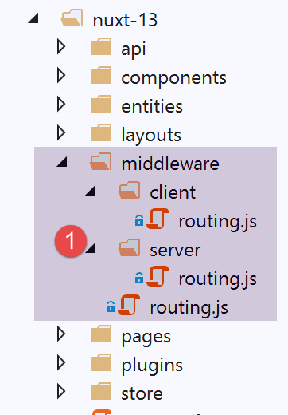
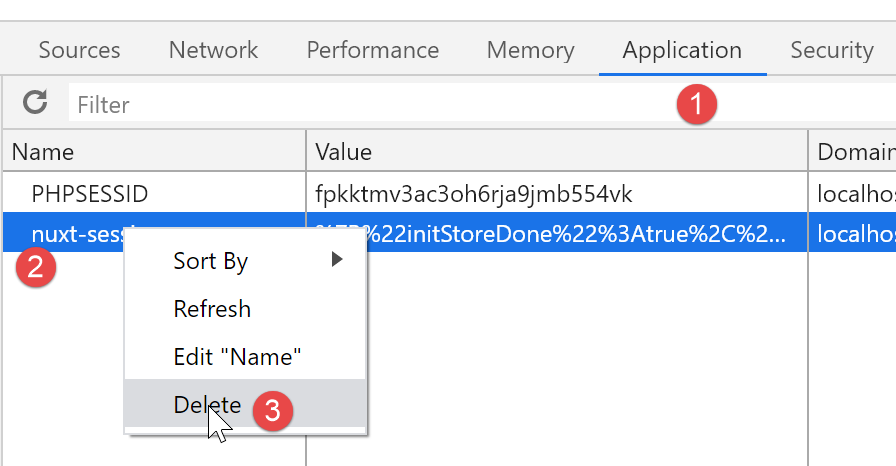

Exemple [nuxt-13] : contrôle de la navigation de [nuxt-12]
==========================================================

Dans cet exemple, nous nous intéressons à la navigation de [nuxt-12]. On
ne l’a pas fait dans [nuxt-12] parce que le contrôle de la navigation
aurait complexifié un exemple déjà complexe.

**Objectif** : nous voulons que l’utilisateur ne puisse faire que des
actions autorisées :

-  si la session jSON n’a pas démarré, alors seule l’URL [/] est
   autorisée ;

-  si la session jSON a démarré mais que l’utilisateur n’est pas
   authentifié, alors seule l’URL [/authentification] est autorisée ;

-  si la session jSON a démarré et que l’utilisateur est authentifié,
   alors seules les URL [/get-admindata, /fin-session] sont autorisées ;

-  lorsque la cible du routage du moment n’est pas autorisée, alors on
   procèdera à une redirection vers une URL autorisée ;

L’exemple [nuxt-13] est obtenu initialement par recopie de l’exemple
[nuxt-12] :

|image0|

C’est dans le dossier du routage [middleware] que vont prendre place les
modifications.

Routage de l’application [nuxt]
-------------------------------

Le routage de l’application est configuré de la façon suivante dans le
fichier [nuxt.config] :

.. code-block:: javascript 
   :linenos:

   // routeur
     router: {
       // racine des URL de l'application
       base: '/nuxt-13/',
       // middleware de routage
       middleware: ['routing']
   },

-  ligne 6 : le routage de l’application est contrôlé par le fichier
   [middleware/routing] ;

Le fichier [middleware/routing] est le suivant :

.. code-block:: javascript 
   :linenos:

   /* eslint-disable no-console */

   // on importe les middleware du serveur et du client
   import serverRouting from './server/routing'
   import clientRouting from './client/routing'

   export default function(context) {
     // qui exécute ce code ?
     console.log('[middleware], process.server', process.server, ', process.client=', process.client)
     if (process.server) {
       // routage serveur
       serverRouting(context)
     } else {
       // routage client
       clientRouting(context)
     }
   }

-  lignes 10-16 : on traite différemment les routages du client et du
   serveur [nuxt]. C’est un point où ils diffèrent grandement ;

-  ligne 4 : le routage du serveur est implémenté par le script
   [middleware/server/routing] ;

-  ligne 5 : le routage du client est implémenté par le script
   [middleware/client/routing] ;

Routage du client [nuxt]
------------------------

Le routage du client [nuxt] reste ce qu’il était dans [nuxt-12] :

.. code-block:: javascript 
   :linenos:

   /* eslint-disable no-console */
   export default function(context) {
     // qui exécute ce code ?
     console.log('[middleware client], process.server', process.server, ', process.client=', process.client)
     // gestion du cookie de la session PHP dans le navigateur
     // le cookie de la session PHP du navigateur doit être identique à celui trouvé en session nuxt
     // l'acion [fin-session] reçoit un nouveau cookie PHP (serveur comme client nuxt)
     // si c'est le serveur qui le reçoit, le client doit le transmettre au navigateur
     // pour ses propres échanges avec le serveur PHP
     // on est ici dans un routing client

     // on récupère le cookie de la session PHP
     const phpSessionCookie = context.store.state.phpSessionCookie
     if (phpSessionCookie) {
       // s'il existe, on affecte le cookie de session PHP au navigateur
       document.cookie = phpSessionCookie
     }

     ...
   }

Pour éviter que le client aille dans des routes non autorisées on va
simplement lui offrir dans le menu de navigation client les seules
routes autorisées. Le composant [components/navigation] devient le
suivant :

.. code-block:: javascript 
   :linenos:

   <template>
     <!-- menu Bootstrap à trois options -->
     <b-nav vertical>
       <b-nav-item v-if="$store.state.jsonSessionStarted && !$store.state.userAuthenticated" to="/authentification" exact exact-active-class="active">
         Authentification
       </b-nav-item>
       <b-nav-item
         v-if="$store.state.jsonSessionStarted && $store.state.userAuthenticated && !$store.state.adminData"
         to="/get-admindata"
         exact
         exact-active-class="active"
       >
         Requête AdminData
       </b-nav-item>
       <b-nav-item v-if="$store.state.jsonSessionStarted && $store.state.userAuthenticated" to="/fin-session" exact exact-active-class="active">
         Fin session impôt
       </b-nav-item>
     </b-nav>
   </template>

-  ligne 4 : l’option [Authentification] n’est offerte que si la session
   jSON a démarré mais que l’utilisateur n’est pas authentifié. Si la
   session jSON n’a pas démarré ou que l’utilisateur est déjà
   authentifié alors l’option n’est pas offerte ;

-  lignes 7-11 : l’option [Requête AdminData] n’est offerte que si la
   session jSON a démarré, que l’utilisateur est authentifié et qu’on
   n’a pas encore récupéré la donnée [AdminData]. Si l’une de ces trois
   conditions n’est pas satisfaite (session jSON pas démarrée,
   utilisateur pas authentifié ou la donnée [AdminData] déjà récupérée,
   l’option n’est pas offerte ;

-  ligne 15 : l’option [Fin session impôt] est offerte dès que la
   session jSON a démarré et que l’utilisateur est authentifié, sinon
   elle ne l’est pas ;

Routage du serveur [nuxt]
-------------------------

Le routage du serveur est en général plus complexe que celle du client
car l’utilisateur peut taper n’importe quelle URL dans la barre
d’adresses de son navigateur. On peut laisser faire (après tout
l’utilisateur n’est pas censé faire ça) ou essayer de contrôler les
choses. C’est ce que nous allons faire ici, pour l’exemple, car dans le
cas de l’application [nuxt-12], on peut très bien s’en passer puisque le
serveur de calcul de l’impôt est bien protégé contre ces URL à la main
et sait envoyer les messages d’erreur adéquats. Nous l’avons vu dans
[next-12] où il n’y avait aucun contrôle de routage.

Le routage d’un serveur [nuxt] est très différent d’un client [nuxt]
quant à la notion de redirection :

-  lorsque un serveur [nuxt] est redirigé, il envoie un ordre de
   redirection au navigateur client avec la cible de la redirection. Le
   navigateur fait alors une nouvelle requête au serveur [nuxt] en lui
   demandant la cible qui lui a été transmise. Tout se passe comme si
   l’utilisateur avait tapé à la main l’URL de la cible de la
   redirection : toute l’application [nuxt] redémarre et donc tout son
   cycle de vie (plugins serveur, store, routage serveur, pages) ;

-  lorsqu’un client [nuxt] est redirigé, rien de tel n’arrive. Il y a un
   simple changement de page, le même que celui qui aurait été obtenu si
   l’utilisateur avait cliqué sur un lien menant à la cible de la
   redirection. Le cycle de vie est alors différent (routage client,
   affichage cible de la route) ;

Pour cette raison, il est préférable de séparer le routage client du
routage serveur même si les deux codes peuvent paraître analogues.

Le script de routage du serveur [middleware/server/routing] sera le
suivant :

.. code-block:: javascript 
   :linenos:

   /* eslint-disable no-console */
   export default function(context) {
     // qui exécute ce code ?
     console.log('[middleware server], process.server', process.server, ', process.client=', process.client)

     // on récupère quelques informations dans le store [nuxt]
     const store = context.store
     // d'où vient-on ?
     const from = store.state.from || 'nowhere'
     ...
   }

-  dans le routage du client, la fonction de routage reçoit le contexte
   [context] avec la propriété [context.from] qui est la route de la
   page d’où l’on vient. La route où l’on va est obtenue par
   [context.route] ;

-  dans le routage du serveur, la fonction de routage reçoit le contexte
   [context] **sans** la propriété [context.from]. Le routage du serveur
   n’intervient que lorsqu’une URL est demandée à la main au serveur
   [nuxt]. On sait qu’alors toute l’application [nuxt] est
   réinitialisée. C’est comme si on repartait de zéro et il n’y a donc
   pas de notion de ‘page précédente’ ;

-  grâce à la session [nuxt] on sait que le serveur peut récupérer cette
   session et donc ne pas repartir de zéro. C’est donc dans cette
   session [nuxt] et plus particulièrement dans le store de cette
   session que nous stockerons le nom de la dernière page affichée par
   le navigateur client avant qu’une URL soit demandée au serveur
   [nuxt] ;

-  lignes 7-9 : on récupère le nom de la dernière page affichée par le
   navigateur client. Au démarrage de l’application, cette information
   [from] n’existe pas dans le store. On affecte alors le nom [nowhere]
   à la variable [from] ;

Pour que le serveur [nuxt] puisse récupérer dans le store le nom de la
dernière page affichée par le navigateur client, il faut que le client
[nuxt] mette également cette information dans le store. Le script de
routage du client [nuxt] est donc complété de la façon suivante :

.. code-block:: javascript 
   :linenos:

   /* eslint-disable no-console */
   export default function(context) {
     // qui exécute ce code ?
     console.log('[middleware client], process.server', process.server, ', process.client=', process.client)
     // gestion du cookie de la session PHP dans le navigateur
     // le cookie de la session PHP du navigateur doit être identique à celui trouvé en session nuxt
     // l'acion [fin-session] reçoit un nouveau cookie PHP (serveur comme client nuxt)
     // si c'est le serveur qui le reçoit, le client doit le transmettre au navigateur
     // pour ses propres échanges avec le serveur PHP
     // on est ici dans un routing client

     // on récupère le cookie de la session PHP
     const phpSessionCookie = context.store.state.phpSessionCookie
     if (phpSessionCookie) {
       // s'il existe, on affecte le cookie de session PHP au navigateur
       document.cookie = phpSessionCookie
     }

     // on met dans la session le nom de la page où on va - pas de redirection serveur
     context.store.commit('replace', { serverRedirection: false, from: context.route.name })
     // on sauvegarde le store dans la session [nuxt]
     const session = context.app.$session()
     session.value.store = context.store.state
     session.save(context)
   }

-  les lignes 19-24 sont ajoutées ;

-  ligne 20 : on met dans le store le nom de la page
   [context.route.name] qui va s’afficher et qui sera donc lors du
   routage suivant, la page d’où l’on vient. Par ailleurs, on va voir
   que dans le routage du serveur [nuxt], celui-ci a besoin de savoir si
   le routage en cours est issu d’une précédente redirection du serveur
   [nuxt]. Ici ce n’est pas le cas, et on met donc la propriété
   [serverRedirection] à [false] ;

-  lignes 22-24 : l’état du store est mis dans la session [nuxt] (ligne
   23) puis la session [nuxt] est sauvegardée dans un cookie (ligne
   24) qui lui-même sera sauvegardé dans le navigateur du client
   [nuxt] ;

Revenons sur le script de routage du serveur [nuxt] :

.. code-block:: javascript 
   :linenos:

   /* eslint-disable no-console */
   export default function(context) {
     // qui exécute ce code ?
     console.log('[middleware server], process.server', process.server, ', process.client=', process.client)

     // on récupère quelques informations dans le store [nuxt]
     const store = context.store
     // d'où vient-on ?
     const from = store.state.from || 'nowhere'
     // où va-t-on ?
     const to = context.route.name
     // éventuelle redirection
     let redirection = ''
     // gestion du routage terminé
     let done = false

     // est-on déjà dans une redirection du serveur [nuxt]?
     if (store.state.serverRedirection) {
       // rien à faire
       done = true
     }

     // est-ce un rechargement de page ?
     if (to === from) {
       // rien à faire
       done = true
     }
     
     // contrôle de la navigation du serveur [nuxt]
     // on s'inspire de la navigation client dans le composant [navigation]

     // cas où la session PHP n'a pas démarré
     if (!done && !store.state.jsonSessionStarted && to !== 'index') {
       // redirection
       redirection = 'index'
       // travail terminé
       done = true
     }

     // cas où l'utilisateur n'est pas authentifié
     if (!done && store.state.jsonSessionStarted && !store.state.userAuthenticated && to !== 'authentification') {
       // redirection
       redirection = from
       // travail terminé
       done = true
     }

     // cas où l'utilisateur a été authentifié
     if (!done && store.state.jsonSessionStarted && store.state.userAuthenticated && to !== 'get-admindata' && to !== 'fin-session') {
       // on reste sur la même page
       redirection = from
       // travail terminé
       done = true
     }

     // cas où [adminData] a été obtenu
     if (!done && store.state.jsonSessionStarted && store.state.userAuthenticated && store.state.adminData && to !== 'fin-session') {
       // on reste sur la même page
       redirection = from
       // travail terminé
       done = true
     }

     // on a fait tous les contrôles ---------------------
     // redirection ?
     if (redirection) {
       // on note la redirection dans le store
       store.commit('replace', { serverRedirection: true })
     } else {
       // pas de redirection
       store.commit('replace', { serverRedirection: false, from: to })
     }
     // on sauvegarde le store dans la session [nuxt]
     const session = context.app.$session()
     session.value.store = store.state
     session.save(context)
     // on fait l'éventuelle redirection
     if (redirection) {
       context.redirect({ name: redirection })
     }
   }

-  lignes 6-9 : on récupère la valeur de [from] dans le store du serveur
   [nuxt] ;

-  ligne 11 : on note la cible du routage courant ;

-  ligne 13 : le routage peut amener à une redirection du navigateur
   client. [redirection] sera la cible de cette redirection ;

-  ligne 15 : [done] à [true] indique que le routage est terminé ;

-  lignes 17-21 : on regarde d’abord si le routage courant est issu
   d’une demande de redirection envoyée au navigateur client. Cette
   information est stockée dans la propriété [serverRedirection] du
   store. Si cette propriété est à vrai, alors c’est que le serveur
   [nuxt] a envoyé une redirection au navigateur client lors de la
   précédente requête au serveur [nuxt]. Dans ce cas, il n’y a pas de
   routage à faire. Lors de la précédente requête, le routeur du serveur
   [nuxt] a décidé que le navigateur client devait être redirigé. Cette
   décision n’a pas à être remise en cause par un nouveau routage ;

-  lignes 23-27 : on regarde si le routage en cours est un rechargement
   de page. Si oui, on laisse faire ;

-  à partir de la ligne 29, on reprend les règles appliquées dans le
   composant [navigation] du client [nuxt] (cf paragraphe précédent) ;

-  lignes 32-38 : on traite le cas où la session jSON n’a pas démarré et
   que la cible du routage n’est pas la page [index]. Dans ce cas, on
   redirige le navigateur client vers la page [index] ;

-  lignes 40-46 : on traite le cas où la session jSON a démarré,
   l’utilisateur n’est pas authentifié et la cible du routage courant
   n’est pas la page [authentification]. Dans ce cas, on refuse le
   routage et on reste là où on était ;

-  lignes 48-54 : on traite le cas où la session jSON a démarré,
   l’utilisateur est authentifié et la cible du routage courant n’est ni
   la page [get-admindata], ni la page [fin-session] qui sont alors les
   seules destinations possibles. Dans ce cas, on refuse le routage
   demandé et on revient là où on était précédemment ;

-  lignes 56-62 : on traite le cas où [adminData] a été obtenu. Dans ce
   cas, il n’y a qu’une cible possible pour le routage : la page
   [fin-session]. Si ce n’était pas elle qui était demandée, on refuse
   le routage et on revient là où on était précédemment ;

-  lignes 64-72 : s’il y a eu redirection, on le note dans le store du
   serveur [nuxt] : [serverRedirection: true]. On notera qu’on ne donne
   pas de valeur à la propriété [from] du store. La raison en est qu’il
   va y avoir redirection du navigateur client et on a vu que dans ce
   cas, il n’y avait pas de routage (lignes 17-20) et la propriété
   [from] du store n’est pas utilisée ;

-  lignes 66-69 : s’il n’y a pas de redirection, alors on le note
   également dans le store du serveur [nuxt] : [serverRedirection:
   false]. Par ailleurs, le routage en cours va afficher la page [to]
   qui pour la requête suivante (client ou serveur [nuxt]) deviendra la
   page précédente. C’est pourquoi on écrit [from: to] ;

-  lignes 73-76 : on sauvegarde le store dans la session [nuxt]
   elle-même sauvegardée dans un cookie ;

-  lignes 77-80 : si [redirection] n’est pas vide, alors on demande au
   navigateur de se rediriger. Sinon (on ne le voit pas ici), le cycle
   de vie du serveur [nuxt] va se poursuivre : la page [to] va être
   traitée par le serveur [nuxt] et envoyée au navigateur du client
   [nuxt] avec le cookie de session [nuxt] ;

Le routage choisi ici pour le serveur [nuxt] est arbitraire. On aurait
pu en choisir un autre ou comme il a été dit ne pas en faire du tout.
Celui choisi ci-dessus a le mérite de toujours laisser l’application
dans un état stable quelque soit l’URL demandée par l’utilisateur.

On peut améliorer un point lorsque la page chargée au final est la page
d’origine. Il y a deux cas :

-  l’utilisateur a provoqué un rechargement de la page (to===from) ;

-  il y a redirections vers la page d’origine (redirection===from) ;

Dans les deux cas la page d’origine va être de nouveau exécutée avec son
appel asynchrone au serveur de calcul de l’impôt. Prenons un exemple. Si
une fois authentifié, l’utilisateur recharge la page (F5). Dans ce cas
dans le routage ci-dessus, on a : [to]=[from]=[authentification]. Il n’y
a pas redirection. La page [to=authentification] va être exécutée par le
serveur [nuxt]. Si on ne fait rien, la fonction [asyncData] va
s’exécuter de nouveau. C’est inutile puisque l’authentification a déjà
été faite.

On peut améliorer les choses en modifiant légèrement la page
[authentification] :

.. code-block:: javascript 
   :linenos:

   // données asynchrones
     async asyncData(context) {
       // log
       console.log('[authentification asyncData started]')
       // on ne fait pas les choses deux fois si la page a déjà été demandée
       if (process.server && context.store.state.userAuthenticated) {
         console.log('[authentification asyncData canceled]')
         return { result: '[succès]' }
       }
       // client [nuxt]
       if (process.client) {
         // début attente
         context.app.$eventBus().$emit('loading', true)
         // pas d'erreur
         context.app.$eventBus().$emit('errorLoading', false)
       }
       try {
         // on s'authentifie auprès du serveur
   ...

-  lignes 6-9 : si la page est exécutée par le serveur [nuxt] et qu’on
   découvre dans le store que l’authentification a déjà été faite, alors
   on retourne directement le résultat souhaité (ligne 8) ;

On fait la même chose pour toutes les pages :

**Page [index]** :

.. code-block:: javascript 
   :linenos:

   // données asynchrones
     async asyncData(context) {
       // log
       console.log('[index asyncData started]')
       // on ne fait pas les choses deux fois si la page a déjà été demandée
       if (process.server && context.store.state.jsonSessionStarted) {
         console.log('[index asyncData canceled]')
         return { result: '[succès]' }
       }
       try {
   ...

**Page [get-admindata]**

.. code-block:: javascript 
   :linenos:

   // données asynchrones
     async asyncData(context) {
       // log
       console.log('[get-admindata asyncData started]')
       // on ne fait pas les choses deux fois si la page a déjà été demandée
       if (process.server && context.store.state.adminData) {
         console.log('[get-admindata asyncData canceled]')
         return { result: context.store.state.adminData }
       }
       // client
       if (process.client) {
         // début attente
         context.app.$eventBus().$emit('loading', true)
         // pas d'erreur
         context.app.$eventBus().$emit('errorLoading', false)
       }
       try {
      ...  

**Page [fin-session]**

.. code-block:: javascript 
   :linenos:

   // données asynchrones
     async asyncData(context) {
       // log
       console.log('[fin-session asyncData started]')
       // on ne fait pas les choses deux fois si la page a déjà été demandée
       if (process.server && context.store.state.jsonSessionStarted && !context.store.state.userAuthenticated) {
         console.log('[fin-session asyncData canceled]')
         return { result: "[succès]. La session jSON reste initialisée mais vous n'êtes plus authentifié(e)." }
       }
       // cas du client [nuxt]
       if (process.client) {
         // début attente
         context.app.$eventBus().$emit('loading', true)
         // pas d'erreur
         context.app.$eventBus().$emit('errorLoading', false)
       }
       try {
      

Exécution
---------

Pour exécuter cet exemple, il faut prendre soin avant l’exécution de
supprimer le cookie de session [nuxt] et le cookie PHP du navigateur
exécutant le client [nuxt] afin de partir d’une situation nette.
Ci-dessous un exemple avec le navigateur Chrome :

|image1|

Conclusion
----------

Le routage du serveur [nuxt] est complexe car il faut prévoir toutes les
URL que peut taper à la main l’utilisateur. C’est un cas d’école. Une
application [nuxt] n’est pas destinée à être utilisée de cette façon.
Une fois la page [index] servie par le routeur du serveur [nuxt], on
pourrait rediriger les appels suivants faits au serveur vers une page
d’erreur.

Dans le cas précis de notre exemple [nuxt-13], le routage du serveur
[nuxt] était inutile. Celui fait par défaut (absence de routage en fait)
dans l’exemple [nuxt-12] convenait très bien.

